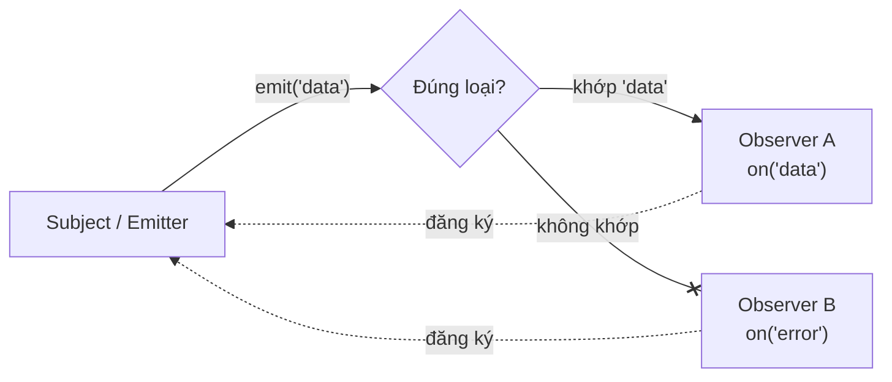

## Mục lục

- [Tổng quan](#tổng-quan)
- [Observer pattern](#observer-pattern)
- [Tự cài một EventEmitter tối giản](#tự-cài-một-eventemitter-tối-giản)
- [Node EventEmitter](#node-eventemitter)
- [addEventListener trong DOM](#addeventlistener-trong-dom)
- [Event flow: capture & bubbling](#event-flow-capture--bubbling)
- [Custom events](#custom-events)
- [Listener chạy đồng bộ hay bất đồng bộ?](#listener-chạy-đồng-bộ-hay-bất-đồng-bộ)
- [Anti-patterns](#anti-patterns)
- [Tự kiểm tra](#tự-kiểm-tra)
- [Cheat sheet](#cheat-sheet)
- [Bài liên quan](#bài-liên-quan)

---

## Tổng quan

**Event-driven** (hướng sự kiện) là mô hình mà code **phản ứng với sự kiện** thay vì chạy tuần tự từ trên xuống. Một bên *phát* sự kiện ("đã click", "data tới", "kết nối đóng"), các bên *quan tâm* đăng ký hàm xử lý (listener) và được gọi khi sự kiện xảy ra. Đây là mô hình nền tảng của cả trình duyệt (DOM events) lẫn Node.js (EventEmitter, stream, HTTP server).

```js
// Trình duyệt
button.addEventListener("click", () => console.log("đã bấm"));

// Node
emitter.on("data", (chunk) => console.log("nhận:", chunk));
```

Mô hình này hợp với JS vì JS [single-thread + event loop](/async/event-loop/): thay vì *chờ* (block), ta *đăng ký* phản ứng rồi để event loop gọi lại khi sự kiện đến.

---

## Observer pattern

Event-driven dựa trên **Observer pattern** (theo ghi chú gốc). Pattern gồm:

- **Subject (Emitter):** đối tượng *phát ra* sự kiện.
- **Observer:** bên *theo dõi*, đăng ký quan tâm tới một loại sự kiện.
- **Listener:** hàm mà observer cung cấp, được chạy khi sự kiện trùng khớp xảy ra.

Đơn giản: Subject phát ra các sự kiện; Observer đăng ký theo dõi *từng loại*; khi Subject phát đúng loại mà Observer theo dõi → listener của Observer được gọi.



Lợi ích: **decoupling** (tách rời) — Subject không cần biết *ai* lắng nghe hay *bao nhiêu* người nghe; chỉ cần phát sự kiện. Thêm/bớt observer không ảnh hưởng Subject.

---

## Tự cài một EventEmitter tối giản

Cài tay để thấy rõ "magic" chỉ là một object map từ *tên sự kiện* → *mảng listener*:

```js
class EventEmitter {
  constructor() {
    this.listeners = {};          // { tênEvent: [fn, fn, ...] }
  }

  on(event, fn) {                 // đăng ký
    (this.listeners[event] ??= []).push(fn);
    return this;                  // cho phép chain
  }

  off(event, fn) {                // gỡ
    this.listeners[event] = (this.listeners[event] ?? []).filter((f) => f !== fn);
    return this;
  }

  once(event, fn) {               // chỉ chạy 1 lần
    const wrap = (...args) => { this.off(event, wrap); fn(...args); };
    return this.on(event, wrap);
  }

  emit(event, ...args) {          // phát: gọi mọi listener của event này
    (this.listeners[event] ?? []).forEach((fn) => fn(...args));
    return this.listeners[event]?.length > 0;
  }
}

const bus = new EventEmitter();
const onMsg = (text) => console.log("nhận:", text);
bus.on("message", onMsg);
bus.emit("message", "xin chào");   // in "nhận: xin chào"
bus.off("message", onMsg);
bus.emit("message", "im lặng");    // không in gì
```

> [!NOTE]
> Đây chính là *cốt lõi* của `EventEmitter` trong Node và `addEventListener` trong DOM — chỉ khác phần API và chi tiết quản lý. Hiểu phiên bản tối giản này thì hiểu cả hai.

---

## Node EventEmitter

Trong Node, class **`EventEmitter`** (module `events`) là nền tảng của rất nhiều core module hỗ trợ bất đồng bộ (stream, HTTP, process...). Các class kế thừa nó được gọi là *emitter* (theo ghi chú gốc):

```js
const { EventEmitter } = require("events");

const emitter = new EventEmitter();

emitter.on("order", (id) => console.log("xử lý đơn", id));   // đăng ký
emitter.once("ready", () => console.log("sẵn sàng 1 lần"));  // chạy 1 lần

emitter.emit("order", 101);   // "xử lý đơn 101"
emitter.emit("ready");        // "sẵn sàng 1 lần"
emitter.emit("ready");        // (không gì — once đã gỡ)

emitter.off("order", fn);     // gỡ listener (alias removeListener)
emitter.listenerCount("order");
```

| Method | Vai trò |
| --- | --- |
| `on(event, fn)` / `addListener` | Đăng ký listener |
| `once(event, fn)` | Đăng ký, chạy đúng **một lần** rồi tự gỡ |
| `emit(event, ...args)` | Phát sự kiện, gọi mọi listener (đồng bộ) |
| `off(event, fn)` / `removeListener` | Gỡ một listener |
| `removeAllListeners(event)` | Gỡ tất cả |

> [!WARNING]
> Sự kiện **`error`** trong Node EventEmitter đặc biệt: nếu `emit("error", ...)` mà *không có* listener nào, Node **ném exception và có thể crash process**. Luôn đăng ký handler cho `error`.

---

## addEventListener trong DOM

Trong trình duyệt, DOM node là emitter; ta đăng ký/gỡ listener:

```js
function onClick(e) { console.log("bấm tại", e.target); }

button.addEventListener("click", onClick);
button.removeEventListener("click", onClick);   // phải CÙNG tham chiếu hàm mới gỡ được

// tuỳ chọn:
button.addEventListener("click", onClick, { once: true });    // tự gỡ sau 1 lần
button.addEventListener("scroll", onScroll, { passive: true }); // không gọi preventDefault
```

> [!IMPORTANT]
> `removeEventListener` chỉ gỡ được khi truyền **đúng tham chiếu hàm** đã đăng ký. Truyền một arrow function *mới* (vd `() => onClick()`) sẽ **không** gỡ được → rò rỉ listener. Hãy giữ tên hàm để gỡ.

---

## Event flow: capture & bubbling

Khi một sự kiện xảy ra trên DOM, nó đi qua **3 pha**: *capture* (từ ngoài vào), *target*, rồi *bubbling* (từ trong ra). Mặc định listener chạy ở pha **bubbling**.

```text
            ┌─────────── capture (đi xuống) ───────────┐
document → html → body → div#parent → button#target
            └────────── bubbling (đi lên) ─────────────┘
```

```js
parent.addEventListener("click", () => console.log("parent"));
child.addEventListener("click", () => console.log("child"));
// Click vào child → in "child" rồi "parent" (bubbling lên)

// Đăng ký pha capture:
parent.addEventListener("click", handler, { capture: true });

// Chặn lan truyền:
child.addEventListener("click", (e) => e.stopPropagation());
```

**Event delegation** tận dụng bubbling: gắn *một* listener ở cha thay vì nhiều listener ở từng con:

```js
list.addEventListener("click", (e) => {
  if (e.target.matches("li")) console.log("bấm item:", e.target.textContent);
});
```

---

## Custom events

Tự tạo và phát sự kiện riêng với `CustomEvent` + `dispatchEvent` — dữ liệu kèm theo nằm trong `detail`:

```js
// Lắng nghe
element.addEventListener("user:login", (e) => {
  console.log("đăng nhập:", e.detail.username);
});

// Phát
element.dispatchEvent(
  new CustomEvent("user:login", {
    detail: { username: "Hiệp" },
    bubbles: true,        // cho phép bubble lên cha
  })
);
```

---

## Listener chạy đồng bộ hay bất đồng bộ?

Điểm dễ nhầm: `emit` của Node EventEmitter gọi các listener **đồng bộ, tuần tự** — *không* phải microtask/macrotask:

```js
console.log("trước");
emitter.on("x", () => console.log("listener"));
emitter.emit("x");          // gọi NGAY, đồng bộ
console.log("sau");
// Output: trước → listener → sau
```

Còn sự kiện DOM thật (click, network) được đưa vào **macrotask queue** và do [event loop](/async/event-loop/) điều phối. Phân biệt: *phát thủ công* (`emit`/`dispatchEvent`) chạy đồng bộ; sự kiện *do hệ thống* sinh ra đi qua queue.

---

## Anti-patterns

| Anti-pattern | Vấn đề | Nên làm |
| --- | --- | --- |
| Quên `removeEventListener`/`off` | Rò rỉ listener & bộ nhớ | Gỡ khi không cần (hoặc `once`) |
| Gỡ bằng arrow mới | Không khớp tham chiếu → không gỡ | Giữ tên hàm để gỡ |
| `emit("error")` không listener (Node) | Crash process | Luôn có handler `error` |
| Nhiều listener trùng từng con | Tốn bộ nhớ | Event delegation ở cha |
| Tưởng `emit` là async | Thực ra đồng bộ | Tự `setTimeout`/Promise nếu cần defer |

---

## Tự kiểm tra

> [!NOTE]
> **Câu 1:** Output theo thứ tự?
> ```js
> const e = new EventEmitter();
> console.log("1");
> e.on("go", () => console.log("2"));
> e.emit("go");
> console.log("3");
> ```

> [!TIP]
> **Đáp án:** `1 2 3`. `emit` gọi listener **đồng bộ ngay tại chỗ** (không phải microtask/macrotask), nên `2` in *giữa* `1` và `3`. Đây là khác biệt then chốt so với `setTimeout`/Promise.

> [!NOTE]
> **Câu 2:** Vì sao listener này không gỡ được?
> ```js
> btn.addEventListener("click", () => doStuff());
> btn.removeEventListener("click", () => doStuff());
> ```

> [!TIP]
> **Đáp án:** Hai arrow function là **hai object hàm khác nhau** (khác tham chiếu) dù nội dung giống hệt. `removeEventListener` so khớp theo *tham chiếu*, không theo nội dung → không tìm thấy listener đã đăng ký nên không gỡ. Phải lưu hàm vào biến và truyền **cùng tham chiếu** cho cả add lẫn remove.

---

## Cheat sheet

> [!IMPORTANT]
> 1. Event-driven = code **phản ứng với sự kiện**; nền tảng là **Observer pattern** (Subject phát ↔ Observer đăng ký listener).
> 2. Cốt lõi EventEmitter chỉ là map `tênEvent → [listener]`; `emit` duyệt và gọi từng listener.
> 3. Node: `on/once/emit/off`; sự kiện **`error`** không có listener → **crash**.
> 4. DOM: `addEventListener`/`removeEventListener` — gỡ phải **đúng tham chiếu hàm**.
> 5. Sự kiện DOM đi qua **capture → target → bubbling**; tận dụng bubbling cho **event delegation**.
> 6. `emit`/`dispatchEvent` thủ công chạy **đồng bộ**; sự kiện hệ thống đi qua **event loop** (macrotask).

---

## Bài liên quan

- [Event Loop — Deep Dive](/async/event-loop/)
- [Callbacks](/async/callbacks/)
- [Web Workers](/advanced/web-workers/)
- [localStorage vs sessionStorage](/advanced/storage/)
