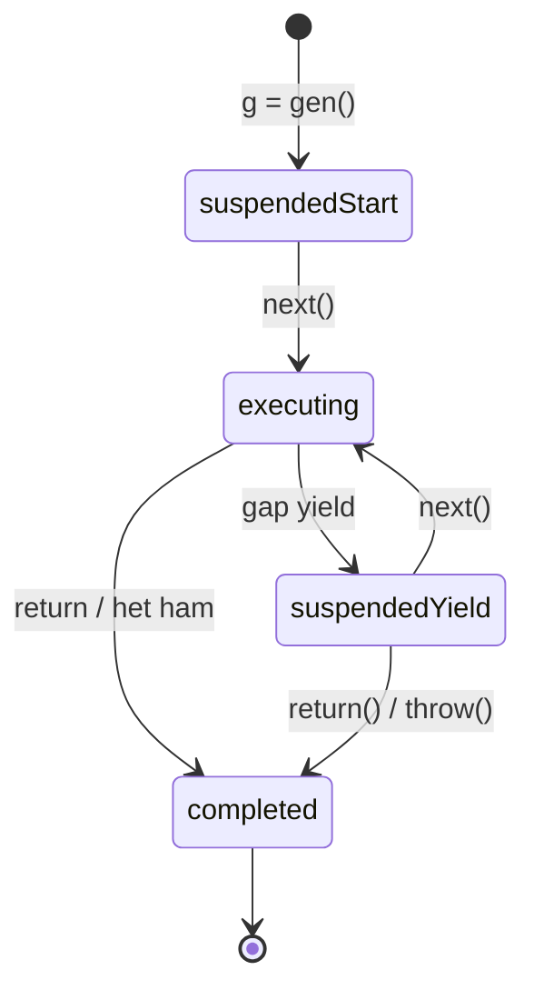

## Mục lục

- [Tổng quan](#tổng-quan)
- [Trực giác: cuốn sách có dấu trang](#trực-giác-cuốn-sách-có-dấu-trang)
- [Iterator protocol](#iterator-protocol)
- [Iterable protocol](#iterable-protocol)
- [function* & yield](#function-yield)
- [Internal: generator tạm dừng thế nào](#internal-generator-tạm-dừng-thế-nào)
- [next / return / throw](#next--return--throw)
- [Truyền dữ liệu hai chiều qua yield](#truyền-dữ-liệu-hai-chiều-qua-yield)
- [yield* — uỷ quyền cho iterator khác](#yield--uỷ-quyền-cho-iterator-khác)
- [Use cases](#use-cases)
- [Anti-patterns](#anti-patterns)
- [Tự kiểm tra](#tự-kiểm-tra)
- [Cheat sheet](#cheat-sheet)
- [Bài liên quan](#bài-liên-quan)

---

## Tổng quan

**Iterator** là một object biết cách "đi từng bước" qua một chuỗi giá trị — mỗi lần gọi `next()` nó trả về *giá trị kế tiếp*. **Generator** là cách *gọn nhất* để tạo iterator: một hàm đặc biệt (`function*`) có thể **tạm dừng** giữa chừng và **tiếp tục** sau, sinh giá trị *theo nhu cầu* (lazy).

```js
function* dem() {
  yield 1;
  yield 2;
  yield 3;
}

const g = dem();
g.next();   // { value: 1, done: false }
g.next();   // { value: 2, done: false }
g.next();   // { value: 3, done: false }
g.next();   // { value: undefined, done: true }
```

Điểm đặc biệt nhất: **gọi `dem()` KHÔNG chạy thân hàm** — nó chỉ tạo ra một generator object đang "treo". Thân hàm chỉ chạy tới `yield` đầu tiên khi bạn gọi `next()` lần đầu.

---

## Trực giác: cuốn sách có dấu trang

Hàm thường giống đọc một mạch từ đầu đến cuối rồi gấp sách. Generator giống đọc sách có **dấu trang (bookmark)**: đọc tới `yield` thì kẹp dấu trang, trả sách cho bạn (trả `value`); khi bạn `next()` lần sau, nó mở đúng trang đã kẹp và đọc tiếp — **mọi biến cục bộ vẫn nguyên vẹn**.

```text
function* dem()        next()①        next()②        next()③
   │                     │              │              │
   ▼                     ▼              ▼              ▼
[chưa chạy] ──► chạy tới yield 1 ─► tiếp tới yield 2 ─► tiếp tới yield 3 ─► done
              kẹp dấu trang      mở dấu trang cũ    ...
```

---

## Iterator protocol

Một object là **iterator** nếu nó có method `next()` trả về object dạng `{ value, done }`:

| Trường | Ý nghĩa |
| --- | --- |
| `value` | Giá trị của bước hiện tại |
| `done` | `false` nếu còn giá trị; `true` khi đã hết |

Tự cài một iterator *thủ công* (không dùng generator) để thấy protocol trần trụi:

```js
function taoIterator(arr) {
  let i = 0;
  return {
    next() {
      if (i < arr.length) {
        return { value: arr[i++], done: false };
      }
      return { value: undefined, done: true };
    },
  };
}

const it = taoIterator(["a", "b"]);
it.next();   // { value: "a", done: false }
it.next();   // { value: "b", done: false }
it.next();   // { value: undefined, done: true }
```

Generator giúp ta khỏi viết tay `i`, `done`... — engine tự quản lý trạng thái.

---

## Iterable protocol

Một object là **iterable** (lặp được bằng `for...of`, spread `...`, destructuring) nếu nó có method đặc biệt với key **`Symbol.iterator`** trả về một *iterator*.

```js
const range = {
  start: 1,
  end: 3,
  [Symbol.iterator]() {           // làm cho object thành iterable
    let current = this.start;
    const end = this.end;
    return {
      next() {
        return current <= end
          ? { value: current++, done: false }
          : { value: undefined, done: true };
      },
    };
  },
};

[...range];                 // [1, 2, 3]
for (const n of range) {}   // 1, 2, 3
```

> [!NOTE]
> `Array`, `String`, `Map`, `Set` đều *iterable* sẵn vì chúng có `Symbol.iterator` tích hợp. Đó là lý do `for...of` và spread chạy được trên chúng. Xem thêm [Symbol](/advanced/symbol/).

Generator function trả về một object **vừa là iterator vừa là iterable** (nó tự có `[Symbol.iterator]` trỏ về chính nó), nên dùng trực tiếp với `for...of`:

```js
function* g() { yield 1; yield 2; }
for (const x of g()) console.log(x);   // 1, 2
```

---

## function* & yield

Cú pháp generator (theo ghi chú gốc):

- Phải có **`*`** sau từ khoá `function`: `function* ten() {}`.
- Mỗi lần `next()`, thân hàm chạy tới **`yield`** kế tiếp rồi *dừng*, trả `{ value: <biểu thức sau yield>, done: false }`.
- Gặp `return` (hoặc hết hàm) → `{ value: <giá trị return>, done: true }`.
- Khi *gọi* generator function, nó **chưa chạy thân hàm** — chỉ trả về generator object; thân chỉ chạy khi `next()`.

```js
function* viDu() {
  console.log("bắt đầu");   // chỉ in khi next() ĐẦU TIÊN
  yield "a";
  console.log("giữa");
  yield "b";
  return "xong";
}

const g = viDu();
// (chưa in gì cả)
g.next();   // in "bắt đầu" → { value: "a", done: false }
g.next();   // in "giữa"   → { value: "b", done: false }
g.next();   // → { value: "xong", done: true }
g.next();   // → { value: undefined, done: true }
```

---

## Internal: generator tạm dừng thế nào

Hàm thường khi chạy tạo một **stack frame** (execution context) rồi *huỷ* khi return. Generator khác: engine tạo một frame nhưng **không huỷ khi gặp `yield`** — nó *đóng băng* (suspend) frame đó, lưu lại vị trí con trỏ lệnh và toàn bộ biến cục bộ, rồi trả quyền về caller. Lần `next()` sau, frame được *làm sống lại* (resume) từ đúng chỗ đã dừng.

```text
Generator object giữ một internal slot [[GeneratorState]]:
  "suspendedStart"  → vừa tạo, chưa chạy thân
  "suspendedYield"  → đang treo ở một yield
  "executing"       → đang chạy
  "completed"       → đã xong (return / hết hàm / throw)

next()  : suspendedYield ─► executing ─► (gặp yield) ─► suspendedYield
return(): ─► completed
```



> [!IMPORTANT]
> Vì frame được *giữ lại* chứ không huỷ, mọi biến cục bộ trong generator **sống xuyên suốt** giữa các lần `next()`. Đây chính là cơ chế cho phép "tạm dừng và tiếp tục" — tương tự cách [closure](/function-closure/closures/) giữ biến, nhưng ở đây là giữ cả *vị trí thực thi*.

---

## next / return / throw

Generator object có **3 method điều khiển** (theo ghi chú gốc):

```js
function* g() {
  yield 1;
  yield 2;
  yield 3;
}
```

**`next(arg)`** — chạy tới `yield` kế tiếp:

```js
const a = g();
a.next();   // { value: 1, done: false }
```

**`return(v)`** — *kết thúc sớm* generator, trả `{ value: v, done: true }`; mọi `next()` sau đều `done: true`:

```js
const b = g();
b.next();        // { value: 1, done: false }
b.return(99);    // { value: 99, done: true }  — dừng hẳn
b.next();        // { value: undefined, done: true }
```

**`throw(err)`** — *ném lỗi* vào trong generator tại vị trí đang treo (có thể `try/catch` bên trong để xử lý):

```js
function* h() {
  try {
    yield 1;
  } catch (e) {
    console.log("bắt được:", e);
    yield 2;     // vẫn tiếp tục được
  }
}
const c = h();
c.next();          // { value: 1, done: false }
c.throw("Oops");   // in "bắt được: Oops" → { value: 2, done: false }
```

> [!TIP]
> Trong `for...of`, engine tự gọi `next()` và *chỉ* lặp khi `done === false`; nếu vòng lặp `break`/`throw` giữa chừng, engine tự gọi `return()` để generator dọn dẹp (chạy `finally`).

---

## Truyền dữ liệu hai chiều qua yield

`yield` không chỉ *đẩy ra* — nó còn *nhận vào*. Giá trị bạn truyền vào `next(arg)` trở thành **kết quả của biểu thức `yield`** đang treo:

```js
function* hoiDap() {
  const ten = yield "Tên bạn?";        // yield trả ra câu hỏi
  const tuoi = yield `Chào ${ten}, tuổi?`;
  return `${ten} - ${tuoi} tuổi`;
}

const g = hoiDap();
g.next();          // { value: "Tên bạn?", done: false }  — chưa truyền gì
g.next("Hiệp");    // { value: "Chào Hiệp, tuổi?", done: false }  — "Hiệp" thành giá trị của yield đầu
g.next(25);        // { value: "Hiệp - 25 tuổi", done: true }
```

> [!WARNING]
> `arg` của lần `next()` **đầu tiên** bị *bỏ qua* — vì lúc đó chưa có `yield` nào đang treo để nhận nó. Chỉ từ lần `next()` thứ hai trở đi `arg` mới có tác dụng.

---

## yield* — uỷ quyền cho iterator khác

`yield*` "trải" toàn bộ một iterable khác vào generator hiện tại — hữu ích để ghép generator:

```js
function* abc() { yield "a"; yield "b"; }
function* nums() { yield 1; yield 2; }

function* gop() {
  yield* abc();      // uỷ quyền: lần lượt yield "a", "b"
  yield* nums();     // rồi 1, 2
  yield* [10, 20];   // yield* chạy được với mọi iterable
}

[...gop()];   // ["a", "b", 1, 2, 10, 20]
```

---

## Use cases

**1) Dãy vô hạn (lazy) — không thể làm với mảng thường:**

```js
function* idMaker() {
  let id = 1;
  while (true) yield id++;   // vô hạn, nhưng chỉ sinh khi cần
}
const gen = idMaker();
gen.next().value;   // 1
gen.next().value;   // 2  — không bao giờ tràn bộ nhớ vì lazy
```

**2) Sinh giá trị tốn kém theo nhu cầu** (chỉ tính khi `next()`), thay vì dựng sẵn cả mảng lớn.

**3) Tự làm object thành iterable** gọn hơn iterator thủ công:

```js
const range = {
  from: 1, to: 5,
  *[Symbol.iterator]() {       // generator làm Symbol.iterator
    for (let i = this.from; i <= this.to; i++) yield i;
  },
};
[...range];   // [1, 2, 3, 4, 5]
```

**4) Điều phối luồng async** (nền tảng tư duy của `async/await` — `await` cũng là "tạm dừng & tiếp tục"). Xem [async/await](/async/async-await/).

---

## Anti-patterns

| Anti-pattern | Vì sao tệ | Nên làm |
| --- | --- | --- |
| Mong `gen()` chạy thân hàm ngay | Thân chỉ chạy khi `next()` | Gọi `next()` để bắt đầu |
| Dùng arg ở `next()` đầu tiên | Bị bỏ qua | Truyền arg từ `next()` thứ hai |
| `[...infiniteGen()]` | Vòng lặp vô hạn → treo | Lấy có giới hạn (`take(n)`) |
| Quên `done` khi tự viết iterator | `for...of` lặp vô tận / lỗi | Luôn trả `done: true` khi hết |

---

## Tự kiểm tra

> [!NOTE]
> **Câu 1:** Output của đoạn này?
> ```js
> function* g() {
>   console.log("A");
>   yield 1;
>   console.log("B");
> }
> const it = g();
> console.log("created");
> it.next();
> ```

> [!TIP]
> **Đáp án:** in `created`, rồi `A`, rồi `1` được trả về object `{value:1,done:false}`. Gọi `g()` **không** chạy thân hàm (nên `A` chưa in lúc tạo); chỉ tới `next()` đầu tiên thân mới chạy tới `yield 1` → in `A` rồi dừng (chưa in `B`).

> [!NOTE]
> **Câu 2:** `g.next(10)` lần đầu thì `10` đi đâu?
> ```js
> function* g() { const x = yield "hỏi"; console.log(x); }
> const it = g();
> it.next(10);
> ```

> [!TIP]
> **Đáp án:** `10` bị **bỏ qua**. Lần `next()` đầu tiên không có `yield` nào đang treo để nhận giá trị, nên `10` mất hút; generator chỉ chạy tới `yield "hỏi"` rồi dừng. Phải `next()` lần hai mới gán được vào `x`.

---

## Cheat sheet

> [!IMPORTANT]
> 1. **Iterator** = object có `next()` trả `{value, done}`. **Iterable** = object có `[Symbol.iterator]()` trả về iterator.
> 2. `function*` + `yield` = cách gọn nhất tạo iterator; engine tự quản trạng thái.
> 3. Gọi generator **không chạy thân** — chỉ tạo object; thân chạy tới `yield` đầu khi `next()` lần đầu.
> 4. `yield` *đẩy ra* `value` **và** *nhận vào* giá trị từ `next(arg)` (arg lần đầu bị bỏ qua).
> 5. 3 method: `next()` (tiếp), `return()` (dừng → `done:true`), `throw()` (ném lỗi vào trong).
> 6. Generator **lazy** → làm được dãy vô hạn; `for...of` tự gọi `next()` và dừng khi `done`.
> 7. `yield*` uỷ quyền cho iterable khác (ghép generator/mảng).

---

## Bài liên quan

- [Symbol](/advanced/symbol/)
- [async / await](/async/async-await/)
- [Closures](/function-closure/closures/)
- [Event Loop — Deep Dive](/async/event-loop/)
