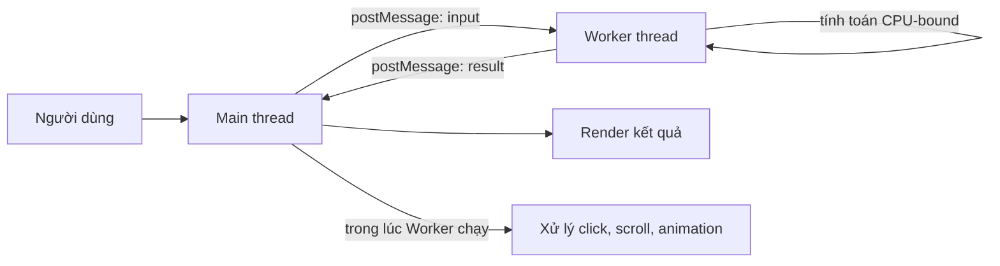
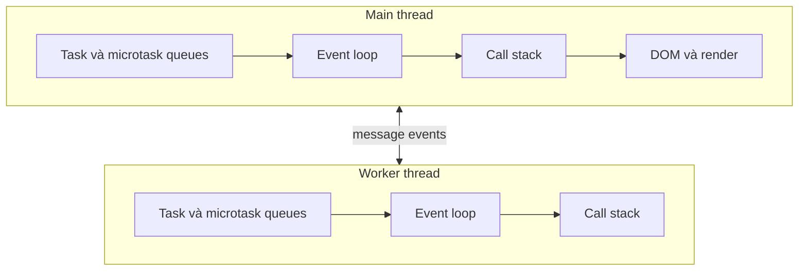
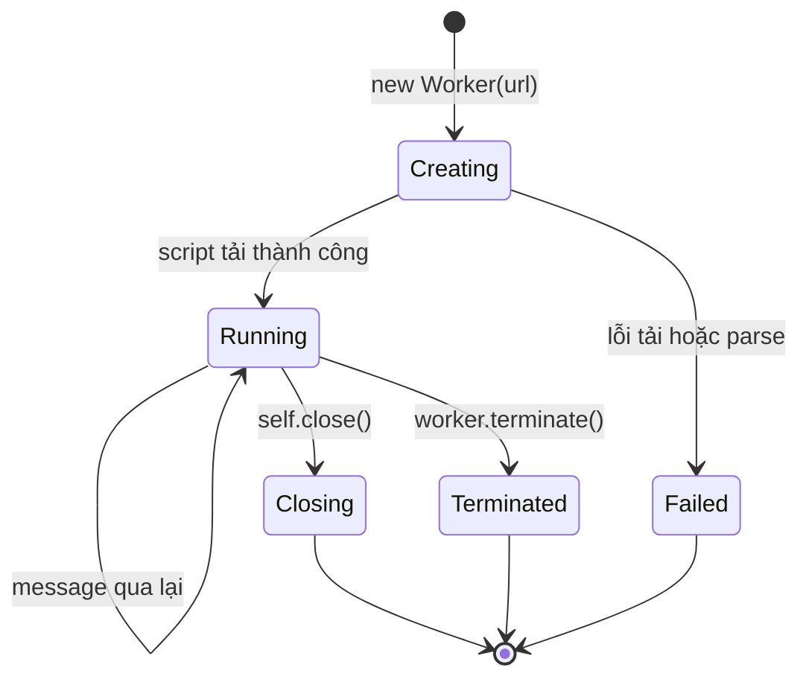
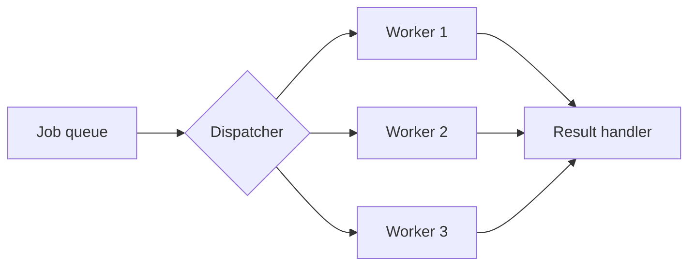

> [!NOTE]
> Web Worker phù hợp với tác vụ **CPU-bound** — công việc dùng CPU lâu như xử lý ảnh, parse dữ liệu lớn hoặc tính toán thuật toán. Worker không làm một thuật toán chạy ít phép tính hơn; nó chuyển công việc sang thread khác để main thread tiếp tục phản hồi thao tác và render giao diện.

## Mục lục

- [Tổng quan](#tổng-quan)
  - [Web Worker giải quyết vấn đề gì](#web-worker-giải-quyết-vấn-đề-gì)
  - [Khi nào không cần Worker](#khi-nào-không-cần-worker)
- [Mô hình thực thi](#mô-hình-thực-thi)
  - [Main thread và worker thread](#main-thread-và-worker-thread)
  - [Worker có event loop riêng](#worker-có-event-loop-riêng)
- [Dedicated Worker đầu tiên](#dedicated-worker-đầu-tiên)
  - [Tạo Worker trên main thread](#tạo-worker-trên-main-thread)
  - [Nhận và xử lý dữ liệu trong Worker](#nhận-và-xử-lý-dữ-liệu-trong-worker)
  - [Vòng đời của Dedicated Worker](#vòng-đời-của-dedicated-worker)
- [Thiết kế giao thức postMessage](#thiết-kế-giao-thức-postmessage)
  - [Gắn id cho từng request](#gắn-id-cho-từng-request)
  - [Đóng gói Worker thành hàm trả Promise](#đóng-gói-worker-thành-hàm-trả-promise)
- [Structured clone và chi phí truyền dữ liệu](#structured-clone-và-chi-phí-truyền-dữ-liệu)
  - [Dữ liệu nào có thể gửi](#dữ-liệu-nào-có-thể-gửi)
  - [Transferable chuyển quyền sở hữu](#transferable-chuyển-quyền-sở-hữu)
  - [SharedArrayBuffer chia sẻ bộ nhớ](#sharedarraybuffer-chia-sẻ-bộ-nhớ)
- [Xử lý lỗi và messageerror](#xử-lý-lỗi-và-messageerror)
- [Hủy tác vụ và giải phóng tài nguyên](#hủy-tác-vụ-và-giải-phóng-tài-nguyên)
  - [Hủy cưỡng bức bằng terminate](#hủy-cưỡng-bức-bằng-terminate)
  - [Hủy hợp tác bằng thông điệp](#hủy-hợp-tác-bằng-thông-điệp)
- [Classic Worker và Module Worker](#classic-worker-và-module-worker)
- [Các loại Worker khác](#các-loại-worker-khác)
- [Use case thực tế](#use-case-thực-tế)
  - [Xử lý dữ liệu lớn theo lô](#xử-lý-dữ-liệu-lớn-theo-lô)
  - [Xử lý ảnh với OffscreenCanvas](#xử-lý-ảnh-với-offscreencanvas)
  - [Worker pool](#worker-pool)
- [Giới hạn và bẫy thường gặp](#giới-hạn-và-bẫy-thường-gặp)
- [Đo hiệu năng trước và sau](#đo-hiệu-năng-trước-và-sau)
- [Checklist production](#checklist-production)
- [Tự kiểm tra](#tự-kiểm-tra)
  - [Câu 1](#câu-1)
  - [Câu 2](#câu-2)
  - [Câu 3](#câu-3)
- [Cheat sheet](#cheat-sheet)
- [Bài liên quan](#bài-liên-quan)
  - [Tài liệu tham khảo](#tài-liệu-tham-khảo)

---

## Tổng quan

JavaScript của một trang web thường chạy trên **main thread**. Thread này vừa thực thi JavaScript, vừa phối hợp xử lý input, layout và paint. Nếu một hàm JavaScript chiếm main thread quá lâu, trình duyệt không có cơ hội cập nhật giao diện.

**Web Worker** là API cho phép chạy một file JavaScript trong background thread. Main thread và Worker không gọi trực tiếp hàm hoặc đọc trực tiếp biến của nhau. Hai phía giao tiếp bằng thông điệp qua `postMessage()`.



### Web Worker giải quyết vấn đề gì

Ví dụ sau tính tổng trên main thread. Khi mảng đủ lớn, vòng lặp có thể làm animation giật hoặc khiến nút bấm phản hồi chậm.

```js
function sum(numbers) {
  let total = 0;

  for (const number of numbers) {
    total += number;
  }

  return total;
}

button.addEventListener('click', () => {
  const total = sum(veryLargeArray); // Main thread bị chiếm trong lúc tính.
  output.textContent = total;
});
```

Nếu chuyển vòng lặp sang Worker, phép tính vẫn tốn CPU. Điểm khác biệt là main thread không phải thực hiện phép tính đó, nên giao diện có thể tiếp tục phản hồi.

> [!IMPORTANT]
> Worker tạo ra **concurrency** giữa main thread và worker thread. Khi thiết bị có nhiều CPU core và hệ điều hành phân lịch phù hợp, chúng có thể chạy song song thật sự. Tuy nhiên, việc tạo Worker và truyền dữ liệu đều có chi phí. Một tác vụ nhỏ có thể chạy chậm hơn khi đưa sang Worker.

### Khi nào không cần Worker

Worker không phải công cụ mặc định cho mọi đoạn code bất đồng bộ.

- `fetch()` chủ yếu chờ network I/O. Trình duyệt vốn đã xử lý phần chờ ở nền, nên chuyển riêng lời gọi `fetch()` vào Worker thường không làm request nhanh hơn.
- `setTimeout()` chỉ lên lịch callback. Nó không biến callback nặng thành code chạy ở thread khác.
- Một phép tính chỉ mất vài mili-giây thường không đáng để trả chi phí khởi tạo Worker và truyền message.
- Nếu công việc cần đọc hoặc cập nhật DOM liên tục, main thread vẫn phải thực hiện phần DOM đó.

Nói ngắn gọn: dùng Worker khi **đo được** một tác vụ CPU-bound đủ nặng đang làm main thread mất khả năng phản hồi.

## Mô hình thực thi

### Main thread và worker thread

Mỗi Dedicated Worker có global scope, call stack và heap riêng. Biến được khai báo trong Worker không xuất hiện trên main thread, và ngược lại.

| Khả năng | Main thread | Dedicated Worker |
|---|---:|---:|
| Truy cập `window` và `document` | Có | Không |
| Cập nhật DOM trực tiếp | Có | Không |
| `postMessage()` | Có | Có |
| `fetch()` | Có | Có |
| Timer như `setTimeout()` | Có | Có |
| `IndexedDB` | Có | Có |
| `localStorage` và `sessionStorage` | Có | Không |
| Chạy JavaScript đồng thời với phía còn lại | — | Có |

Trong Worker, global object là một `WorkerGlobalScope`. Có thể truy cập nó qua `self` hoặc `globalThis`.

```js
// worker.js
console.log(self === globalThis); // true trong Worker
console.log(typeof document);     // "undefined"
```

> [!WARNING]
> Không thể “lách” giới hạn DOM bằng cách gửi một DOM node qua `postMessage()`. DOM node không thuộc nhóm dữ liệu mà structured clone có thể sao chép. Hãy gửi dữ liệu thuần về main thread, rồi để main thread cập nhật DOM.

### Worker có event loop riêng

Worker không phải một hàm đặc biệt chạy chen vào event loop của trang. Nó là một môi trường thực thi khác và có event loop riêng.



Một vòng lặp đồng bộ nặng trong Worker sẽ block **event loop của Worker**, nhưng không trực tiếp block event loop của main thread. Hệ quả là Worker đó chưa thể nhận message mới cho đến khi vòng lặp kết thúc.

Main thread cũng có quy tắc tương tự. Nếu main thread đang bị block, kết quả Worker đã gửi về vẫn phải chờ trước khi handler `message` được chạy.

## Dedicated Worker đầu tiên

**Dedicated Worker** thuộc về context đã tạo nó. Đây là loại Worker phổ biến nhất cho việc tách một phép tính khỏi UI.

Ví dụ hoàn chỉnh gồm hai file:

```text
app/
├── main.js
└── sum.worker.js
```

### Tạo Worker trên main thread

```js
// main.js
const worker = new Worker(
  new URL('./sum.worker.js', import.meta.url),
  { type: 'module' },
);

const numbers = Array.from({ length: 5_000_000 }, (_, index) => index + 1);

worker.postMessage({
  type: 'sum',
  payload: numbers,
});

worker.addEventListener('message', (event) => {
  const message = event.data;

  if (message.type === 'result') {
    output.textContent = `Tổng: ${message.payload}`;
  }
});
```

`new URL('./sum.worker.js', import.meta.url)` giúp bundler nhận ra Worker là một asset phụ thuộc của module hiện tại. Cách này cũng tránh nhầm đường dẫn tương đối theo URL của trang.

> [!NOTE]
> Nếu không dùng bundler, có thể tạo Worker từ URL được phục vụ bởi web server, ví dụ `new Worker('/workers/sum.worker.js', { type: 'module' })`. Không nên mở file HTML trực tiếp bằng `file://`, vì chính sách origin của trình duyệt có thể ngăn Worker được tải.

### Nhận và xử lý dữ liệu trong Worker

```js
// sum.worker.js
self.addEventListener('message', (event) => {
  const message = event.data;

  if (message.type !== 'sum') return;

  let total = 0;

  for (const number of message.payload) {
    total += number;
  }

  self.postMessage({
    type: 'result',
    payload: total,
  });
});
```

Luồng chạy của ví dụ:

1. Main thread tạo Worker.
2. Main thread gửi message `sum` cùng mảng đầu vào.
3. Trình duyệt sao chép dữ liệu sang môi trường của Worker bằng **structured clone**.
4. Worker tính tổng trên worker thread.
5. Worker gửi message `result` về.
6. Main thread nhận kết quả và cập nhật DOM.

`postMessage()` là bất đồng bộ. Lệnh này không chờ phía bên kia xử lý xong và cũng không trả trực tiếp kết quả tính toán.

### Vòng đời của Dedicated Worker



Có hai cách kết thúc Worker:

```js
// Từ main thread: dừng Worker ngay lập tức.
worker.terminate();
```

```js
// Từ bên trong Worker: đóng Worker sau khi công việc hiện tại kết thúc.
self.close();
```

Nên tái sử dụng một Worker cho nhiều tác vụ cùng loại thay vì tạo Worker mới cho mỗi lần bấm nút. Việc tải script, khởi tạo runtime và warm-up JavaScript engine đều có chi phí.

## Thiết kế giao thức postMessage

Ví dụ đơn giản chỉ có một loại message. Ứng dụng thực tế thường gửi nhiều request đồng thời, báo tiến độ, trả lỗi và hỗ trợ hủy. Khi đó, hãy xem message như một **giao thức API nội bộ**.

Một cấu trúc dễ mở rộng:

```js
// Request
{
  id: 'job-42',
  type: 'PROCESS_ROWS',
  payload: { rows: [...] }
}

// Response thành công
{
  id: 'job-42',
  type: 'SUCCESS',
  payload: { result: ... }
}

// Response thất bại
{
  id: 'job-42',
  type: 'ERROR',
  error: { name: 'RangeError', message: 'Dữ liệu không hợp lệ' }
}
```

Các trường có vai trò riêng:

- `id` ghép response với request tương ứng.
- `type` giúp phía nhận phân nhánh rõ ràng.
- `payload` chứa dữ liệu nghiệp vụ.
- `error` là object thuần có thể clone, thay vì giả định mọi thuộc tính của `Error` đều được giữ nguyên như mong muốn.

### Gắn id cho từng request

Không nên gán lại `worker.onmessage` cho mỗi request. Request sau có thể ghi đè handler của request trước, và response về không đúng thứ tự sẽ gây lỗi logic.

```js
// ❌ Dễ race khi calculate() được gọi nhiều lần.
function calculate(payload) {
  worker.postMessage(payload);

  return new Promise((resolve) => {
    worker.onmessage = (event) => resolve(event.data);
  });
}
```

Thay vào đó, giữ một `Map` các request đang chờ:

```js
const pending = new Map();
let nextId = 0;

worker.addEventListener('message', (event) => {
  const { id, type, payload, error } = event.data;
  const request = pending.get(id);

  if (!request) return;

  if (type === 'SUCCESS') {
    request.resolve(payload);
    pending.delete(id);
  }

  if (type === 'ERROR') {
    request.reject(new Error(error.message));
    pending.delete(id);
  }
});
```

### Đóng gói Worker thành hàm trả Promise

```js
function runWorkerTask(type, payload) {
  const id = `job-${nextId++}`;

  return new Promise((resolve, reject) => {
    pending.set(id, { resolve, reject });
    worker.postMessage({ id, type, payload });
  });
}

const result = await runWorkerTask('PROCESS_ROWS', { rows });
```

Phía Worker phản hồi cùng `id`:

```js
self.addEventListener('message', (event) => {
  const { id, type, payload } = event.data;

  try {
    if (type !== 'PROCESS_ROWS') {
      throw new Error(`Không hỗ trợ message type: ${type}`);
    }

    const result = processRows(payload.rows);
    self.postMessage({ id, type: 'SUCCESS', payload: result });
  } catch (error) {
    self.postMessage({
      id,
      type: 'ERROR',
      error: {
        name: error instanceof Error ? error.name : 'Error',
        message: error instanceof Error ? error.message : String(error),
      },
    });
  }
});
```

Pattern này biến cơ chế message thành một API gần giống gọi hàm bất đồng bộ. Dù vậy, dữ liệu vẫn được truyền qua ranh giới thread; nó không phải lời gọi hàm trực tiếp.

## Structured clone và chi phí truyền dữ liệu

Mặc định, `postMessage()` dùng **structured clone algorithm**. Thuật toán này sao chép một đồ thị dữ liệu sang môi trường nhận và xử lý được cả tham chiếu vòng.

```js
const payload = { name: 'worker' };
payload.self = payload;

worker.postMessage(payload); // Tham chiếu vòng vẫn được clone.
```

Sau khi gửi, hai phía có hai object độc lập:

```js
const config = { threshold: 10 };
worker.postMessage(config);

config.threshold = 20;
// Worker vẫn nhận snapshot đã được clone tại thời điểm gửi.
```

### Dữ liệu nào có thể gửi

Một số nhóm thường gặp:

| Dữ liệu | Structured clone | Ghi chú |
|---|---:|---|
| Primitive, object thuần, array | Có | Prototype tùy chỉnh không được giữ như gọi constructor lại |
| `Map`, `Set`, `Date`, `RegExp` | Có | Được clone theo quy tắc của từng kiểu |
| `ArrayBuffer`, typed array | Có | Có thể clone hoặc transfer buffer |
| `Blob`, `File`, `ImageData` | Có | Hữu ích cho xử lý file và ảnh |
| `Error` | Có | Nên chuẩn hóa trường lỗi mà ứng dụng cần |
| Function | Không | Gây `DataCloneError` |
| DOM node | Không | Worker cũng không thể thao tác DOM |
| `WeakMap`, `WeakSet` | Không | Nội dung không thể liệt kê để clone |

Ví dụ lỗi:

```js
worker.postMessage({
  transform(value) {
    return value * 2;
  },
});
// DataCloneError: function không thể được clone.
```

Hãy gửi **dữ liệu**, không gửi hành vi. Logic xử lý phải được định nghĩa trong script Worker.

### Transferable chuyển quyền sở hữu

Sao chép một buffer hàng trăm MB có thể tốn cả thời gian lẫn bộ nhớ. Với object **Transferable**, có thể chuyển tài nguyên nền sang phía nhận thay vì sao chép nội dung.

```js
const buffer = new ArrayBuffer(100 * 1024 * 1024);

worker.postMessage(
  { type: 'PROCESS_BUFFER', buffer },
  [buffer], // transfer list
);

console.log(buffer.byteLength); // 0: buffer ở phía gửi đã bị detach.
```

Sau khi transfer, main thread không còn quyền dùng nội dung của `buffer`. Quyền sở hữu đã chuyển sang Worker.

Worker có thể xử lý rồi transfer buffer trở lại:

```js
self.addEventListener('message', (event) => {
  const { buffer } = event.data;
  const bytes = new Uint8Array(buffer);

  transformInPlace(bytes);

  self.postMessage(
    { type: 'DONE', buffer },
    [buffer],
  );
});
```

> [!TIP]
> Với binary data lớn, hãy ưu tiên `ArrayBuffer` và transfer list. Với object nhỏ hoặc cấu trúc nghiệp vụ thông thường, structured clone thường đơn giản hơn. Luôn benchmark bằng kích thước dữ liệu thật thay vì mặc định transfer mọi thứ.

### SharedArrayBuffer chia sẻ bộ nhớ

`SharedArrayBuffer` cho phép nhiều thread nhìn vào cùng một vùng nhớ. Không giống transfer, quyền truy cập không bị chuyển khỏi phía gửi.

```js
const shared = new SharedArrayBuffer(Int32Array.BYTES_PER_ELEMENT);
const state = new Int32Array(shared);

worker.postMessage({ type: 'START', shared });
Atomics.store(state, 0, 1);
Atomics.notify(state, 0);
```

Khi nhiều thread cùng đọc và ghi, **race condition** có thể xuất hiện. `Atomics` cung cấp thao tác nguyên tử và cơ chế phối hợp trên typed array dùng shared memory.

> [!WARNING]
> `SharedArrayBuffer` là công cụ low-level. Trang thường phải chạy trong secure context và đạt trạng thái **cross-origin isolated** bằng các header COOP/COEP phù hợp. Chỉ dùng shared memory khi structured clone hoặc Transferable không đáp ứng hiệu năng, và phải thiết kế đồng bộ hóa cẩn thận.

## Xử lý lỗi và messageerror

Có ba nhóm lỗi nên tách riêng:

1. **Lỗi khởi tạo hoặc lỗi không được bắt trong Worker** phát ra event `error` ở phía tạo Worker.
2. **Lỗi nghiệp vụ** nên được bắt trong Worker rồi gửi về bằng message `ERROR` có `id`.
3. **Lỗi giải tuần tự message** có thể phát ra event `messageerror`.

```js
worker.addEventListener('error', (event) => {
  console.error('Worker runtime error:', {
    message: event.message,
    file: event.filename,
    line: event.lineno,
    column: event.colno,
  });

  for (const { reject } of pending.values()) {
    reject(new Error('Worker đã dừng vì runtime error'));
  }

  pending.clear();
});

worker.addEventListener('messageerror', () => {
  console.error('Không thể deserialize message từ Worker');
});
```

Phía Worker cũng có thể nghe `messageerror`:

```js
self.addEventListener('messageerror', () => {
  self.postMessage({
    type: 'ERROR',
    error: { message: 'Worker không thể đọc message đầu vào' },
  });
});
```

> [!IMPORTANT]
> Một Promise đang chờ trong `pending` không tự reject khi Worker crash hoặc bị terminate. Wrapper của ứng dụng phải chủ động reject và xóa tất cả request còn treo.

## Hủy tác vụ và giải phóng tài nguyên

Web Worker không tự cung cấp một `cancel()` chung cho mọi phép tính. Có hai chiến lược chính.

### Hủy cưỡng bức bằng terminate

```js
worker.terminate();
```

`terminate()` dừng Worker ngay. Các thao tác đang chạy không có cơ hội hoàn tất cleanup trong JavaScript.

Cách này phù hợp khi:

- Worker chỉ phục vụ một job độc lập.
- Kết quả của mọi job đang chạy đều có thể bỏ.
- Tác vụ là một vòng lặp đồng bộ dài, nên Worker không thể nhận message hủy.

Sau khi terminate, instance đó không thể khởi động lại. Muốn chạy job mới phải tạo Worker mới.

### Hủy hợp tác bằng thông điệp

Nếu muốn giữ Worker để tái sử dụng, gửi message `CANCEL`. Worker cần chia công việc thành các chunk để event loop của nó có cơ hội xử lý message hủy.

```js
// main.js
worker.postMessage({ type: 'CANCEL', id: 'job-42' });
```

```js
// worker.js
const cancelledJobs = new Set();

self.addEventListener('message', (event) => {
  const { type, id, payload } = event.data;

  if (type === 'CANCEL') {
    cancelledJobs.add(id);
    return;
  }

  if (type === 'PROCESS') {
    processInChunks(id, payload.items);
  }
});

async function processInChunks(id, items) {
  const result = [];
  const chunkSize = 10_000;

  for (let start = 0; start < items.length; start += chunkSize) {
    if (cancelledJobs.has(id)) {
      cancelledJobs.delete(id);
      self.postMessage({ id, type: 'CANCELLED' });
      return;
    }

    const chunk = items.slice(start, start + chunkSize);
    result.push(...transform(chunk));

    // Nhường event loop của Worker để nhận CANCEL và message khác.
    await new Promise((resolve) => setTimeout(resolve, 0));
  }

  self.postMessage({ id, type: 'SUCCESS', payload: result });
}
```

> [!WARNING]
> Chỉ kiểm tra một biến `cancelled` bên trong vòng lặp đồng bộ chưa đủ nếu biến đó được thay đổi bởi message handler. Message handler không thể chạy khi chính vòng lặp đang chiếm worker thread. Hãy chia nhỏ tác vụ, dùng shared memory với `Atomics`, hoặc terminate Worker.

## Classic Worker và Module Worker

Hai loại script có cách nạp dependency khác nhau.

| Đặc điểm | Classic Worker | Module Worker |
|---|---|---|
| Tạo | `new Worker(url)` | `new Worker(url, { type: 'module' })` |
| Nạp dependency | `importScripts()` | `import` tĩnh hoặc động |
| Module scope | Không | Có |
| Strict mode | Không mặc định | Mặc định |
| Phù hợp code hiện đại và bundler | Hạn chế hơn | Tốt hơn |

Module Worker:

```js
// main.js
const worker = new Worker(
  new URL('./image.worker.js', import.meta.url),
  { type: 'module', name: 'image-processor' },
);
```

```js
// image.worker.js
import { applyFilter } from './filters.js';

self.addEventListener('message', (event) => {
  const result = applyFilter(event.data);
  self.postMessage(result);
});
```

Classic Worker:

```js
// classic.worker.js
importScripts('./filters.js');

self.addEventListener('message', (event) => {
  self.postMessage(applyFilter(event.data));
});
```

Với dự án hiện đại, Module Worker thường là lựa chọn đầu tiên. Hãy dùng Classic Worker khi cần tương thích với code cũ hoặc môi trường build cụ thể.

## Các loại Worker khác

“Worker” là một họ API, nhưng mỗi loại giải quyết một bài toán khác.

| Loại | Chủ sở hữu và vòng đời | Mục đích chính |
|---|---|---|
| Dedicated Worker | Một page hoặc context tạo nó | Tách CPU-bound task khỏi main thread |
| Shared Worker | Nhiều tab/window cùng origin có thể kết nối | Chia sẻ trạng thái hoặc một kết nối nền |
| Service Worker | Gắn với origin/scope, có thể sống ngoài vòng đời trang | Chặn request, cache, offline, push notification |
| Worklet | Gắn với pipeline chuyên biệt của browser | Audio, animation, paint hoặc layout chuyên dụng |

Shared Worker giao tiếp qua `MessagePort`:

```js
// page.js
const sharedWorker = new SharedWorker('/workers/shared.js');
sharedWorker.port.start();
sharedWorker.port.postMessage({ type: 'CONNECT' });
```

```js
// shared.js
self.addEventListener('connect', (event) => {
  const port = event.ports[0];

  port.addEventListener('message', (messageEvent) => {
    port.postMessage({ received: messageEvent.data });
  });

  port.start();
});
```

> [!NOTE]
> Service Worker không phải “Dedicated Worker chạy mãi”. Browser có thể dừng Service Worker khi rảnh và khởi động lại khi có event. Không dùng Service Worker làm nơi chạy một phép tính dài cần tiến trình liên tục.

Node.js có `worker_threads`, nhưng đó là API của Node chứ không phải Web Worker API của trình duyệt. Mô hình thread và message tương tự, còn module, lifecycle và API cụ thể khác nhau.

## Use case thực tế

Worker phù hợp khi input và output có thể biểu diễn bằng dữ liệu, còn phần giữa là một phép tính đủ nặng.

Các use case phổ biến:

- Parse, validate hoặc tổng hợp file CSV/JSON lớn.
- Nén và giải nén dữ liệu.
- Mã hóa, hashing hoặc xử lý tín hiệu.
- Resize, filter và encode ảnh.
- Chạy thuật toán tìm kiếm, mô phỏng, pathfinding hoặc machine learning inference.
- Tô sáng cú pháp hoặc phân tích source code lớn.
- Chuẩn bị dữ liệu cho biểu đồ có hàng trăm nghìn điểm.

### Xử lý dữ liệu lớn theo lô

Worker có thể báo tiến độ để UI cập nhật progress bar:

```js
// data.worker.js
self.addEventListener('message', (event) => {
  const { id, rows } = event.data;
  const output = [];
  const reportEvery = 10_000;

  for (let index = 0; index < rows.length; index++) {
    output.push(normalize(rows[index]));

    if ((index + 1) % reportEvery === 0) {
      self.postMessage({
        id,
        type: 'PROGRESS',
        payload: {
          processed: index + 1,
          total: rows.length,
        },
      });
    }
  }

  self.postMessage({ id, type: 'SUCCESS', payload: output });
});
```

Không nên gửi progress sau mỗi item. Mỗi message tạo thêm công việc cho cả hai event loop. Hãy throttle theo số item hoặc theo khoảng thời gian, chẳng hạn tối đa vài lần mỗi giây.

### Xử lý ảnh với OffscreenCanvas

`OffscreenCanvas` cho phép một số công việc canvas chạy ngoài main thread.

```js
// main.js
const canvas = document.querySelector('canvas');
const offscreen = canvas.transferControlToOffscreen();

worker.postMessage(
  { type: 'INIT_CANVAS', canvas: offscreen },
  [offscreen],
);
```

```js
// render.worker.js
self.addEventListener('message', (event) => {
  if (event.data.type !== 'INIT_CANVAS') return;

  const canvas = event.data.canvas;
  const context = canvas.getContext('2d');

  context.fillStyle = '#2563eb';
  context.fillRect(20, 20, 160, 80);
});
```

Khả năng cụ thể của `OffscreenCanvas` và context phụ thuộc trình duyệt. Hãy kiểm tra support cho target browser của dự án và luôn có fallback nếu tính năng không bắt buộc.

### Worker pool

Tạo một Worker cho mỗi item có thể tiêu tốn quá nhiều memory và thời gian khởi tạo. **Worker pool** tạo một số Worker cố định rồi phân phối job qua queue.



Một pool tối giản:

```js
class WorkerPool {
  constructor(size, workerUrl) {
    this.queue = [];
    this.workers = Array.from({ length: size }, () => {
      const worker = new Worker(workerUrl, { type: 'module' });
      const slot = { worker, busy: false };

      worker.addEventListener('message', (event) => {
        slot.busy = false;
        slot.resolve?.(event.data);
        slot.resolve = undefined;
        slot.reject = undefined;
        this.dispatch();
      });

      worker.addEventListener('error', (error) => {
        slot.busy = false;
        slot.reject?.(error);
        slot.resolve = undefined;
        slot.reject = undefined;
        this.dispatch();
      });

      return slot;
    });
  }

  run(payload) {
    return new Promise((resolve, reject) => {
      this.queue.push({ payload, resolve, reject });
      this.dispatch();
    });
  }

  dispatch() {
    for (const slot of this.workers) {
      if (slot.busy) continue;

      const job = this.queue.shift();
      if (!job) return;

      slot.busy = true;
      slot.resolve = job.resolve;
      slot.reject = job.reject;
      slot.worker.postMessage(job.payload);
    }
  }

  destroy() {
    for (const slot of this.workers) {
      slot.worker.terminate();
      slot.reject?.(new Error('Worker pool đã bị đóng'));
    }

    for (const job of this.queue) {
      job.reject(new Error('Worker pool đã bị đóng'));
    }

    this.queue = [];
  }
}
```

Có thể lấy `navigator.hardwareConcurrency` làm tín hiệu ban đầu, nhưng không nên coi nó là số Worker tối ưu tuyệt đối:

```js
const logicalCores = navigator.hardwareConcurrency ?? 2;
const poolSize = Math.max(1, Math.min(logicalCores - 1, 4));
```

Thiết bị cần dành CPU cho main thread, render, browser và ứng dụng khác. Một pool quá lớn có thể làm mọi thứ chậm hơn do tranh chấp CPU và memory. Hãy benchmark rồi đặt giới hạn phù hợp với workload.

## Giới hạn và bẫy thường gặp

| Bẫy | Triệu chứng | Cách xử lý |
|---|---|---|
| Dùng Worker cho task quá nhỏ | Tổng thời gian tăng | Gom nhiều item thành batch hoặc chạy trên main thread |
| Gửi object rất lớn bằng clone | Tốn CPU và tăng memory | Dùng Transferable, chia batch hoặc giảm dữ liệu |
| Cố truy cập `document` | `ReferenceError` | Gửi dữ liệu về main thread để cập nhật DOM |
| Tạo Worker cho mỗi thao tác | Khởi tạo nhiều runtime, tốn memory | Tái sử dụng Worker hoặc dùng pool |
| Không có request `id` | Response bị ghép nhầm khi chạy đồng thời | Thiết kế protocol có `id` và `type` |
| Gán lại `onmessage` nhiều lần | Handler cũ bị ghi đè | Dùng một dispatcher và `Map` pending |
| Chỉ gửi message `CANCEL` cho loop đồng bộ dài | Worker không đọc được message hủy | Chia chunk, dùng `Atomics`, hoặc `terminate()` |
| Không xử lý Worker crash | Promise pending mãi | Nghe `error`, reject và cleanup toàn bộ request |
| Quên `terminate()` khi không dùng | Rò tài nguyên | Gắn cleanup vào lifecycle của page/component |
| Tạo Worker bằng URL sai | Lỗi tải script hoặc MIME/CORS | Dùng `new URL(..., import.meta.url)` và cấu hình server đúng |
| CSP không cho Worker | Worker bị chặn khi tạo | Cấu hình directive `worker-src` phù hợp |
| Main thread vẫn nặng | Worker xong nhưng UI vẫn đơ | Profile cả main thread và handler nhận kết quả |

Các giới hạn quan trọng khác:

- Worker vẫn dùng CPU và memory của thiết bị. Nó không phải tài nguyên miễn phí.
- Mỗi Worker có heap riêng, nên thư viện lớn được import vào nhiều Worker có thể làm memory tăng đáng kể.
- Thứ tự response không nhất thiết giống thứ tự request nếu job có thời gian xử lý khác nhau hoặc chạy qua pool.
- Dữ liệu clone là snapshot, không tự đồng bộ khi object gốc thay đổi.
- URL Worker phải tuân thủ quy tắc origin, CORS, MIME type và Content Security Policy của môi trường triển khai.
- API hỗ trợ trong Worker không hoàn toàn giống main thread. Hãy kiểm tra API cụ thể thay vì suy luận rằng mọi Web API đều có mặt.

## Đo hiệu năng trước và sau

Mục tiêu của Worker thường không chỉ là giảm tổng thời gian. Mục tiêu chính là giữ **responsiveness** của main thread.

Hãy đo ít nhất ba phần:

1. Thời gian chuẩn bị và clone hoặc transfer input.
2. Thời gian Worker xử lý.
3. Thời gian nhận kết quả và cập nhật UI.

```js
performance.mark('job:start');

const result = await runWorkerTask('PROCESS_ROWS', { rows });

performance.mark('job:worker-done');
renderResult(result);
performance.mark('job:rendered');

performance.measure('worker round trip', 'job:start', 'job:worker-done');
performance.measure('render result', 'job:worker-done', 'job:rendered');
```

Trong Chrome hoặc trình duyệt tương đương, dùng Performance panel để kiểm tra:

- Main thread có còn long task hay không.
- Worker thread dùng CPU trong khoảng nào.
- Có khoảng trống bất thường do clone dữ liệu hay không.
- Handler `message` có tự tạo ra công việc nặng trên main thread hay không.

> [!TIP]
> Một tối ưu tốt có thể làm tổng round-trip tăng nhẹ nhưng loại bỏ tình trạng UI bị đứng. Với ứng dụng tương tác, khả năng phản hồi thường quan trọng hơn việc một phép tính hoàn tất sớm hơn vài mili-giây.

## Checklist production

Trước khi đưa Worker vào production, kiểm tra:

- [ ] Tác vụ đã được profile và thực sự CPU-bound.
- [ ] Worker dùng Module Worker nếu hệ thống build hỗ trợ.
- [ ] Protocol có `id`, `type`, response thành công và response lỗi.
- [ ] Có handler cho `error` và `messageerror`.
- [ ] Promise pending được reject khi Worker crash hoặc bị đóng.
- [ ] Binary data lớn dùng Transferable khi phù hợp.
- [ ] Progress message được throttle.
- [ ] Có chiến lược cancel, timeout và cleanup.
- [ ] Worker được tái sử dụng hoặc quản lý bằng pool có giới hạn.
- [ ] URL, MIME type, CORS và CSP đã được kiểm tra trên bản deploy.
- [ ] Có fallback nếu target browser thiếu API bổ trợ như `OffscreenCanvas`.
- [ ] Hiệu năng được đo trên thiết bị yếu, không chỉ máy development.

## Tự kiểm tra

### Câu 1

Đoạn code nào dưới đây vẫn có thể làm UI đơ?

```js
fetch('/large-data.json')
  .then((response) => response.json())
  .then((data) => {
    for (let index = 0; index < 2_000_000_000; index++) {
      // Tính toán nặng.
    }

    render(data);
  });
```

> [!TIP]
> **Đáp án:** callback `.then()` vẫn chạy trên main thread. `fetch()` không block trong lúc chờ mạng, nhưng vòng lặp CPU-bound trong callback vẫn block UI. Đây là ứng viên phù hợp để chuyển phần tính toán sang Worker.

### Câu 2

Sau đoạn code này, `buffer.byteLength` bằng bao nhiêu?

```js
const buffer = new ArrayBuffer(1024);
worker.postMessage({ buffer }, [buffer]);
console.log(buffer.byteLength);
```

> [!TIP]
> **Đáp án:** `0`. `buffer` đã được transfer, nên ArrayBuffer ở phía gửi bị detach.

### Câu 3

Vì sao message `CANCEL` không dừng ngay vòng lặp sau?

```js
self.addEventListener('message', (event) => {
  if (event.data.type === 'START') {
    while (true) {
      // Công việc đồng bộ vô hạn.
    }
  }

  if (event.data.type === 'CANCEL') {
    cancelled = true;
  }
});
```

> [!TIP]
> **Đáp án:** vòng lặp `while` đang chiếm call stack và event loop của Worker. Handler cho message `CANCEL` chưa có cơ hội chạy. Cần chia tác vụ thành chunk, dùng shared state với `Atomics`, hoặc gọi `worker.terminate()` từ main thread.

## Cheat sheet

1. Web Worker chạy JavaScript trong thread khác để main thread tiếp tục xử lý UI.
2. Worker có global scope, heap, call stack và event loop riêng; không truy cập trực tiếp DOM.
3. Hai phía giao tiếp bằng `postMessage()` và event `message`.
4. Mặc định dữ liệu được sao chép bằng structured clone.
5. Dùng Transferable cho binary data lớn khi có thể chuyển quyền sở hữu.
6. Dùng `id` và `type` để biến message thành protocol rõ ràng.
7. Nghe cả `error` và `messageerror`; reject mọi request đang treo khi Worker chết.
8. Message hủy không thể chen vào một vòng lặp đồng bộ đang chạy. Phải chia chunk, dùng shared memory, hoặc terminate.
9. Tái sử dụng Worker; dùng pool có giới hạn cho nhiều job độc lập.
10. Profile trước và sau. Worker tối ưu responsiveness, không đảm bảo tổng thời gian luôn ngắn hơn.

## Bài liên quan

<Cards>
  <Card title="Event Loop — Deep Dive" href="/async/event-loop/" description="Hiểu vì sao CPU-bound task block main thread và render." />
  <Card title="Promises" href="/async/promises/" description="Đóng gói giao tiếp Worker thành API bất đồng bộ bằng Promise." />
  <Card title="async / await" href="/async/async-await/" description="Sử dụng wrapper Worker theo phong cách async/await." />
  <Card title="Event-Driven & EventEmitter" href="/advanced/event-driven/" description="Thiết kế giao tiếp dựa trên event và message." />
</Cards>

### Tài liệu tham khảo

- [MDN — Web Workers API](https://developer.mozilla.org/en-US/docs/Web/API/Web_Workers_API)
- [MDN — The structured clone algorithm](https://developer.mozilla.org/en-US/docs/Web/API/Web_Workers_API/Structured_clone_algorithm)
- [MDN — Transferable objects](https://developer.mozilla.org/en-US/docs/Web/API/Web_Workers_API/Transferable_objects)
- [HTML Living Standard — Web workers](https://html.spec.whatwg.org/multipage/workers.html)
