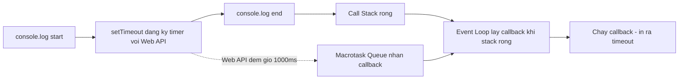

## Mục lục

- [Bối cảnh: spinner không hiện & thứ tự log sai](#1-bối-cảnh-spinner-không-hiện--thứ-tự-log-sai)
- [Kiến trúc tổng quan — các thành phần của runtime](#2-kiến-trúc-tổng-quan--các-thành-phần-của-runtime)
- [Call Stack & Execution Context internals](#3-call-stack--execution-context-internals)
- [Single-threaded & non-blocking — Web APIs offload](#4-single-threaded--non-blocking--web-apis-offload)
- [Macrotask Queue (Task Queue)](#5-macrotask-queue-task-queue)
- [Microtask Queue — Promise, queueMicrotask](#6-microtask-queue--promise-queuemicrotask)
- [Thuật toán Event Loop theo HTML spec](#7-thuật-toán-event-loop-theo-html-spec)
- [Rendering & requestAnimationFrame](#8-rendering--requestanimationframe)
- [setTimeout(fn, 0) — sự thật về 4ms clamping](#9-settimeoutfn-0--sự-thật-về-4ms-clamping)
- [Trace table — dự đoán thứ tự output](#10-trace-table--dự-đoán-thứ-tự-output)
- [async / await dưới capo — desugar thành microtask](#11-async--await-dưới-capo--desugar-thành-microtask)
- [Node.js Event Loop — libuv phases](#12-nodejs-event-loop--libuv-phases)
- [process.nextTick vs Promise microtask](#13-processnexttick-vs-promise-microtask)
- [setImmediate vs setTimeout trong Node](#14-setimmediate-vs-settimeout-trong-node)
- [Browser vs Node — bảng khác biệt](#15-browser-vs-node--bảng-khác-biệt)
- [Microtask starvation — đói macrotask & render](#16-microtask-starvation--đói-macrotask--render)
- [Anti-patterns & Production Pitfalls](#17-anti-patterns--production-pitfalls)
- [Tóm tắt — Cheat sheet & 7 nguyên tắc](#18-tóm-tắt--cheat-sheet--7-nguyên-tắc)

---

## 1. Bối cảnh: spinner không hiện & thứ tự log sai

Một dev viết đoạn xử lý nút "Tính toán": bật spinner, chạy vòng lặp nặng, rồi tắt spinner.

```js
button.addEventListener('click', () => {
  spinner.style.display = 'block';   // (1) muốn hiện spinner ngay

  let total = 0;
  for (let i = 0; i < 2_000_000_000; i++) total += i;   // (2) loop nặng ~vài giây

  spinner.style.display = 'none';    // (3) ẩn spinner
  result.textContent = total;
});
```

Triệu chứng: **spinner không bao giờ hiện ra**, trang đơ vài giây rồi kết quả nhảy ra. Dù `display = 'block'` đứng trước vòng lặp.

Nguyên nhân: JS chạy **single-threaded** trên cùng một thread với rendering. Dòng `(1)` chỉ **đánh dấu** DOM là "cần repaint" chứ chưa vẽ. Trình duyệt chỉ repaint **giữa các lần lặp của event loop** — nhưng cả callback `click` (gồm cả vòng lặp nặng) là **một task duy nhất**, chạy liền mạch trên call stack. Trình duyệt không có cơ hội render cho tới khi stack rỗng. Lúc đó `display` đã quay về `'none'` ở `(3)`.

Cùng nhóm bug là câu hỏi phỏng vấn kinh điển — đoạn này in ra gì, theo thứ tự nào?

```js
console.log('A');
setTimeout(() => console.log('B'), 0);
Promise.resolve().then(() => console.log('C'));
console.log('D');
```

Trả lời sai phổ biến: `A B C D` hoặc `A D B C`. Đáp án đúng: **`A D C B`**. Để giải thích được *tại sao*, ta cần mổ xẻ từng thành phần của runtime.

> [!IMPORTANT]
> Event Loop là cơ chế cho phép JS **single-threaded** vẫn xử lý được tác vụ bất đồng bộ mà không block. Hiểu sai nó dẫn tới UI đơ, thứ tự thực thi sai, race condition logic, và memory/CPU bị "đói". Mọi thứ async — `setTimeout`, `fetch`, Promise, `async/await`, event handler — cuối cùng đều đi qua event loop.

---

## 2. Kiến trúc tổng quan — các thành phần của runtime

JS engine (V8, SpiderMonkey...) **chỉ** cung cấp Call Stack + Heap + bộ thực thi. Những thứ async (`setTimeout`, DOM event, `fetch`) **không thuộc** engine — chúng do **môi trường host** (trình duyệt qua Web APIs, hoặc Node qua libuv) cung cấp. Event loop là cầu nối.

```
            ┌──────────────────────────────────────────────────────────┐
            │                    JS Engine (V8)                          │
            │   ┌───────────────┐         ┌──────────────────────────┐   │
            │   │   Call Stack  │         │           Heap           │   │
            │   │  ┌─────────┐  │         │  (objects, closures...)  │   │
            │   │  │ frame   │  │         └──────────────────────────┘   │
            │   │  ├─────────┤  │                                        │
            │   │  │ frame   │  │                                        │
            │   │  └─────────┘  │                                        │
            │   └───────┬───────┘                                        │
            └───────────┼────────────────────────────────────────────── ┘
                        │ stack rỗng?
                        ▼
       ┌───────────────────────────┐        đẩy callback        ┌──────────────────────┐
       │        EVENT LOOP         │◀───────────────────────────│   Host environment   │
       │  while(true):             │                            │  (Browser Web APIs / │
       │   1. lấy 1 macrotask      │     timer xong / I/O xong  │   Node libuv)        │
       │   2. drain HẾT microtask  │                            │  - Timer (setTimeout)│
       │   3. render (nếu cần)     │                            │  - fetch / XHR       │
       └───────────┬───────────────┘                            │  - DOM events        │
                   │                                            └──────────┬───────────┘
        lấy task   │                                                       │
                   ▼                                                       ▼
   ┌───────────────────────────┐                          ┌───────────────────────────┐
   │   Microtask Queue (FIFO)  │  ◀── ưu tiên drain HẾT   │   Macrotask Queue (FIFO)  │
   │  Promise.then / await /   │      trước mỗi macrotask  │  setTimeout / setInterval │
   │  queueMicrotask / MO      │                          │  I/O, UI event, message   │
   └───────────────────────────┘                          └───────────────────────────┘
```

| Thành phần | Vai trò |
|------------|---------|
| **Call Stack** | Ngăn xếp các execution context đang chạy. Engine chỉ làm việc khi có frame trên stack. |
| **Heap** | Vùng nhớ cấp phát động cho object, closure. |
| **Web APIs / libuv** | Host cung cấp; xử lý timer, network, I/O *song song* với engine. |
| **Macrotask Queue** | Hàng đợi task: `setTimeout`, `setInterval`, I/O callback, UI event. |
| **Microtask Queue** | Hàng đợi microtask: Promise reaction, `await` continuation, `queueMicrotask`, `MutationObserver`. |
| **Event Loop** | Vòng lặp điều phối: khi stack rỗng, lấy task → chạy → drain microtask → render. |

---

## 3. Call Stack & Execution Context internals

Mỗi lần gọi hàm, engine tạo một **execution context** và push thành một frame lên Call Stack. Khi hàm return, frame bị pop.

```js
function multiply(a, b) { return a * b; }
function square(n)      { return multiply(n, n); }
function printSquare(n) { const s = square(n); console.log(s); }
printSquare(5);
```

Diễn biến stack (đáy → đỉnh):

```
push printSquare(5)
        push square(5)
                push multiply(5,5)  → return 25, pop
        return 25, pop square
        push console.log(25) → pop
return, pop printSquare
→ stack rỗng
```

Điểm cốt lõi: **engine chỉ chạy đúng một thứ tại một thời điểm** (single-threaded). Bao lâu stack còn frame, event loop **không** thể lấy task mới. Đây chính là lý do vòng lặp nặng ở phần 1 chặn mọi thứ — call stack không bao giờ rỗng trong suốt vòng lặp.

> [!NOTE]
> "Blocking" = một frame chiếm call stack quá lâu. `JSON.parse` file lớn, vòng lặp triệu phần tử, `alert()` đều block. Cách thoát: chia nhỏ công việc bằng `setTimeout`/`queueMicrotask`/`requestIdleCallback`, hoặc đẩy sang **Web Worker** (thread riêng).

---

## 4. Single-threaded & non-blocking — Web APIs offload

Nghịch lý: JS single-threaded nhưng `setTimeout`, `fetch` không block. Bí mật là callback async **không chạy trên engine** trong lúc chờ — chúng được host xử lý song song.

```js
console.log('start');
setTimeout(() => console.log('timeout'), 1000);
console.log('end');
// start → end → (sau ~1s) timeout
```

Diễn biến:



`setTimeout` chỉ **đăng ký** timer với Web API rồi return ngay (non-blocking). Web API đếm giờ trên một thread khác của trình duyệt. Khi hết giờ, nó **không** chạy callback trực tiếp — mà đẩy callback vào **Macrotask Queue**, chờ event loop lấy ra khi stack rỗng.

---

## 5. Macrotask Queue (Task Queue)

Macrotask (spec gọi là **task**) là đơn vị công việc lớn. Mỗi vòng lặp event loop xử lý **đúng 1 macrotask**, rồi mới drain microtask và (có thể) render.

Nguồn tạo macrotask:

| Nguồn | Ghi chú |
|-------|---------|
| `setTimeout` / `setInterval` | Sau khi timer hết hạn. |
| `setImmediate` (Node, IE) | Chạy ở phase `check`. |
| `MessageChannel` / `postMessage` | Macrotask độ trễ thấp. |
| UI events (click, scroll, input) | Mỗi event là một task. |
| I/O callback (network, fs) | Khi I/O hoàn tất. |

> [!IMPORTANT]
> Có thể có **nhiều task queue** với độ ưu tiên khác nhau (spec cho phép). Ví dụ trình duyệt thường ưu tiên user-interaction queue hơn timer queue. Nhưng quy tắc vàng vẫn là: **1 macrotask → drain hết microtask → render**.

---

## 6. Microtask Queue — Promise, queueMicrotask

Microtask là tác vụ "nhỏ, gấp", có **độ ưu tiên cao hơn** macrotask. Sau **mỗi** macrotask (và sau khi script đồng bộ ban đầu chạy xong), event loop **drain SẠCH** microtask queue trước khi làm bất cứ điều gì khác.

Nguồn tạo microtask:

| Nguồn | Ghi chú |
|-------|---------|
| `Promise.then / catch / finally` | Reaction được enqueue khi promise settle. |
| `await` (continuation sau await) | Bản chất là `.then` ngầm. |
| `queueMicrotask(fn)` | API tường minh để enqueue microtask. |
| `MutationObserver` | Callback quan sát DOM. |

Khác biệt sống còn so với macrotask: **microtask sinh ra trong lúc drain cũng được xử lý ngay trong cùng lần drain đó** — vòng drain chỉ dừng khi queue *thực sự rỗng*. Macrotask thì không: task mới sinh ra phải chờ vòng lặp sau.

```js
console.log('script start');
setTimeout(() => console.log('setTimeout'), 0);     // macrotask
Promise.resolve()
  .then(() => console.log('promise 1'))             // microtask
  .then(() => console.log('promise 2'));            // microtask (sinh trong drain)
console.log('script end');
// script start → script end → promise 1 → promise 2 → setTimeout
```

`promise 2` (sinh ra khi `promise 1` chạy) vẫn được drain **trước** `setTimeout`, dù `setTimeout(0)` đã sẵn sàng từ sớm. Vì drain microtask phải vét sạch trước khi chạm tới macrotask kế tiếp.

---

## 7. Thuật toán Event Loop theo HTML spec

Bản chất event loop là một vòng `while` vô hạn. Pseudocode sát với [HTML Living Standard](https://html.spec.whatwg.org/multipage/webappapis.html#event-loops):

```text
while (true) {
  // 1. Lấy MỘT macrotask cũ nhất đã sẵn sàng (nếu có)
  task = oldestReadyTask(macrotaskQueues)
  if (task) run(task)            // chạy tới khi call stack rỗng

  // 2. Drain TOÀN BỘ microtask queue (kể cả microtask sinh thêm)
  while (!microtaskQueue.isEmpty()) {
    micro = microtaskQueue.dequeue()
    run(micro)
  }

  // 3. (chỉ trong browser) cập nhật rendering nếu tới nhịp
  if (timeToRender()) {
    runAnimationFrameCallbacks()   // requestAnimationFrame
    style(); layout(); paint()
  }

  // 4. (nếu không còn việc) ngủ chờ task mới — không busy-loop
}
```

Ba bất biến cần nhớ:

1. **Script đồng bộ ban đầu** = macrotask đầu tiên. Chạy xong nó mới drain microtask lần đầu → đó là lý do `Promise.then` luôn sau toàn bộ code đồng bộ.
2. Giữa hai macrotask **luôn** có một lần drain microtask sạch sẽ.
3. Render **không** xen vào giữa microtask; render chỉ xảy ra sau khi microtask đã rỗng.

---

## 8. Rendering & requestAnimationFrame

Trong trình duyệt, repaint là một bước riêng trong event loop, thường nhịp ~60fps (mỗi ~16.7ms). Thứ tự trong một "frame":

```
[macrotask] → [drain microtasks] → [requestAnimationFrame callbacks] → [style → layout → paint]
```

`requestAnimationFrame(cb)` đăng ký `cb` chạy **ngay trước lần paint kế tiếp** — đúng nơi để cập nhật animation mượt.

```js
console.log('sync');
requestAnimationFrame(() => console.log('rAF'));
Promise.resolve().then(() => console.log('microtask'));
setTimeout(() => console.log('macrotask'), 0);
// sync → microtask → (thường) rAF → ... → macrotask
// rAF chạy trước paint; macrotask timer thường xếp sau frame hiện tại
```

> [!TIP]
> Quay lại bug spinner ở phần 1: fix bằng cách trả quyền điều khiển về event loop để trình duyệt kịp paint spinner *trước khi* chạy phần nặng — ví dụ bọc phần nặng trong `setTimeout(heavy, 0)` (hoặc tốt hơn: `requestAnimationFrame` rồi mới chạy phần nặng ở task sau, hoặc đẩy hẳn sang Web Worker).

---

## 9. setTimeout(fn, 0) — sự thật về 4ms clamping

`setTimeout(fn, 0)` **không** chạy ngay và **không** thực sự 0ms:

- Nó chỉ enqueue một macrotask — phải chờ stack rỗng **và** drain hết microtask.
- Theo spec HTML, khi nesting level > 5, delay tối thiểu bị **clamp về 4ms**. Background tab còn bị throttle nặng hơn (≥1000ms).

```js
let count = 0, start = Date.now();
function tick() {
  if (++count >= 5) { console.log(Date.now() - start, 'ms cho 5 lần'); return; }
  setTimeout(tick, 0);   // mỗi lần lồng sâu hơn → bị clamp ~4ms
}
setTimeout(tick, 0);     // thực tế ~16-20ms chứ không phải 0
```

Muốn "macrotask càng sớm càng tốt" mà tránh clamp 4ms, dùng `MessageChannel`:

```js
const { port1, port2 } = new MessageChannel();
function scheduleMacrotask(fn) { port1.onmessage = fn; port2.postMessage(null); }
```

---

## 10. Trace table — dự đoán thứ tự output

Ráp mọi thứ vào ví dụ ở phần 1:

```js
console.log('A');                                   // sync
setTimeout(() => console.log('B'), 0);              // macrotask
Promise.resolve().then(() => console.log('C'));     // microtask
console.log('D');                                   // sync
```

| Bước | Hành động | Call Stack | Microtask Q | Macrotask Q | Output |
|------|-----------|-----------|-------------|-------------|--------|
| 1 | chạy script (macrotask #1) | `log('A')` | — | — | A |
| 2 | đăng ký timer | — | — | `[B]` | A |
| 3 | `Promise.resolve().then` | — | `[C]` | `[B]` | A |
| 4 | `log('D')` | `log('D')` | `[C]` | `[B]` | A D |
| 5 | script xong → **drain microtask** | `log('C')` | `[]` | `[B]` | A D C |
| 6 | render (nếu cần) | — | `[]` | `[B]` | A D C |
| 7 | lấy macrotask kế → chạy B | `log('B')` | `[]` | `[]` | A D C B |

→ **`A D C B`**. Quy tắc rút ra: **sync → microtask → macrotask**.

Một ví dụ khó hơn trộn `async/await`:

```js
async function f() {
  console.log(1);
  await null;          // tạm dừng, phần sau thành microtask
  console.log(2);
}
console.log(3);
f();
console.log(4);
Promise.resolve().then(() => console.log(5));
// 3 → 1 → 4 → 2 → 5
```

`console.log(1)` chạy đồng bộ (phần trước `await`). Gặp `await`, `f` nhả call stack, phần sau (`console.log(2)`) được lên lịch microtask. Code đồng bộ chạy tiếp: `4`. Sau đó drain microtask theo thứ tự enqueue: `2` (enqueue trước) rồi `5`.

---

## 11. async / await dưới capo — desugar thành microtask

`await` không phải phép màu — nó là cú pháp đường trên Promise. Trình biên dịch biến hàm `async` thành state machine, mỗi `await` chia hàm thành các đoạn nối bằng `.then`.

```js
async function g() {
  const a = await fetchA();
  const b = await fetchB(a);
  return a + b;
}
```

tương đương (đơn giản hoá):

```js
function g() {
  return fetchA().then((a) =>
    fetchB(a).then((b) => a + b)
  );
}
```

Hệ quả thực chiến:

- Phần code **trước** `await` đầu tiên chạy **đồng bộ** (cùng task với caller).
- Mọi thứ **sau** mỗi `await` là **microtask** (continuation), nên luôn chạy trước macrotask đang chờ.
- `await` một giá trị không-Promise (vd `await 5`) vẫn tốn **một** vòng microtask — không miễn phí.

> [!WARNING]
> `await` trong vòng lặp tuần tự hoá các tác vụ độc lập, làm chậm gấp N lần:
> ```js
> // CHẬM: tuần tự
> for (const id of ids) results.push(await fetch(id));
> // NHANH: song song
> const results = await Promise.all(ids.map((id) => fetch(id)));
> ```

---

## 12. Node.js Event Loop — libuv phases

Trong Node, event loop do **libuv** cài đặt và phức tạp hơn trình duyệt: macrotask được chia thành nhiều **phase**, chạy theo vòng. Mỗi phase có queue riêng.

```
   ┌───────────────────────────┐
┌─▶│           timers          │  callback của setTimeout / setInterval đã hết hạn
│  └─────────────┬─────────────┘
│  ┌─────────────▼─────────────┐
│  │     pending callbacks     │  một số callback I/O bị hoãn từ vòng trước
│  └─────────────┬─────────────┘
│  ┌─────────────▼─────────────┐
│  │       idle, prepare       │  (nội bộ)
│  └─────────────┬─────────────┘
│  ┌─────────────▼─────────────┐      ┌───────────────┐
│  │           poll            │◀────▶│  I/O đến / chờ │  lấy I/O event, chạy callback
│  └─────────────┬─────────────┘      └───────────────┘
│  ┌─────────────▼─────────────┐
│  │           check           │  callback của setImmediate()
│  └─────────────┬─────────────┘
│  ┌─────────────▼─────────────┐
└──┤      close callbacks      │  vd socket.on('close', ...)
   └───────────────────────────┘
```

> [!IMPORTANT]
> Điểm mấu chốt giống browser: **giữa mỗi callback** (và giữa các phase), Node **drain toàn bộ microtask** — gồm `process.nextTick` queue (ưu tiên cao nhất) rồi Promise queue. Vì thế Promise vẫn luôn chạy trước macrotask phase kế tiếp.

---

## 13. process.nextTick vs Promise microtask

Node có **hai** hàng microtask, drain theo thứ tự ưu tiên sau mỗi thao tác:

1. `process.nextTick` queue — **ưu tiên cao nhất**, drain trước.
2. Promise microtask queue — drain sau.

```js
Promise.resolve().then(() => console.log('promise'));
process.nextTick(() => console.log('nextTick'));
// nextTick → promise
```

> [!WARNING]
> `process.nextTick` đệ quy vô hạn sẽ **chặn vĩnh viễn** event loop bước sang phase khác (kể cả timers, I/O) — vì nextTick queue luôn được vét sạch trước. Đây là dạng starvation nguy hiểm trong Node.

---

## 14. setImmediate vs setTimeout trong Node

```js
setTimeout(() => console.log('timeout'), 0);
setImmediate(() => console.log('immediate'));
```

Thứ tự **không xác định** nếu gọi ở top-level (phụ thuộc thời điểm vào loop, độ phân giải timer). Nhưng **bên trong một I/O callback** thì xác định: `setImmediate` (phase `check`) **luôn** chạy trước `setTimeout` (phase `timers` của vòng kế).

```js
const fs = require('fs');
fs.readFile(__filename, () => {
  setTimeout(() => console.log('timeout'), 0);
  setImmediate(() => console.log('immediate'));
});
// luôn: immediate → timeout
```

Vì callback của `readFile` chạy ở phase `poll`; ngay sau `poll` là `check` (setImmediate), còn `timers` phải chờ vòng sau.

---

## 15. Browser vs Node — bảng khác biệt

| Khía cạnh | Browser | Node.js |
|-----------|---------|---------|
| Cài đặt | Web APIs của trình duyệt | libuv |
| Macrotask | một task queue (nhiều queue logic theo nguồn) | chia thành **phases** (timers/poll/check/close) |
| Microtask hàng đầu | chỉ Promise/queueMicrotask/MutationObserver | `process.nextTick` (ưu tiên) **rồi** Promise |
| `setImmediate` | không (non-standard) | có — phase `check` |
| Render step | có (`requestAnimationFrame`, paint) | không có |
| Timer tối thiểu | clamp 4ms (nesting), throttle background | không clamp 4ms |

---

## 16. Microtask starvation — đói macrotask & render

Vì event loop **phải vét sạch microtask** trước khi chạm macrotask hoặc render, một microtask tự sinh microtask vô hạn sẽ **đóng băng** mọi thứ:

```js
function flood() {
  Promise.resolve().then(flood);   // mỗi microtask lại enqueue microtask mới
}
flood();
setTimeout(() => console.log('không bao giờ chạy'), 0);  // bị bỏ đói
```

Microtask queue không bao giờ rỗng → event loop không bao giờ tới được macrotask hay bước render → tab treo, dù CPU vẫn "bận".

> [!TIP]
> Khi cần xử lý lượng lớn việc theo từng mảnh mà vẫn cho UI thở, hãy dùng **macrotask** (`setTimeout`/`MessageChannel`) hoặc `requestIdleCallback` để chia lô, **không** dùng microtask đệ quy.

---

## 17. Anti-patterns & Production Pitfalls

| Anti-pattern | Hậu quả | Cách đúng |
|--------------|---------|-----------|
| Loop nặng trong event handler | UI đơ, không paint | Chia lô qua `setTimeout`/`rAF`, hoặc Web Worker |
| `await` tuần tự việc độc lập | Chậm gấp N lần | `Promise.all` chạy song song |
| Microtask đệ quy (`then` tự gọi) | Starvation, treo tab | Dùng macrotask để chia lô |
| `process.nextTick` đệ quy (Node) | Chặn timers & I/O | Dùng `setImmediate`/`setTimeout` |
| Tin `setTimeout(0)` chạy ngay/đúng 0ms | Sai timing, clamp 4ms | Hiểu macrotask; cần sớm thì `MessageChannel` |
| Cập nhật DOM rồi đo layout trong cùng task | Layout cũ / forced reflow | Đo trong `requestAnimationFrame` kế tiếp |
| Quên `await`/quên `return` trong chain | Lỗi bị nuốt, race | Luôn return Promise, `await` đúng chỗ |
| `try/catch` không bọc được lỗi async trong callback | Crash ngoài ý muốn | Dùng `async/await` + `try/catch`, hoặc `.catch` |

---

## 18. Tóm tắt — Cheat sheet & 7 nguyên tắc

**Thứ tự thực thi trong một vòng (browser):**

```
[1 macrotask] → [drain HẾT microtask] → [rAF callbacks] → [style/layout/paint]
```

**Phân loại nhanh:**

| Loại | Ví dụ | Khi nào chạy |
|------|-------|--------------|
| Sync | code thường, phần trước `await` đầu | ngay lập tức trên call stack |
| Microtask | `Promise.then`, `await` continuation, `queueMicrotask` | sau sync, trước mọi macrotask |
| Macrotask | `setTimeout`, I/O, UI event, `setImmediate` | một cái mỗi vòng, sau khi microtask rỗng |
| rAF | `requestAnimationFrame` | ngay trước paint |

**7 nguyên tắc:**

1. JS **single-threaded**: một thời điểm chỉ một thứ chạy trên call stack — đừng block nó.
2. Async không "đa luồng JS"; host (Web API/libuv) làm việc song song rồi **đẩy callback vào queue**.
3. **Sync chạy hết → drain microtask → mới tới macrotask.** Nhớ là ra đúng thứ tự.
4. Microtask được **vét sạch** (kể cả cái sinh thêm) trước mỗi macrotask & trước render.
5. `await` = `.then` ngầm: phần sau `await` là microtask; trước `await` đầu là sync.
6. `setTimeout(0)` ≠ 0ms (clamp 4ms); cần macrotask sớm thì dùng `MessageChannel`.
7. Node có thêm **phases** + `process.nextTick` ưu tiên hơn Promise — đừng để nextTick/microtask đệ quy gây starvation.

<Cards>
  <Card title="Promises" href="/async/promises/" />
  <Card title="async / await" href="/async/async-await/" />
  <Card title="Callbacks & Callback Hell" href="/async/callbacks/" />
  <Card title="Web Workers" href="/advanced/web-workers/" />
</Cards>
