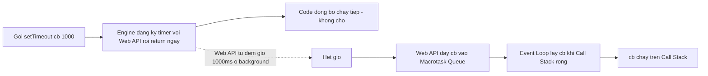

## Mục lục

- [Bắt đầu từ trực giác: quán ăn một đầu bếp](#bắt-đầu-từ-trực-giác-quán-ăn-một-đầu-bếp)
- [Hai câu hỏi mở đầu](#hai-câu-hỏi-mở-đầu)
- [JS single-threaded nghĩa là gì? — Call Stack](#js-single-threaded-nghĩa-là-gì--call-stack)
- [Vì sao single-thread vẫn không block? — Web APIs offload](#vì-sao-single-thread-vẫn-không-block--web-apis-offload)
- [Hai hàng đợi: Macrotask vs Microtask](#hai-hàng-đợi-macrotask-vs-microtask)
- [Event Loop chạy ra sao — thuật toán 4 bước](#event-loop-chạy-ra-sao--thuật-toán-4-bước)
- [Mổ xẻ ví dụ A D C B — trace từng bước](#mổ-xẻ-ví-dụ-a-d-c-b--trace-từng-bước)
- [Microtask sinh ra microtask — quy tắc "vét sạch"](#microtask-sinh-ra-microtask--quy-tắc-vét-sạch)
- [async / await dưới mui xe](#async--await-dưới-mui-xe)
- [Rendering & requestAnimationFrame — fix bug spinner](#rendering--requestanimationframe--fix-bug-spinner)
- [setTimeout(fn, 0) — sự thật về 4ms clamping](#settimeoutfn-0--sự-thật-về-4ms-clamping)
- [Node.js Event Loop — libuv phases](#nodejs-event-loop--libuv-phases)
- [Browser vs Node — bảng khác biệt](#browser-vs-node--bảng-khác-biệt)
- [Microtask starvation — đói macrotask & render](#microtask-starvation--đói-macrotask--render)
- [Anti-patterns & Production Pitfalls](#anti-patterns--production-pitfalls)
- [Tự kiểm tra — dự đoán output](#tự-kiểm-tra--dự-đoán-output)
- [Tóm tắt — Cheat sheet & nguyên tắc vàng](#tóm-tắt--cheat-sheet--nguyên-tắc-vàng)

---

## Bắt đầu từ trực giác: quán ăn một đầu bếp

Trước khi đụng tới thuật ngữ, hãy tưởng tượng một **quán ăn chỉ có đúng một đầu bếp**. Đó chính là JavaScript: **single-threaded** — một thời điểm chỉ làm được đúng một việc.

Đầu bếp làm việc theo nguyên tắc:

- Có **một tờ order đang cầm trên tay** → nấu cho xong mới bỏ xuống. → đây là **Call Stack**.
- Món nào cần **chờ lâu** (hầm xương 1 tiếng, nướng 20 phút) thì đầu bếp **không đứng nhìn nồi**. Anh ta giao cho **lò/nồi tự chạy**, rồi quay sang làm món khác. → host (**Web APIs / libuv**) xử lý song song.
- Khi lò kêu "xong rồi!", order đó **không chen ngang** món đang nấu. Nó được **xếp vào hàng chờ**, đợi đầu bếp rảnh tay mới lấy ra làm tiếp. → **Task Queue**.
- Có loại việc **gấp, làm cực nhanh** (rắc thêm muối, đảo qua chảo) — đầu bếp ưu tiên làm hết những việc gấp này **ngay sau khi xong món hiện tại**, trước khi bốc order mới từ hàng chờ. → **Microtask**.

> [!IMPORTANT]
> **Mô hình cần nhớ:** JS không tự "đa luồng". Nó chỉ có **một đầu bếp** (một luồng chạy code). Cái khiến nó xử lý được nhiều việc bất đồng bộ là: **giao việc chờ cho host làm song song**, rồi dùng **Event Loop** để lần lượt nhặt kết quả về xử lý khi rảnh tay.

Giữ hình ảnh quán ăn này trong đầu — phần còn lại của bài chỉ là gọi đúng tên từng thứ và xem JS làm y hệt như vậy.

---

## Hai câu hỏi mở đầu

Hai đoạn code dưới đây là lý do thực tế khiến ta phải hiểu Event Loop. Đọc xong bài bạn sẽ giải thích được cả hai một cách tự tin.

**Câu hỏi 1 — Vì sao spinner không hiện?** Một dev xử lý nút "Tính toán": bật spinner, chạy vòng lặp nặng, rồi tắt spinner.

```js
button.addEventListener('click', () => {
  spinner.style.display = 'block';   // (1) muốn hiện spinner ngay
  let total = 0;
  for (let i = 0; i < 2_000_000_000; i++) total += i;   // (2) loop nặng ~vài giây
  spinner.style.display = 'none';    // (3) ẩn spinner
  result.textContent = total;
});
```

Triệu chứng: **spinner không bao giờ hiện ra**, trang đơ vài giây rồi kết quả nhảy ra — dù `display = 'block'` rõ ràng đứng *trước* vòng lặp.

**Câu hỏi 2 — In ra gì, theo thứ tự nào?**

```js
console.log('A');
setTimeout(() => console.log('B'), 0);
Promise.resolve().then(() => console.log('C'));
console.log('D');
```

Trả lời sai phổ biến: `A B C D` hoặc `A D B C`. Đáp án đúng là **`A D C B`**.

> [!WARNING]
> Cả hai "bug" này đều bắt nguồn từ cùng một điều: hiểu sai cách JS sắp xếp thứ tự thực thi. Hiểu đúng Event Loop giúp tránh UI đơ, thứ tự log sai, race condition logic, và CPU/UI bị "đói".

---

## JS single-threaded nghĩa là gì? — Call Stack

**Call Stack** là tờ order trong tay đầu bếp: một ngăn xếp (stack) ghi lại "đang chạy hàm nào, gọi từ đâu". Mỗi lần gọi hàm, engine tạo một **execution context** và **push** nó lên đỉnh stack. Hàm `return` thì **pop** ra.

```js
function multiply(a, b) { return a * b; }
function square(n)      { return multiply(n, n); }
function printSquare(n) { const s = square(n); console.log(s); }
printSquare(5);
```

Diễn biến stack (đỉnh ở trên, đáy ở dưới):

```text
(1) push    (2) push      (3) push & pop     (4) pop dần     (5) xong
                         multiply(5,5)→25
            square(5)    square(5)          → 25
printSquare printSquare  printSquare        printSquare      → stack rỗng
─────────────────────────────────────────────────────────────────────────
```

Hai hệ quả cực kỳ quan trọng:

1. **Chỉ một frame chạy tại một thời điểm.** Đây chính là "single-threaded" — engine không thể vừa chạy hàm này vừa chạy hàm khác.
2. **Bao lâu stack còn frame, không gì khác chen vào được** — kể cả render, kể cả callback đã sẵn sàng. Event loop chỉ lấy việc mới khi stack **rỗng**.

Đây là lý do vòng lặp nặng ở Câu hỏi 1 làm đơ trang: callback `click` là một frame **chiếm call stack suốt vài giây**, nên trình duyệt không có một khe nào để repaint.

> [!CAUTION]
> **"Blocking" là gì?** Blocking = một frame chiếm call stack quá lâu. Thủ phạm điển hình: vòng lặp triệu phần tử, `JSON.parse` file lớn, `alert()`. Cách thoát: chia nhỏ công việc (`setTimeout` / `queueMicrotask` / `requestIdleCallback`) hoặc đẩy hẳn sang **Web Worker** (một luồng thật sự khác).

> [!NOTE]
> Gọi hàm đệ quy quá sâu làm stack đầy → `RangeError: Maximum call stack size exceeded`. Đó là khi "tờ order chồng cao quá giới hạn".

---

## Vì sao single-thread vẫn không block? — Web APIs offload

Nghịch lý: JS chỉ một luồng, nhưng `setTimeout`, `fetch`, đọc file... **không** làm đơ trang. Bí mật nằm ở chỗ: **những việc chờ đó không do engine làm.**

JS engine (V8, SpiderMonkey...) thật ra **chỉ** có Call Stack + Heap. Những thứ async — timer, network, DOM event — do **môi trường host** cung cấp:

- Trên trình duyệt: **Web APIs** (timer, `fetch`/XHR, DOM events...).
- Trên Node.js: thư viện **libuv**.



Xem ví dụ kinh điển:

```js
console.log('start');
setTimeout(() => console.log('timeout'), 1000);
console.log('end');
// start → end → (sau ~1s) timeout
```

Diễn biến đúng theo mô hình quán ăn:

1. **`console.log('start')`** — chạy ngay trên call stack → in `start`.
2. **`setTimeout(..., 1000)`** — đầu bếp *giao việc đếm giờ cho Web API* rồi return ngay lập tức (non-blocking). Web API tự đếm 1000ms ở "background", engine không chờ.
3. **`console.log('end')`** — vì không phải chờ, code đồng bộ chạy tiếp → in `end`. Call stack rỗng.
4. **Sau ~1s, callback vào hàng chờ** — Web API đếm xong *không tự chạy* callback, nó đẩy callback vào **Macrotask Queue**. Event Loop thấy stack rỗng → lấy ra chạy → in `timeout`.

> [!IMPORTANT]
> **Mấu chốt:** `setTimeout` chỉ **đăng ký** lịch rồi return. Callback **không bao giờ chen ngang** code đang chạy — nó luôn phải đi qua hàng chờ và đợi Event Loop. Vì vậy `timeout` luôn in *sau* `end`, kể cả khi delay là `0`.

---

## Hai hàng đợi: Macrotask vs Microtask

Đây là phần hay nhầm nhất. Có **hai** loại hàng chờ, và microtask **luôn được ưu tiên** hơn.

### Macrotask (task) — "order mới từ hàng chờ"

Đơn vị công việc lớn. Event loop mỗi vòng chỉ lấy **đúng 1 macrotask**.

| Nguồn tạo macrotask | Ghi chú |
|---------------------|---------|
| `setTimeout` / `setInterval` | Sau khi timer hết hạn |
| `setImmediate` (Node) | Chạy ở phase `check` |
| `MessageChannel` / `postMessage` | Macrotask độ trễ thấp |
| UI events (click, scroll, input) | Mỗi event là một task |
| I/O callback (network, fs) | Khi I/O hoàn tất |

### Microtask — "việc gấp làm liền tay"

Tác vụ nhỏ, ưu tiên cao. Sau **mỗi** macrotask (và ngay sau khi script đồng bộ ban đầu chạy xong), event loop **vét SẠCH** toàn bộ microtask queue rồi mới làm việc khác.

| Nguồn tạo microtask | Ghi chú |
|---------------------|---------|
| `Promise.then / catch / finally` | Enqueue khi promise settle |
| `await` (phần sau `await`) | Bản chất là `.then` ngầm |
| `queueMicrotask(fn)` | API tường minh |
| `MutationObserver` | Callback quan sát DOM |

> [!WARNING]
> **Khác biệt sống còn:** microtask được ưu tiên tuyệt đối so với macrotask. Dù `setTimeout(0)` đã sẵn sàng từ lâu, mọi microtask đang chờ vẫn chạy *trước*. Hãy nhớ một câu duy nhất: **sync → microtask → macrotask**.

---

## Event Loop chạy ra sao — thuật toán 4 bước

Event Loop bản chất là một vòng `while (true)` chạy mãi. Bốn bước mỗi vòng (sát với [HTML Living Standard](https://html.spec.whatwg.org/multipage/webappapis.html#event-loops)):

1. **Lấy 1 macrotask** — chọn *một* macrotask cũ nhất đã sẵn sàng, chạy nó tới khi call stack rỗng. (Lần đầu tiên, chính *script đồng bộ ban đầu* được coi là macrotask #1.)
2. **Drain HẾT microtask** — vét sạch microtask queue, chạy lần lượt tới khi *rỗng hoàn toàn*. Microtask sinh thêm trong lúc này cũng bị vét luôn trong cùng lượt.
3. **Render (chỉ browser)** — nếu tới nhịp (~60fps), chạy `requestAnimationFrame` callbacks → `style → layout → paint`. Render *không* xen vào giữa microtask.
4. **Quay lại bước 1** — hết việc thì "ngủ" chờ task mới (không busy-loop), có việc thì lặp lại.

```text
   ┌──────────────────────────────────────────────────────────┐
   │  while (true):                                             │
   │    1. task = lấy 1 macrotask cũ nhất đã sẵn sàng           │
   │       run(task)               // chạy tới khi stack rỗng   │
   │    2. while (microtask queue chưa rỗng)                    │
   │         run(microtask)        // vét SẠCH, kể cả cái mới   │
   │    3. if (tới nhịp render) → rAF callbacks; paint          │
   │    4. (hết việc thì ngủ chờ)                               │
   └──────────────────────────────────────────────────────────┘
```

Ba bất biến rút ra từ thuật toán này — học thuộc là giải được mọi câu đố:

1. **Script đồng bộ ban đầu chạy hết trước tiên** (nó là macrotask đầu). Vì vậy `Promise.then` luôn nằm *sau* toàn bộ code đồng bộ.
2. **Giữa hai macrotask luôn có một lần vét sạch microtask.**
3. **Render chỉ xảy ra khi microtask đã rỗng** — không bao giờ chen vào giữa.

---

## Mổ xẻ ví dụ A D C B — trace từng bước

Giờ ta giải Câu hỏi 2 ở đầu bài bằng cách lập bảng trạng thái sau mỗi dòng:

```js
console.log('A');                                // sync
setTimeout(() => console.log('B'), 0);           // macrotask
Promise.resolve().then(() => console.log('C'));  // microtask
console.log('D');                                // sync
```

| Bước | Hành động | Call Stack | Microtask Q | Macrotask Q | Output |
|------|-----------|-----------|-------------|-------------|--------|
| 1 | chạy script (macrotask #1) | `log('A')` | — | — | `A` |
| 2 | đăng ký timer (giao Web API) | — | — | `[B]` | `A` |
| 3 | `Promise.resolve().then` | — | `[C]` | `[B]` | `A` |
| 4 | `log('D')` | `log('D')` | `[C]` | `[B]` | `A D` |
| 5 | script xong → **drain microtask** | `log('C')` | `[]` | `[B]` | `A D C` |
| 6 | render (nếu cần) | — | `[]` | `[B]` | `A D C` |
| 7 | lấy macrotask kế → chạy `B` | `log('B')` | `[]` | `[]` | `A D C B` |

Kết quả **`A D C B`**. Đọc lại bước 5: dù `B` đã nằm sẵn trong macrotask queue từ bước 2, nó **vẫn phải đợi** vì microtask `C` được vét trước. Đúng quy tắc **sync (`A`, `D`) → microtask (`C`) → macrotask (`B`)**.

> [!TIP]
> **Mẹo làm bài phỏng vấn:** khi gặp câu đố thứ tự, hãy chia mỗi dòng vào 1 trong 3 nhóm — **sync / microtask / macrotask**. In tất cả sync trước, rồi tất cả microtask (theo thứ tự enqueue), rồi mới tới từng macrotask.

---

## Microtask sinh ra microtask — quy tắc "vét sạch"

Điểm khiến microtask khác hẳn macrotask: **microtask sinh thêm trong lúc drain cũng bị xử lý ngay trong cùng lượt drain đó.** Vòng drain chỉ dừng khi queue *thực sự rỗng*.

```js
console.log('script start');
setTimeout(() => console.log('setTimeout'), 0);     // macrotask
Promise.resolve()
  .then(() => console.log('promise 1'))             // microtask
  .then(() => console.log('promise 2'));            // microtask (sinh trong lúc drain)
console.log('script end');
// script start → script end → promise 1 → promise 2 → setTimeout
```

`promise 2` được tạo ra *khi* `promise 1` chạy (tức trong lúc đang drain). Nó **vẫn được vét trước** `setTimeout`, dù timer đã sẵn sàng từ sớm. Lý do: bước 2 của thuật toán phải làm rỗng hoàn toàn microtask queue trước khi đụng tới macrotask kế tiếp.

> [!IMPORTANT]
> Đây vừa là sức mạnh vừa là cái bẫy. Sức mạnh: chuỗi `.then` luôn chạy gọn trước khi UI/timer xen vào. Bẫy: nếu microtask **tự sinh microtask vô hạn**, event loop sẽ kẹt mãi ở bước 2 (xem phần Microtask starvation bên dưới).

---

## async / await dưới mui xe

`await` không phải phép màu — nó chỉ là **cú pháp đường (syntactic sugar)** trên Promise. Trình biên dịch biến hàm `async` thành một "máy trạng thái", cắt hàm tại mỗi `await` thành các đoạn nối với nhau bằng `.then`.

**Viết với `async/await`:**

```js
async function g() {
  const a = await fetchA();
  const b = await fetchB(a);
  return a + b;
}
```

**Tương đương (đơn giản hoá) với `.then`:**

```js
function g() {
  return fetchA().then((a) =>
    fetchB(a).then((b) => a + b)
  );
}
```

Ba hệ quả thực chiến:

- Phần code **trước** `await` đầu tiên chạy **đồng bộ** (cùng task với nơi gọi).
- Mọi thứ **sau** mỗi `await` là **microtask** (continuation) → luôn chạy trước macrotask đang chờ.
- `await` một giá trị không phải Promise (vd `await 5`, `await null`) **vẫn tốn một vòng microtask** — không miễn phí.

Trace một ví dụ trộn lẫn:

```js
async function f() {
  console.log(1);
  await null;          // tạm dừng f, phần sau thành microtask
  console.log(2);
}
console.log(3);
f();
console.log(4);
Promise.resolve().then(() => console.log(5));
// 3 → 1 → 4 → 2 → 5
```

- `3`: sync.
- `f()` gọi → `1` in ngay (phần trước `await` là sync). Gặp `await`, `f` nhả call stack, `console.log(2)` được lên lịch microtask.
- `4`: sync (code đồng bộ chạy tiếp).
- Hết sync → drain microtask theo thứ tự enqueue: `2` (vào trước) rồi `5`.

> [!WARNING]
> **Bẫy hiệu năng — `await` trong vòng lặp:** `await` tuần tự biến N việc *độc lập* thành chạy nối đuôi → chậm gấp N lần.
> ```js
> // CHẬM: tuần tự, tổng thời gian = tổng từng request
> for (const id of ids) results.push(await fetch(id));
> // NHANH: song song, tổng thời gian ≈ request lâu nhất
> const results = await Promise.all(ids.map((id) => fetch(id)));
> ```

---

## Rendering & requestAnimationFrame — fix bug spinner

Trong trình duyệt, **repaint là một bước riêng** trong event loop, thường nhịp ~60fps (mỗi ~16.7ms). Thứ tự trong một "frame":

```text
[1 macrotask] → [drain HẾT microtask] → [requestAnimationFrame callbacks] → [style → layout → paint]
```

`requestAnimationFrame(cb)` đăng ký `cb` chạy **ngay trước lần paint kế tiếp** — đúng chỗ để cập nhật animation cho mượt và đồng bộ với màn hình.

```js
console.log('sync');
requestAnimationFrame(() => console.log('rAF'));
Promise.resolve().then(() => console.log('microtask'));
setTimeout(() => console.log('macrotask'), 0);
// sync → microtask → (thường) rAF → ... → macrotask
```

Giờ quay lại **bug spinner** ở Câu hỏi 1. Vấn đề: dòng `display = 'block'` chỉ *đánh dấu* DOM cần vẽ lại; trình duyệt chỉ thực sự paint **giữa các vòng event loop**. Nhưng cả callback `click` (gồm vòng lặp nặng) là **một macrotask liền mạch** → stack không rỗng → không có khe nào để paint. Khi stack rỗng thì `display` đã về `'none'`.

Cách sửa: **trả quyền điều khiển về event loop** để trình duyệt kịp paint spinner *trước khi* chạy phần nặng.

**Cách 1 — Bug (đơ):**

```js
button.addEventListener('click', () => {
  spinner.style.display = 'block';
  heavyCompute();              // chiếm call stack → không kịp paint
  spinner.style.display = 'none';
});
```

**Cách 2 — Tách task (nhường 1 vòng để paint):**

```js
button.addEventListener('click', () => {
  spinner.style.display = 'block';
  requestAnimationFrame(() => setTimeout(() => {
    heavyCompute();
    spinner.style.display = 'none';
  }, 0));
});
```

**Cách 3 — Tốt nhất: Web Worker (đẩy việc nặng sang luồng khác):**

```js
const worker = new Worker('compute.js');
button.addEventListener('click', () => {
  spinner.style.display = 'block';
  worker.postMessage('start');           // tính ở luồng khác
  worker.onmessage = (e) => {
    result.textContent = e.data;
    spinner.style.display = 'none';      // main thread vẫn mượt
  };
});
```

> [!TIP]
> **Vì sao Web Worker là tốt nhất:** tách task chỉ giúp paint *một lần* rồi vẫn đơ trong lúc `heavyCompute` chạy. Web Worker đẩy hẳn việc nặng sang luồng riêng → main thread không bao giờ bị block, UI mượt suốt. Xem thêm tại [Web Workers](/advanced/web-workers/).

---

## setTimeout(fn, 0) — sự thật về 4ms clamping

`setTimeout(fn, 0)` **không** chạy ngay và **không** thực sự 0ms:

- Nó chỉ enqueue một macrotask → phải chờ stack rỗng **và** microtask vét sạch.
- Theo spec HTML, khi đệ quy `setTimeout` lồng nhau quá 5 cấp, delay tối thiểu bị **clamp về 4ms**. Tab chạy nền còn bị throttle nặng hơn (≥1000ms).

```js
let count = 0, start = Date.now();
function tick() {
  if (++count >= 5) { console.log(Date.now() - start, 'ms cho 5 lần'); return; }
  setTimeout(tick, 0);   // lồng càng sâu → bị clamp ~4ms
}
setTimeout(tick, 0);     // thực tế ~16-20ms chứ không phải 0
```

Muốn "macrotask càng sớm càng tốt" mà tránh clamp 4ms, dùng `MessageChannel`:

```js
const { port1, port2 } = new MessageChannel();
function scheduleMacrotask(fn) {
  port1.onmessage = fn;
  port2.postMessage(null);   // tạo macrotask gần như tức thì, không clamp
}
```

---

## Node.js Event Loop — libuv phases

Trên Node, event loop do **libuv** cài đặt và chi tiết hơn trình duyệt: macrotask được chia thành nhiều **phase**, chạy theo vòng, mỗi phase có queue riêng.

```text
   ┌───────────────────────────┐
┌─▶│           timers          │  callback setTimeout / setInterval đã hết hạn
│  └─────────────┬─────────────┘
│  ┌─────────────▼─────────────┐
│  │     pending callbacks     │  vài callback I/O bị hoãn từ vòng trước
│  └─────────────┬─────────────┘
│  ┌─────────────▼─────────────┐
│  │       idle, prepare       │  (nội bộ)
│  └─────────────┬─────────────┘
│  ┌─────────────▼─────────────┐      ┌───────────────┐
│  │           poll            │◀────▶│  I/O đến / chờ │  lấy I/O event, chạy callback
│  └─────────────┬─────────────┘      └───────────────┘
│  ┌─────────────▼─────────────┐
│  │           check           │  callback setImmediate()
│  └─────────────┬─────────────┘
│  ┌─────────────▼─────────────┐
└──┤      close callbacks      │  vd socket.on('close', ...)
   └───────────────────────────┘
```

> [!IMPORTANT]
> Điểm giống browser: **giữa mỗi callback** (và giữa các phase), Node **drain toàn bộ microtask** — gồm `process.nextTick` queue (ưu tiên cao nhất) rồi Promise queue. Vì thế Promise vẫn luôn chạy trước macrotask phase kế tiếp.

### process.nextTick vs Promise microtask

Node có **hai** hàng microtask, drain theo thứ tự ưu tiên sau mỗi thao tác:

1. `process.nextTick` queue — **ưu tiên cao nhất**, drain trước.
2. Promise microtask queue — drain sau.

```js
Promise.resolve().then(() => console.log('promise'));
process.nextTick(() => console.log('nextTick'));
// nextTick → promise
```

> [!WARNING]
> `process.nextTick` đệ quy vô hạn sẽ **chặn vĩnh viễn** event loop sang phase khác (kể cả timers, I/O) — vì nextTick queue luôn được vét sạch trước. Đây là dạng starvation nguy hiểm trong Node.

### setImmediate vs setTimeout

```js
setTimeout(() => console.log('timeout'), 0);
setImmediate(() => console.log('immediate'));
```

Gọi ở top-level thì thứ tự **không xác định** (phụ thuộc thời điểm vào loop, độ phân giải timer). Nhưng **bên trong một I/O callback** thì xác định: `setImmediate` (phase `check`) **luôn** chạy trước `setTimeout` (phase `timers` của vòng kế).

```js
const fs = require('fs');
fs.readFile(__filename, () => {
  setTimeout(() => console.log('timeout'), 0);
  setImmediate(() => console.log('immediate'));
});
// luôn: immediate → timeout
```

Vì callback `readFile` chạy ở phase `poll`; ngay sau `poll` là `check` (setImmediate), còn `timers` phải chờ vòng sau.

---

## Browser vs Node — bảng khác biệt

| Khía cạnh | Browser | Node.js |
|-----------|---------|---------|
| Cài đặt | Web APIs của trình duyệt | libuv |
| Macrotask | một task queue (nhiều queue logic theo nguồn) | chia thành **phases** (timers/poll/check/close) |
| Microtask ưu tiên hàng đầu | chỉ Promise / `queueMicrotask` / `MutationObserver` | `process.nextTick` (ưu tiên) **rồi** Promise |
| `setImmediate` | không (non-standard) | có — phase `check` |
| Render step | có (`requestAnimationFrame`, paint) | không có |
| Timer tối thiểu | clamp 4ms (nesting), throttle background | không clamp 4ms |

---

## Microtask starvation — đói macrotask & render

Vì event loop **phải vét sạch microtask** trước khi chạm macrotask hoặc render, một microtask tự sinh microtask vô hạn sẽ **đóng băng** mọi thứ:

```js
function flood() {
  Promise.resolve().then(flood);   // mỗi microtask lại enqueue microtask mới
}
flood();
setTimeout(() => console.log('không bao giờ chạy'), 0);  // bị bỏ đói
```

Microtask queue không bao giờ rỗng → event loop kẹt mãi ở bước 2 → không bao giờ tới được macrotask hay bước render → **tab treo**, dù CPU vẫn "bận".

> [!TIP]
> **Cách đúng để chia việc lớn:** cần xử lý lượng lớn việc theo từng mảnh mà vẫn cho UI thở → dùng **macrotask** (`setTimeout` / `MessageChannel`) hoặc `requestIdleCallback` để chia lô. *Không* dùng microtask đệ quy.

---

## Anti-patterns & Production Pitfalls

| Anti-pattern | Hậu quả | Cách đúng |
|--------------|---------|-----------|
| Loop nặng trong event handler | UI đơ, không paint | Chia lô qua `setTimeout`/`rAF`, hoặc Web Worker |
| `await` tuần tự việc độc lập | Chậm gấp N lần | `Promise.all` chạy song song |
| Microtask đệ quy (`then` tự gọi) | Starvation, treo tab | Dùng macrotask để chia lô |
| `process.nextTick` đệ quy (Node) | Chặn timers & I/O | Dùng `setImmediate`/`setTimeout` |
| Tin `setTimeout(0)` chạy ngay/đúng 0ms | Sai timing, clamp 4ms | Hiểu macrotask; cần sớm thì `MessageChannel` |
| Cập nhật DOM rồi đo layout trong cùng task | Layout cũ / forced reflow | Đo trong `requestAnimationFrame` kế tiếp |
| Quên `await` / quên `return` trong chain | Lỗi bị nuốt, race | Luôn return Promise, `await` đúng chỗ |
| `try/catch` không bọc được lỗi async trong callback | Crash ngoài ý muốn | Dùng `async/await` + `try/catch`, hoặc `.catch` |

---

## Tự kiểm tra — dự đoán output

Tự nhẩm đáp án trước, rồi đối chiếu với khối "Đáp án" bên dưới mỗi câu. Giải đúng cả 3 là bạn đã nắm chắc Event Loop.

### Câu 1 — sync vs micro vs macro

```js
console.log(1);
setTimeout(() => console.log(2), 0);
Promise.resolve().then(() => console.log(3));
console.log(4);
```

> [!TIP]
> **Đáp án: `1 4 3 2`.** Sync (`1`, `4`) → microtask (`3`) → macrotask (`2`).

### Câu 2 — có `await` trộn vào

```js
async function a() {
  console.log('a1');
  await b();
  console.log('a2');
}
async function b() {
  console.log('b1');
}
console.log('start');
a();
console.log('end');
```

> [!TIP]
> **Đáp án: `start → a1 → b1 → end → a2`.** `a1`, `b1` chạy đồng bộ cho tới `await b()`. Sau `await`, `a2` thành microtask, nên chạy *sau* `end` (sync).

### Câu 3 — setTimeout và Promise lồng nhau

```js
console.log('A');
setTimeout(() => {
  console.log('B');
  Promise.resolve().then(() => console.log('C'));
}, 0);
Promise.resolve().then(() => {
  console.log('D');
  setTimeout(() => console.log('E'), 0);
});
console.log('F');
```

> [!TIP]
> **Đáp án: `A F D B C E`.** Sync: `A`, `F`. Drain microtask: `D` (và enqueue timer `E`). Macrotask 1: `B`, rồi drain microtask ngay → `C`. Macrotask 2: `E`.

---

## Tóm tắt — Cheat sheet & nguyên tắc vàng

**Một vòng event loop (browser):**

```text
[1 macrotask] → [drain HẾT microtask] → [rAF callbacks] → [style/layout/paint]
```

**Phân loại nhanh từng dòng code:**

| Loại | Ví dụ | Khi nào chạy |
|------|-------|--------------|
| Sync | code thường, phần trước `await` đầu | ngay lập tức trên call stack |
| Microtask | `Promise.then`, `await` continuation, `queueMicrotask` | sau sync, trước mọi macrotask |
| Macrotask | `setTimeout`, I/O, UI event, `setImmediate` | một cái mỗi vòng, sau khi microtask rỗng |
| rAF | `requestAnimationFrame` | ngay trước paint |

**7 nguyên tắc vàng:**

1. JS **single-threaded**: một thời điểm chỉ một thứ chạy trên call stack — đừng block nó.
2. Async không phải "đa luồng JS"; host (Web API/libuv) làm việc song song rồi **đẩy callback vào queue**.
3. **Sync chạy hết → drain microtask → mới tới macrotask.** Thuộc lòng câu này.
4. Microtask được **vét sạch** (kể cả cái sinh thêm) trước mỗi macrotask & trước render.
5. `await` = `.then` ngầm: phần sau `await` là microtask; phần trước `await` đầu là sync.
6. `setTimeout(0)` ≠ 0ms (clamp 4ms); cần macrotask sớm thì dùng `MessageChannel`.
7. Node có thêm **phases** + `process.nextTick` ưu tiên hơn Promise — đừng để nextTick/microtask đệ quy gây starvation.

**Bài liên quan:**

- [Promises](/async/promises/)
- [async / await](/async/async-await/)
- [Callbacks & Callback Hell](/async/callbacks/)
- [Web Workers](/advanced/web-workers/)
