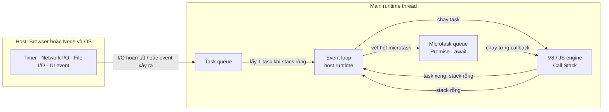
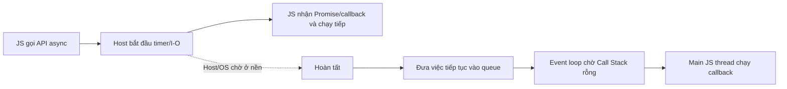

## Mục lục

- [Bắt đầu từ trực giác: quán ăn một đầu bếp](#bắt-đầu-từ-trực-giác-quán-ăn-một-đầu-bếp)
  - [Bản đồ toàn cảnh Event Loop](#bản-đồ-toàn-cảnh-event-loop)
- [Hai câu hỏi mở đầu](#hai-câu-hỏi-mở-đầu)
- [JS single-threaded nghĩa là gì? — Call Stack](#js-single-threaded-nghĩa-là-gì--call-stack)
- [Vì sao single-thread vẫn không block? — Web APIs offload](#vì-sao-single-thread-vẫn-không-block--web-apis-offload)
  - ["Single-threaded" nói chính xác là gì?](#single-threaded-nói-chính-xác-là-gì)
  - [Host làm phần việc nào?](#host-làm-phần-việc-nào)
  - [Host có thật sự dùng thread không?](#host-có-thật-sự-dùng-thread-không)
  - [`fetch` diễn ra từng bước](#fetch-diễn-ra-từng-bước)
  - [Callback vẫn chạy trên main JS thread](#callback-vẫn-chạy-trên-main-js-thread)
- [Hai hàng đợi: Macrotask vs Microtask](#hai-hàng-đợi-macrotask-vs-microtask)
  - [Khi có 5 microtask và 3 task](#khi-có-5-microtask-và-3-task)
- [Event Loop chạy ra sao — thuật toán 4 bước](#event-loop-chạy-ra-sao--thuật-toán-4-bước)
- [Mổ xẻ ví dụ A D C B — trace từng bước](#mổ-xẻ-ví-dụ-a-d-c-b--trace-từng-bước)
- [Microtask sinh ra microtask — quy tắc "vét sạch"](#microtask-sinh-ra-microtask--quy-tắc-vét-sạch)
- [async / await dưới mui xe](#async--await-dưới-mui-xe)
- [Rendering & requestAnimationFrame — fix bug spinner](#rendering--requestanimationframe--fix-bug-spinner)
- [setTimeout(fn, 0) — sự thật về 4ms clamping](#settimeoutfn-0--sự-thật-về-4ms-clamping)
- [Node.js Event Loop — libuv phases](#nodejs-event-loop--libuv-phases)
- [Browser vs Node — bảng khác biệt](#browser-vs-node--bảng-khác-biệt)
- [Microtask starvation — đói macrotask & render](#microtask-starvation--đói-macrotask--render)
- [Anti-patterns & Production Pitfalls](#anti-patterns--production-pitfalls)
- [Tự kiểm tra — dự đoán output](#tự-kiểm-tra--dự-đoán-output)
- [Tóm tắt — Cheat sheet & nguyên tắc vàng](#tóm-tắt--cheat-sheet--nguyên-tắc-vàng)

---

## Bắt đầu từ trực giác: quán ăn một đầu bếp

Trước khi đụng tới thuật ngữ, hãy tưởng tượng một **quán ăn chỉ có đúng một đầu bếp**. Đó chính là JavaScript: **single-threaded** — một thời điểm chỉ làm được đúng một việc.

Đầu bếp làm việc theo nguyên tắc:

- Có **một tờ order đang cầm trên tay** → nấu cho xong mới bỏ xuống. → đây là **Call Stack**.
- Món nào cần **chờ lâu** (hầm xương 1 tiếng, nướng 20 phút) thì đầu bếp **không đứng nhìn nồi**. Anh ta giao cho **lò/nồi tự chạy**, rồi quay sang làm món khác. → host (**Web APIs / libuv**) xử lý song song.
- Khi lò kêu "xong rồi!", order đó **không chen ngang** món đang nấu. Nó được **xếp vào hàng chờ**, đợi đầu bếp rảnh tay mới lấy ra làm tiếp. → **Task Queue**.
- Có loại việc **gấp, làm cực nhanh** (rắc thêm muối, đảo qua chảo) — đầu bếp ưu tiên làm hết những việc gấp này **ngay sau khi xong món hiện tại**, trước khi bốc order mới từ hàng chờ. → **Microtask**.

> [!IMPORTANT]
> **Mô hình cần nhớ:** JS không tự "đa luồng". Nó chỉ có **một đầu bếp** (một luồng chạy code). Cái khiến nó xử lý được nhiều việc bất đồng bộ là: **giao việc chờ cho host làm song song**, rồi dùng **Event Loop** để lần lượt nhặt kết quả về xử lý khi rảnh tay.

Giữ hình ảnh quán ăn này trong đầu — phần còn lại của bài chỉ là gọi đúng tên từng thứ và xem JS làm y hệt như vậy.

### Bản đồ toàn cảnh Event Loop


```mermaid
flowchart LR
    subgraph HOST[Host: Browser hoặc Node và OS]
        IO[Timer · Network I/O · File I/O · UI event]
    end

    subgraph RUNTIME[Main runtime thread]
        TQ[Task queue]
        EL[Event loop<br/>host runtime]
        CS[V8 / JS engine<br/>Call Stack]
        MQ[Microtask queue<br/>Promise · await]
    end

    IO -->|I/O hoàn tất hoặc event xảy ra| TQ
    TQ -->|lấy 1 task khi stack rỗng| EL
    EL -->|chạy task| CS
    CS -->|task xong, stack rỗng| EL
    EL -->|vét hết microtask| MQ
    MQ -->|chạy từng callback| CS
    CS -->|stack rỗng| EL
```

Đọc theo chiều mũi tên: host/OS làm phần chờ; khi xong, nó đưa việc vào **task queue**. Event loop chạy trên main runtime thread, chỉ giao callback cho V8 khi **call stack rỗng**. Sau một task, event loop phải chạy hết **microtask queue** rồi mới lấy task kế tiếp.

> [!NOTE]
> Sơ đồ là mô hình học tập: browser có nhiều task source, còn Node có các phase của libuv thay vì đúng một queue vật lý. Quy tắc quan trọng vẫn không đổi: **một task → hết microtask → task tiếp theo**.

---

## Hai câu hỏi mở đầu

Hai đoạn code dưới đây là lý do thực tế khiến ta phải hiểu Event Loop. Đọc xong bài bạn sẽ giải thích được cả hai một cách tự tin.

**Câu hỏi 1 — Vì sao spinner không hiện?** Một dev xử lý nút "Tính toán": bật spinner, chạy vòng lặp nặng, rồi tắt spinner.

```js
button.addEventListener('click', () => {
  spinner.style.display = 'block';   // (1) muốn hiện spinner ngay
  let total = 0;
  for (let i = 0; i < 2_000_000_000; i++) total += i;   // (2) loop nặng ~vài giây
  spinner.style.display = 'none';    // (3) ẩn spinner
  result.textContent = total;
});
```

Triệu chứng: **spinner không bao giờ hiện ra**, trang đơ vài giây rồi kết quả nhảy ra — dù `display = 'block'` rõ ràng đứng *trước* vòng lặp.

**Câu hỏi 2 — In ra gì, theo thứ tự nào?**

```js
console.log('A');
setTimeout(() => console.log('B'), 0);
Promise.resolve().then(() => console.log('C'));
console.log('D');
```

Trả lời sai phổ biến: `A B C D` hoặc `A D B C`. Đáp án đúng là **`A D C B`**.

> [!WARNING]
> Cả hai "bug" này đều bắt nguồn từ cùng một điều: hiểu sai cách JS sắp xếp thứ tự thực thi. Hiểu đúng Event Loop giúp tránh UI đơ, thứ tự log sai, race condition logic, và CPU/UI bị "đói".

---

## JS single-threaded nghĩa là gì? — Call Stack

**Call Stack** là tờ order trong tay đầu bếp: một ngăn xếp (stack) ghi lại "đang chạy hàm nào, gọi từ đâu". Mỗi lần gọi hàm, engine tạo một **execution context** và **push** nó lên đỉnh stack. Hàm `return` thì **pop** ra.

```js
function multiply(a, b) { return a * b; }
function square(n)      { return multiply(n, n); }
function printSquare(n) { const s = square(n); console.log(s); }
printSquare(5);
```

Diễn biến stack (đỉnh ở trên, đáy ở dưới):

```text
(1) push    (2) push      (3) push & pop     (4) pop dần     (5) xong
                         multiply(5,5)→25
            square(5)    square(5)          → 25
printSquare printSquare  printSquare        printSquare      → stack rỗng
─────────────────────────────────────────────────────────────────────────
```

Hai hệ quả cực kỳ quan trọng:

1. **Trong main JS context, chỉ một frame/callback chạy tại một thời điểm.** Nghĩa là code JS của trang (hoặc main thread của Node) không thể vừa chạy hàm A vừa chạy hàm B. Đây mới là ý nghĩa thực tế của “single-threaded”; mọi thread đều chạy tuần tự bên trong nó, nhưng Java có thể dễ dàng tạo nhiều thread chạy code Java song song, còn JS thông thường thì chưa có thêm thread chạy code JS.
2. **Bao lâu stack còn frame, không gì khác chen vào được** — kể cả render, kể cả callback đã sẵn sàng. Event loop chỉ lấy việc mới khi stack **rỗng**.

Đây là lý do vòng lặp nặng ở Câu hỏi 1 làm đơ trang: callback `click` là một frame **chiếm call stack suốt vài giây**, nên trình duyệt không có một khe nào để repaint.

> [!CAUTION]
> **"Blocking" là gì?** Blocking = một frame chiếm call stack quá lâu. Thủ phạm điển hình: vòng lặp triệu phần tử, `JSON.parse` file lớn, `alert()`. Chia nhỏ công việc bằng `setTimeout` hoặc `requestIdleCallback` chỉ tạo cơ hội cho UI và callback khác được chạy xen kẽ — **không tạo thêm thread, cũng không làm tính toán chạy song song**. Với CPU-bound task thật sự nặng, hãy đẩy hẳn sang **Web Worker** (browser) hoặc `worker_threads` (Node).

> [!NOTE]
> Gọi hàm đệ quy quá sâu làm stack đầy → `RangeError: Maximum call stack size exceeded`. Đó là khi "tờ order chồng cao quá giới hạn".

---

## Vì sao single-thread vẫn không block? — Web APIs offload

`setTimeout`, `fetch`, hay đọc file không làm main JS thread phải **ngồi chờ**. Code JS chỉ khởi động công việc rồi nhận về một callback hoặc `Promise`; phần chờ được giao cho **host** (trình duyệt, Node.js và hệ điều hành).

### "Single-threaded" nói chính xác là gì?

Câu “JavaScript chỉ có một thread” là cách nói rút gọn. Nó **không** có nghĩa cả browser, Node.js hay V8 chỉ có đúng một thread. Browser/Node/V8 đều có thể có thread nội bộ cho mạng, render, garbage collection, tối ưu mã máy…

Điều cần nhớ khi viết ứng dụng là: **nếu không tạo Worker, chỉ có một main JS thread chạy code JavaScript của bạn**. Các phần sau đều phải lần lượt chạy trên thread này; chúng không chạy song song với nhau:

```js
console.log('code đồng bộ');
setTimeout(() => console.log('timer callback'), 0);
fetch('/api/users').then(() => console.log('fetch callback'));
button.addEventListener('click', () => console.log('click callback'));
```

`setTimeout`, `Promise`, `async/await` và `fetch` **không tạo thêm JS thread**. Chúng chỉ cho main thread cơ hội làm việc khác trong lúc I/O đang chờ.

### Host làm phần việc nào?

V8/SpiderMonkey thực thi code JS, quản lý call stack và heap. Còn host cung cấp API và xử lý phần **chờ I/O** — những việc không biết khi nào sẽ xong.

| API / sự kiện | Host làm ở nền | Khi hoàn tất |
|---|---|---|
| `setTimeout` | theo dõi thời gian | xếp timer callback thành task |
| `fetch` / HTTP | gửi request, chờ mạng, nhận response | resolve/reject Promise |
| click, keyboard | OS/browser nhận input | xếp event listener callback thành task |
| `fs.readFile` trong Node | libuv/OS đọc file (thường dùng worker pool hoặc API async của OS) | xếp callback hoàn tất I/O |
| crypto, nén, một số DNS API trong Node | libuv worker pool xử lý | xếp callback/resolve Promise |

Không nên hiểu bảng này là “mỗi `fetch` chiếm một thread riêng”. Cách cài đặt tùy host và hệ điều hành: network I/O thường dùng cơ chế thông báo bất đồng bộ của OS; `fs`, crypto hoặc DNS trong Node có thể dùng thread pool. Dù cơ chế bên dưới là gì, kết quả nhìn từ JS giống nhau: **main thread không chờ**.

### Host có thật sự dùng thread không?

**Có.** Browser, Node.js và hệ điều hành đều dùng CPU/thread để thực hiện công việc của chúng. Browser có thể có main thread, network service, render/compositor và GPU process. Node có main thread, event loop của libuv và một worker pool. V8 cũng có thể có background thread nội bộ cho garbage collection hoặc tối ưu mã.

Tuy nhiên, “host dùng nhiều thread” không có nghĩa **mỗi I/O có một thread ngồi chờ**. Nếu 1.000 lệnh `fetch` cùng lúc đều cần một thread, hệ thống sẽ cạn thread rất nhanh. Với network I/O, host thường đăng ký 1.000 socket với OS. Card mạng và kernel báo khi socket nào có dữ liệu; host chỉ xử lý socket đã sẵn sàng rồi đưa việc tiếp tục vào queue.

```text
1.000 fetch
    │
    ▼
Host đăng ký 1.000 socket với OS
    │
    ▼
OS/network stack báo socket nào có dữ liệu
    │
    ▼
Host xếp callback/Promise continuation tương ứng
    │
    ▼
Main JS thread chạy từng callback một
```

Một số việc thực sự cần CPU hoặc có API đồng bộ/blocking thì host có thể dùng **thread pool**. Trong Node, `fs`, nhiều API crypto, zlib và một số DNS API thường đi qua libuv worker pool; ngược lại, network I/O như `fetch` thường dùng cơ chế thông báo sự kiện của OS thay vì giữ một worker thread chỉ để chờ mạng.

> [!NOTE]
> Có thể hình dung: host/OS có nhiều người để **chờ và báo tin**; main JS thread là người duy nhất chạy code callback của ứng dụng. Dù host dùng thread nào bên dưới, callback JS vẫn không tự chạy song song.


```mermaid
flowchart LR
    A[JS gọi API async] --> B[Host bắt đầu timer/I-O]
    B --> C[JS nhận Promise/callback và chạy tiếp]
    B -. Host/OS chờ ở nền .-> D[Hoàn tất]
    D --> E[Đưa việc tiếp tục vào queue]
    E --> F[Event loop chờ Call Stack rỗng]
    F --> G[Main JS thread chạy callback]
```

### `fetch` diễn ra từng bước

```js
console.log('A');

fetch('/api/users')
  .then((response) => response.json())
  .then((users) => console.log('C:', users));

console.log('B');
```

Đầu ra bắt đầu bằng `A`, rồi `B`; `C` chỉ xuất hiện sau khi response sẵn sàng.

1. Main JS thread in `A`, rồi gọi `fetch('/api/users')`.
2. Browser nhận yêu cầu và bắt đầu network I/O. `fetch` trả về một `Promise` **ngay**, nên main JS thread không chờ server.
3. Main JS thread in `B` và có thể tiếp tục chạy code, nhận event hoặc render.
4. Browser/hệ điều hành gửi request, chờ server và nhận dữ liệu response.
5. Khi response sẵn sàng, browser resolve Promise. Hàm `.then(...)` được đưa vào **microtask queue**.
6. Khi call stack rỗng, event loop lấy microtask đó. Main JS thread chạy `.then`, gọi `response.json()`, rồi chạy `.then` kế tiếp khi việc đọc/parse body hoàn tất.

```text
Main JS thread                         Browser / OS
──────────────────────────────────     ───────────────────────────────
gọi fetch('/api/users')                gửi HTTP request
nhận Promise, chạy console.log('B')    chờ server và nhận response
... tiếp tục làm việc khác ...          báo Promise đã sẵn sàng
chạy .then(...)
```

### Callback vẫn chạy trên main JS thread

Host xử lý **việc chờ**, không chạy tùy ý code JS của bạn ở nền. Code bên trong callback, `.then(...)` hoặc phần sau `await` quay lại main JS thread:

```js
fetch('/api/users').then((response) => response.json()).then((users) => {
  // Vẫn là main JS thread.
  renderUsers(users);
});
```

Vì vậy callback nặng vẫn làm UI đơ:

```js
fetch('/api/users').then(() => {
  while (true) {
    // Chặn main JS thread. Click, render và callback khác phải chờ.
  }
});
```

> [!IMPORTANT]
> **Mấu chốt:** async I/O khác với chạy song song. I/O được host/OS xử lý trong lúc chờ; callback xử lý kết quả vẫn chạy lần lượt trên main JS thread. Muốn chạy code JS CPU-bound song song thật sự, dùng **Web Worker** trong browser hoặc **`worker_threads`** trong Node.

Ví dụ `setTimeout` cũng theo đúng mô hình này:

```js
console.log('start');
setTimeout(() => console.log('timeout'), 1000);
console.log('end');
// start → end → (sau ~1s) timeout
```

`setTimeout(..., 1000)` chỉ đăng ký timer rồi return. Sau khoảng 1 giây, host đưa callback vào **macrotask queue**; callback không thể chen ngang code đang chạy. Vì vậy `timeout` luôn in sau `end`, kể cả khi delay là `0`.

---

## Hai hàng đợi: Macrotask vs Microtask

Đây là phần hay nhầm nhất. Có **hai** loại hàng chờ, và microtask **luôn được ưu tiên** hơn.

### Macrotask (task) — "order mới từ hàng chờ"

Đơn vị công việc lớn. Event loop mỗi vòng chỉ lấy **đúng 1 macrotask**.

| Nguồn tạo macrotask | Ghi chú |
|---------------------|---------|
| `setTimeout` / `setInterval` | Sau khi timer hết hạn |
| `setImmediate` (Node) | Chạy ở phase `check` |
| `MessageChannel` / `postMessage` | Macrotask độ trễ thấp |
| UI events (click, scroll, input) | Mỗi event là một task |
| I/O callback (network, fs) | Khi I/O hoàn tất |

### Microtask — "việc gấp làm liền tay"

Tác vụ nhỏ, ưu tiên cao. Sau **mỗi** macrotask (và ngay sau khi script đồng bộ ban đầu chạy xong), event loop **vét SẠCH** toàn bộ microtask queue rồi mới làm việc khác.

| Nguồn tạo microtask | Ghi chú |
|---------------------|---------|
| `Promise.then / catch / finally` | Enqueue khi promise settle |
| `await` (phần sau `await`) | Bản chất là `.then` ngầm |
| `queueMicrotask(fn)` | API tường minh |
| `MutationObserver` | Callback quan sát DOM |

### Khi có 5 microtask và 3 task

Giả sử callback hiện tại vừa chạy xong nên **call stack rỗng**. Hàng đợi đang có:

```text
Microtask queue: [M1, M2, M3, M4, M5]
Task queue:      [T1, T2, T3]
```

Event loop **không đưa cả 5 microtask vào call stack cùng lúc**. Call stack chỉ chạy được một callback tại một thời điểm. Nó lấy từng microtask ra, chạy xong thì mới lấy cái tiếp theo:

```text
Call Stack       Microtask queue        Task queue
───────────      ─────────────────      ───────────
rỗng             M1 M2 M3 M4 M5         T1 T2 T3
M1 đang chạy     M2 M3 M4 M5            T1 T2 T3
M2 đang chạy     M3 M4 M5               T1 T2 T3
M3 đang chạy     M4 M5                  T1 T2 T3
M4 đang chạy     M5                     T1 T2 T3
M5 đang chạy     rỗng                   T1 T2 T3
T1 đang chạy     rỗng                   T2 T3
```

Kết quả: `M1 → M2 → M3 → M4 → M5 → T1`. `T2` và `T3` tiếp tục phải chờ đến các vòng sau.

Nếu `M3` tạo thêm `M6`, `M6` được thêm vào cuối microtask queue và vẫn phải chạy **trước** `T1`:

```js
queueMicrotask(() => { // M3
  queueMicrotask(() => { // M6
    console.log('M6');
  });
});
```

Khi đó thứ tự là `M1 → M2 → M3 → M4 → M5 → M6 → T1`. Vì microtask có thể tự sinh thêm microtask, queue này có thể không bao giờ rỗng; đó là hiện tượng **microtask starvation**.

> [!WARNING]
> **Khác biệt sống còn:** microtask được ưu tiên tuyệt đối so với macrotask. Dù `setTimeout(0)` đã sẵn sàng từ lâu, mọi microtask đang chờ vẫn chạy *trước*. Hãy nhớ một câu duy nhất: **sync → microtask → macrotask**.

---

## Event Loop chạy ra sao — thuật toán 4 bước

Event Loop bản chất là một vòng `while (true)` chạy mãi. Bốn bước mỗi vòng (sát với [HTML Living Standard](https://html.spec.whatwg.org/multipage/webappapis.html#event-loops)):

1. **Lấy 1 macrotask** — chọn *một* macrotask cũ nhất đã sẵn sàng, chạy nó tới khi call stack rỗng. (Lần đầu tiên, chính *script đồng bộ ban đầu* được coi là macrotask #1.)
2. **Drain HẾT microtask** — vét sạch microtask queue, chạy lần lượt tới khi *rỗng hoàn toàn*. Microtask sinh thêm trong lúc này cũng bị vét luôn trong cùng lượt.
3. **Render (chỉ browser)** — nếu tới nhịp (~60fps), chạy `requestAnimationFrame` callbacks → `style → layout → paint`. Render *không* xen vào giữa microtask.
4. **Quay lại bước 1** — hết việc thì "ngủ" chờ task mới (không busy-loop), có việc thì lặp lại.

```text
   ┌────────────────────────────────────────────────────────────┐
   │  while (true):                                             │
   │    1. task = lấy 1 macrotask cũ nhất đã sẵn sàng           │
   │       run(task)               // chạy tới khi stack rỗng   │
   │    2. while (microtask queue chưa rỗng)                    │
   │         run(microtask)        // vét SẠCH, kể cả cái mới   │
   │    3. if (tới nhịp render) → rAF callbacks; paint          │
   │    4. (hết việc thì ngủ chờ)                               │
   └────────────────────────────────────────────────────────────┘
```

Ba bất biến rút ra từ thuật toán này — học thuộc là giải được mọi câu đố:

1. **Script đồng bộ ban đầu chạy hết trước tiên** (nó là macrotask đầu). Vì vậy `Promise.then` luôn nằm *sau* toàn bộ code đồng bộ.
2. **Giữa hai macrotask luôn có một lần vét sạch microtask.**
3. **Render chỉ xảy ra khi microtask đã rỗng** — không bao giờ chen vào giữa.

---

## Mổ xẻ ví dụ A D C B — trace từng bước

Giờ ta giải Câu hỏi 2 ở đầu bài bằng cách lập bảng trạng thái sau mỗi dòng:

```js
console.log('A');                                // sync
setTimeout(() => console.log('B'), 0);           // macrotask
Promise.resolve().then(() => console.log('C'));  // microtask
console.log('D');                                // sync
```

| Bước | Hành động | Call Stack | Microtask Q | Macrotask Q | Output |
|------|-----------|-----------|-------------|-------------|--------|
| 1 | chạy script (macrotask #1) | `log('A')` | — | — | `A` |
| 2 | đăng ký timer (giao Web API) | — | — | `[B]` | `A` |
| 3 | `Promise.resolve().then` | — | `[C]` | `[B]` | `A` |
| 4 | `log('D')` | `log('D')` | `[C]` | `[B]` | `A D` |
| 5 | script xong → **drain microtask** | `log('C')` | `[]` | `[B]` | `A D C` |
| 6 | render (nếu cần) | — | `[]` | `[B]` | `A D C` |
| 7 | lấy macrotask kế → chạy `B` | `log('B')` | `[]` | `[]` | `A D C B` |

Kết quả **`A D C B`**. Đọc lại bước 5: dù `B` đã nằm sẵn trong macrotask queue từ bước 2, nó **vẫn phải đợi** vì microtask `C` được vét trước. Đúng quy tắc **sync (`A`, `D`) → microtask (`C`) → macrotask (`B`)**.

> [!TIP]
> **Mẹo làm bài phỏng vấn:** khi gặp câu đố thứ tự, hãy chia mỗi dòng vào 1 trong 3 nhóm — **sync / microtask / macrotask**. In tất cả sync trước, rồi tất cả microtask (theo thứ tự enqueue), rồi mới tới từng macrotask.

---

## Microtask sinh ra microtask — quy tắc "vét sạch"

Điểm khiến microtask khác hẳn macrotask: **microtask sinh thêm trong lúc drain cũng bị xử lý ngay trong cùng lượt drain đó.** Vòng drain chỉ dừng khi queue *thực sự rỗng*.

```js
console.log('script start');
setTimeout(() => console.log('setTimeout'), 0);     // macrotask
Promise.resolve()
  .then(() => console.log('promise 1'))             // microtask
  .then(() => console.log('promise 2'));            // microtask (sinh trong lúc drain)
console.log('script end');
// script start → script end → promise 1 → promise 2 → setTimeout
```

`promise 2` được tạo ra *khi* `promise 1` chạy (tức trong lúc đang drain). Nó **vẫn được vét trước** `setTimeout`, dù timer đã sẵn sàng từ sớm. Lý do: bước 2 của thuật toán phải làm rỗng hoàn toàn microtask queue trước khi đụng tới macrotask kế tiếp.

> [!IMPORTANT]
> Đây vừa là sức mạnh vừa là cái bẫy. Sức mạnh: chuỗi `.then` luôn chạy gọn trước khi UI/timer xen vào. Bẫy: nếu microtask **tự sinh microtask vô hạn**, event loop sẽ kẹt mãi ở bước 2 (xem phần Microtask starvation bên dưới).

---

## async / await dưới mui xe

`await` không phải phép màu — nó chỉ là **cú pháp đường (syntactic sugar)** trên Promise. Trình biên dịch biến hàm `async` thành một "máy trạng thái", cắt hàm tại mỗi `await` thành các đoạn nối với nhau bằng `.then`.

**Viết với `async/await`:**

```js
async function g() {
  const a = await fetchA();
  const b = await fetchB(a);
  return a + b;
}
```

**Tương đương (đơn giản hoá) với `.then`:**

```js
function g() {
  return fetchA().then((a) =>
    fetchB(a).then((b) => a + b)
  );
}
```

Ba hệ quả thực chiến:

- Phần code **trước** `await` đầu tiên chạy **đồng bộ** (cùng task với nơi gọi).
- Mọi thứ **sau** mỗi `await` là **microtask** (continuation) → luôn chạy trước macrotask đang chờ.
- `await` một giá trị không phải Promise (vd `await 5`, `await null`) **vẫn tốn một vòng microtask** — không miễn phí.

Trace một ví dụ trộn lẫn:

```js
async function f() {
  console.log(1);
  await null;          // tạm dừng f, phần sau thành microtask
  console.log(2);
}
console.log(3);
f();
console.log(4);
Promise.resolve().then(() => console.log(5));
// 3 → 1 → 4 → 2 → 5
```

- `3`: sync.
- `f()` gọi → `1` in ngay (phần trước `await` là sync). Gặp `await`, `f` nhả call stack, `console.log(2)` được lên lịch microtask.
- `4`: sync (code đồng bộ chạy tiếp).
- Hết sync → drain microtask theo thứ tự enqueue: `2` (vào trước) rồi `5`.

> [!WARNING]
> **Bẫy hiệu năng — `await` trong vòng lặp:** `await` tuần tự biến N việc *độc lập* thành chạy nối đuôi → chậm gấp N lần.
> ```js
> // CHẬM: tuần tự, tổng thời gian = tổng từng request
> for (const id of ids) results.push(await fetch(id));
> // NHANH: song song, tổng thời gian ≈ request lâu nhất
> const results = await Promise.all(ids.map((id) => fetch(id)));
> ```

---

## Rendering & requestAnimationFrame — fix bug spinner

Trong trình duyệt, **repaint là một bước riêng** trong event loop, thường nhịp ~60fps (mỗi ~16.7ms). Thứ tự trong một "frame":

```text
[1 macrotask] → [drain HẾT microtask] → [requestAnimationFrame callbacks] → [style → layout → paint]
```

`requestAnimationFrame(cb)` đăng ký `cb` chạy **ngay trước lần paint kế tiếp** — đúng chỗ để cập nhật animation cho mượt và đồng bộ với màn hình.

```js
console.log('sync');
requestAnimationFrame(() => console.log('rAF'));
Promise.resolve().then(() => console.log('microtask'));
setTimeout(() => console.log('macrotask'), 0);
// sync → microtask → (thường) rAF → ... → macrotask
```

Giờ quay lại **bug spinner** ở Câu hỏi 1. Vấn đề: dòng `display = 'block'` chỉ *đánh dấu* DOM cần vẽ lại; trình duyệt chỉ thực sự paint **giữa các vòng event loop**. Nhưng cả callback `click` (gồm vòng lặp nặng) là **một macrotask liền mạch** → stack không rỗng → không có khe nào để paint. Khi stack rỗng thì `display` đã về `'none'`.

Cách sửa: **trả quyền điều khiển về event loop** để trình duyệt kịp paint spinner *trước khi* chạy phần nặng.

**Cách 1 — Bug (đơ):**

```js
button.addEventListener('click', () => {
  spinner.style.display = 'block';
  heavyCompute();              // chiếm call stack → không kịp paint
  spinner.style.display = 'none';
});
```

**Cách 2 — Tách task (nhường 1 vòng để paint):**

```js
button.addEventListener('click', () => {
  spinner.style.display = 'block';
  requestAnimationFrame(() => setTimeout(() => {
    heavyCompute();
    spinner.style.display = 'none';
  }, 0));
});
```

**Cách 3 — Tốt nhất: Web Worker (đẩy việc nặng sang luồng khác):**

```js
const worker = new Worker('compute.js');
button.addEventListener('click', () => {
  spinner.style.display = 'block';
  worker.postMessage('start');           // tính ở luồng khác
  worker.onmessage = (e) => {
    result.textContent = e.data;
    spinner.style.display = 'none';      // main thread vẫn mượt
  };
});
```

> [!TIP]
> **Vì sao Web Worker là tốt nhất:** tách task chỉ giúp paint *một lần* rồi vẫn đơ trong lúc `heavyCompute` chạy. Web Worker đẩy hẳn việc nặng sang luồng riêng → main thread không bao giờ bị block, UI mượt suốt. Xem thêm tại [Web Workers](/advanced/web-workers/).

---

## setTimeout(fn, 0) — sự thật về 4ms clamping

`setTimeout(fn, 0)` **không** chạy ngay và **không** thực sự 0ms:

- Nó chỉ enqueue một macrotask → phải chờ stack rỗng **và** microtask vét sạch.
- Theo spec HTML, khi đệ quy `setTimeout` lồng nhau quá 5 cấp, delay tối thiểu bị **clamp về 4ms**. Tab chạy nền còn bị throttle nặng hơn (≥1000ms).

```js
let count = 0, start = Date.now();
function tick() {
  if (++count >= 5) { console.log(Date.now() - start, 'ms cho 5 lần'); return; }
  setTimeout(tick, 0);   // lồng càng sâu → bị clamp ~4ms
}
setTimeout(tick, 0);     // thực tế ~16-20ms chứ không phải 0
```

Muốn "macrotask càng sớm càng tốt" mà tránh clamp 4ms, dùng `MessageChannel`:

```js
const { port1, port2 } = new MessageChannel();
function scheduleMacrotask(fn) {
  port1.onmessage = fn;
  port2.postMessage(null);   // tạo macrotask gần như tức thì, không clamp
}
```

---

## Node.js Event Loop — libuv phases

Trên Node, event loop do **libuv** cài đặt và chi tiết hơn trình duyệt: macrotask được chia thành nhiều **phase**, chạy theo vòng, mỗi phase có queue riêng.

```text
   ┌───────────────────────────┐
┌─▶│           timers          │  callback setTimeout / setInterval đã hết hạn
│  └─────────────┬─────────────┘
│  ┌─────────────▼─────────────┐
│  │     pending callbacks     │  vài callback I/O bị hoãn từ vòng trước
│  └─────────────┬─────────────┘
│  ┌─────────────▼─────────────┐
│  │       idle, prepare       │  (nội bộ)
│  └─────────────┬─────────────┘
│  ┌─────────────▼─────────────┐      ┌───────────────┐
│  │           poll            │◀────▶│  I/O đến / chờ│  lấy I/O event, chạy callback
│  └─────────────┬─────────────┘      └───────────────┘
│  ┌─────────────▼─────────────┐
│  │           check           │  callback setImmediate()
│  └─────────────┬─────────────┘
│  ┌─────────────▼─────────────┐
└──┤      close callbacks      │  vd socket.on('close', ...)
   └───────────────────────────┘
```

> [!IMPORTANT]
> Điểm giống browser: **giữa mỗi callback** (và giữa các phase), Node **drain toàn bộ microtask** — gồm `process.nextTick` queue (ưu tiên cao nhất) rồi Promise queue. Vì thế Promise vẫn luôn chạy trước macrotask phase kế tiếp.

### process.nextTick vs Promise microtask

Node có **hai** hàng microtask, drain theo thứ tự ưu tiên sau mỗi thao tác:

1. `process.nextTick` queue — **ưu tiên cao nhất**, drain trước.
2. Promise microtask queue — drain sau.

```js
Promise.resolve().then(() => console.log('promise'));
process.nextTick(() => console.log('nextTick'));
// nextTick → promise
```

> [!WARNING]
> `process.nextTick` đệ quy vô hạn sẽ **chặn vĩnh viễn** event loop sang phase khác (kể cả timers, I/O) — vì nextTick queue luôn được vét sạch trước. Đây là dạng starvation nguy hiểm trong Node.

### setImmediate vs setTimeout

```js
setTimeout(() => console.log('timeout'), 0);
setImmediate(() => console.log('immediate'));
```

Gọi ở top-level thì thứ tự **không xác định** (phụ thuộc thời điểm vào loop, độ phân giải timer). Nhưng **bên trong một I/O callback** thì xác định: `setImmediate` (phase `check`) **luôn** chạy trước `setTimeout` (phase `timers` của vòng kế).

```js
const fs = require('fs');
fs.readFile(__filename, () => {
  setTimeout(() => console.log('timeout'), 0);
  setImmediate(() => console.log('immediate'));
});
// luôn: immediate → timeout
```

Vì callback `readFile` chạy ở phase `poll`; ngay sau `poll` là `check` (setImmediate), còn `timers` phải chờ vòng sau.

---

## Browser vs Node — bảng khác biệt

| Khía cạnh | Browser | Node.js |
|-----------|---------|---------|
| Cài đặt | Web APIs của trình duyệt | libuv |
| Macrotask | một task queue (nhiều queue logic theo nguồn) | chia thành **phases** (timers/poll/check/close) |
| Microtask ưu tiên hàng đầu | chỉ Promise / `queueMicrotask` / `MutationObserver` | `process.nextTick` (ưu tiên) **rồi** Promise |
| `setImmediate` | không (non-standard) | có — phase `check` |
| Render step | có (`requestAnimationFrame`, paint) | không có |
| Timer tối thiểu | clamp 4ms (nesting), throttle background | không clamp 4ms |

---

## Microtask starvation — đói macrotask & render

Vì event loop **phải vét sạch microtask** trước khi chạm macrotask hoặc render, một microtask tự sinh microtask vô hạn sẽ **đóng băng** mọi thứ:

```js
function flood() {
  Promise.resolve().then(flood);   // mỗi microtask lại enqueue microtask mới
}
flood();
setTimeout(() => console.log('không bao giờ chạy'), 0);  // bị bỏ đói
```

Microtask queue không bao giờ rỗng → event loop kẹt mãi ở bước 2 → không bao giờ tới được macrotask hay bước render → **tab treo**, dù CPU vẫn "bận".

> [!TIP]
> **Cách đúng để chia việc lớn:** cần xử lý lượng lớn việc theo từng mảnh mà vẫn cho UI thở → dùng **macrotask** (`setTimeout` / `MessageChannel`) hoặc `requestIdleCallback` để chia lô. *Không* dùng microtask đệ quy.

---

## Anti-patterns & Production Pitfalls

| Anti-pattern | Hậu quả | Cách đúng |
|--------------|---------|-----------|
| Loop nặng trong event handler | UI đơ, không paint | Chia lô qua `setTimeout`/`rAF`, hoặc Web Worker |
| `await` tuần tự việc độc lập | Chậm gấp N lần | `Promise.all` chạy song song |
| Microtask đệ quy (`then` tự gọi) | Starvation, treo tab | Dùng macrotask để chia lô |
| `process.nextTick` đệ quy (Node) | Chặn timers & I/O | Dùng `setImmediate`/`setTimeout` |
| Tin `setTimeout(0)` chạy ngay/đúng 0ms | Sai timing, clamp 4ms | Hiểu macrotask; cần sớm thì `MessageChannel` |
| Cập nhật DOM rồi đo layout trong cùng task | Layout cũ / forced reflow | Đo trong `requestAnimationFrame` kế tiếp |
| Quên `await` / quên `return` trong chain | Lỗi bị nuốt, race | Luôn return Promise, `await` đúng chỗ |
| `try/catch` không bọc được lỗi async trong callback | Crash ngoài ý muốn | Dùng `async/await` + `try/catch`, hoặc `.catch` |

---

## Tự kiểm tra — dự đoán output

Tự nhẩm đáp án trước, rồi đối chiếu với khối "Đáp án" bên dưới mỗi câu. Giải đúng cả 3 là bạn đã nắm chắc Event Loop.

### Câu 1 — sync vs micro vs macro

```js
console.log(1);
setTimeout(() => console.log(2), 0);
Promise.resolve().then(() => console.log(3));
console.log(4);
```

> [!TIP]
> **Đáp án: `1 4 3 2`.** Sync (`1`, `4`) → microtask (`3`) → macrotask (`2`).

### Câu 2 — có `await` trộn vào

```js
async function a() {
  console.log('a1');
  await b();
  console.log('a2');
}
async function b() {
  console.log('b1');
}
console.log('start');
a();
console.log('end');
```

> [!TIP]
> **Đáp án: `start → a1 → b1 → end → a2`.** `a1`, `b1` chạy đồng bộ cho tới `await b()`. Sau `await`, `a2` thành microtask, nên chạy *sau* `end` (sync).

### Câu 3 — setTimeout và Promise lồng nhau

```js
console.log('A');
setTimeout(() => {
  console.log('B');
  Promise.resolve().then(() => console.log('C'));
}, 0);
Promise.resolve().then(() => {
  console.log('D');
  setTimeout(() => console.log('E'), 0);
});
console.log('F');
```

> [!TIP]
> **Đáp án: `A F D B C E`.** Sync: `A`, `F`. Drain microtask: `D` (và enqueue timer `E`). Macrotask 1: `B`, rồi drain microtask ngay → `C`. Macrotask 2: `E`.

---

## Tóm tắt — Cheat sheet & nguyên tắc vàng

**Một vòng event loop (browser):**

```text
[1 macrotask] → [drain HẾT microtask] → [rAF callbacks] → [style/layout/paint]
```

**Phân loại nhanh từng dòng code:**

| Loại | Ví dụ | Khi nào chạy |
|------|-------|--------------|
| Sync | code thường, phần trước `await` đầu | ngay lập tức trên call stack |
| Microtask | `Promise.then`, `await` continuation, `queueMicrotask` | sau sync, trước mọi macrotask |
| Macrotask | `setTimeout`, I/O, UI event, `setImmediate` | một cái mỗi vòng, sau khi microtask rỗng |
| rAF | `requestAnimationFrame` | ngay trước paint |

**7 nguyên tắc vàng:**

1. JS **single-threaded**: một thời điểm chỉ một thứ chạy trên call stack — đừng block nó.
2. Async không phải "đa luồng JS"; host (Web API/libuv) làm việc song song rồi **đẩy callback vào queue**.
3. **Sync chạy hết → drain microtask → mới tới macrotask.** Thuộc lòng câu này.
4. Microtask được **vét sạch** (kể cả cái sinh thêm) trước mỗi macrotask & trước render.
5. `await` = `.then` ngầm: phần sau `await` là microtask; phần trước `await` đầu là sync.
6. `setTimeout(0)` ≠ 0ms (clamp 4ms); cần macrotask sớm thì dùng `MessageChannel`.
7. Node có thêm **phases** + `process.nextTick` ưu tiên hơn Promise — đừng để nextTick/microtask đệ quy gây starvation.

**Bài liên quan:**

- [Promises](/async/promises/)
- [async / await](/async/async-await/)
- [Callbacks & Callback Hell](/async/callbacks/)
- [Web Workers](/advanced/web-workers/)
