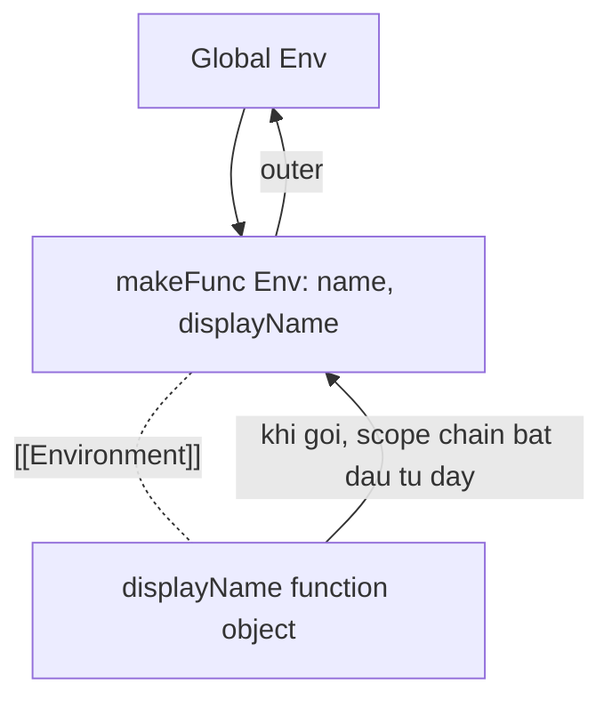

## Mục lục

- [Tổng quan](#tổng-quan)
- [Trực giác trước](#trực-giác-trước)
- [Internal: Lexical Environment & [[Environment]]](#internal-lexical-environment--environment)
- [Closure giữ địa chỉ, không copy giá trị](#closure-giữ-địa-chỉ-không-copy-giá-trị)
- [Ba scope của một closure](#ba-scope-của-một-closure)
- [Vì sao biến không bị garbage collect](#vì-sao-biến-không-bị-garbage-collect)
- [Use cases](#use-cases)
- [Bẫy closure trong vòng lặp](#bẫy-closure-trong-vòng-lặp)
- [Đánh đổi bộ nhớ & hiệu năng](#đánh-đổi-bộ-nhớ--hiệu-năng)
- [Self-check](#self-check)
- [Cheat sheet](#cheat-sheet)
- [Bài liên quan](#bài-liên-quan)

---

## Tổng quan

**Closure** là khả năng một hàm "ghi nhớ" và truy cập **lexical scope** nơi nó được *định nghĩa*, ngay cả khi hàm đó được *thực thi ở nơi khác* (sau khi hàm cha đã return).

Trong JavaScript, **mọi hàm đều tạo closure** ngay tại thời điểm nó được định nghĩa — đó không phải tính năng bạn bật/tắt, mà là hệ quả tất yếu của [lexical scope](/fundamentals/scope/).

```js
function makeFunc() {
  const name = "Mozilla";
  function displayName() {
    console.log(name);   // dùng biến của hàm cha
  }
  return displayName;
}

const myFunc = makeFunc();   // makeFunc đã chạy xong, return rồi
myFunc();                     // "Mozilla" — vẫn truy cập được `name`!
```

Câu hỏi cốt lõi: **`makeFunc` đã return, sao biến `name` vẫn sống?** Phần internal bên dưới trả lời.

---

## Trực giác trước

Hãy hình dung mỗi hàm khi sinh ra được phát kèm một "ba lô" (backpack) chứa tất cả biến trong tầm nhìn lexical của nó. Dù bạn mang hàm đi đâu — gán vào biến, truyền qua nơi khác, gọi sau 10 giây — nó vẫn đeo ba lô đó.

```text
makeFunc() chạy:
   tạo biến name = "Mozilla"
   tạo displayName ──┐
                     ├──🎒 ba lô: { name }   ← displayName mang theo
   return displayName┘

makeFunc() kết thúc... nhưng ba lô vẫn còn vì displayName còn cầm nó.
myFunc() = displayName()  →  mở ba lô, đọc name → "Mozilla"
```

---

## Internal: Lexical Environment & [[Environment]]

Đi vào cơ chế thật của engine (theo spec ECMAScript):

- Mỗi lần một scope chạy, engine tạo một **Lexical Environment** — một "bản ghi" (Environment Record) chứa các biến của scope đó, **cộng** một con trỏ `outer` tới Lexical Environment cha.
- Khi một hàm được **tạo**, engine lưu vào thuộc tính nội bộ `[[Environment]]` của hàm một tham chiếu tới Lexical Environment *hiện tại* (nơi hàm được định nghĩa).
- Khi hàm được **gọi**, scope chain của nó bắt đầu từ chính `[[Environment]]` đã lưu — *không* phải từ nơi gọi. Đó là lý do closure theo *nơi định nghĩa*, không theo *nơi gọi*.

```text
Global Lexical Environment
  └─ makeFunc            outer: null
        │
        ▼ (khi makeFunc() chạy)
  makeFunc Lexical Environment
     record: { name: "Mozilla", displayName: <fn> }
     outer: Global
        ▲
        │ displayName.[[Environment]] trỏ vào đây
        │
  displayName được return ra ngoài, nhưng vẫn giữ [[Environment]]
  → Lexical Environment của makeFunc KHÔNG bị giải phóng
```



> [!IMPORTANT]
> Closure **không** "chụp ảnh" giá trị tại thời điểm định nghĩa. Nó giữ **tham chiếu tới Lexical Environment** — tức là tới chính các *ô biến*. Đây là điểm hiểu lầm phổ biến nhất, và mục tiếp theo chứng minh.

---

## Closure giữ địa chỉ, không copy giá trị

Closure đọc **giá trị mới nhất** của biến tại thời điểm hàm được *gọi*, không phải lúc nó được định nghĩa:

```js
let userName = "Hiệp";

function greetUser() {
  console.log("Hi " + userName);   // đọc ô biến userName, không copy
}

userName = "Manuel";   // đổi giá trị SAU khi định nghĩa hàm
greetUser();            // "Hi Manuel"  — lấy giá trị mới nhất
```

```text
greetUser.[[Environment]] ──▶ ô biến [ userName ]
                                         │
   lúc định nghĩa: "Hiệp"  ───────────────┤  (cùng một ô)
   trước khi gọi:  "Manuel" ──────────────┘
   → greetUser() đọc ô đó NGAY LÚC GỌI → "Manuel"
```

Hệ quả thực tế: counter dùng chung một biến và cập nhật qua các lần gọi:

```js
function counter() {
  let count = 0;          // ô biến nằm trong closure
  return () => ++count;   // mỗi lần gọi đọc & ghi cùng ô count
}
const next = counter();
next();  // 1
next();  // 2
next();  // 3  — count được giữ và cập nhật giữa các lần gọi
```

---

## Ba scope của một closure

Khi một hàm được định nghĩa, nó xác định ngay ba lớp scope mà nó có thể truy cập:

1. **Local scope** (own) — biến của chính hàm.
2. **Outer function scope** — biến của (các) hàm cha bao quanh.
3. **Global scope** — biến toàn cục.

```js
const g = "global";
function outer() {
  const o = "outer";
  function inner() {
    const i = "inner";
    console.log(i, o, g);   // truy cập cả 3 lớp
  }
  return inner;
}
outer()();   // "inner outer global"
```

Engine resolve biến theo **scope chain**: local → outer → global (xem [Scope & Scope Chain](/fundamentals/scope/)).

---

## Vì sao biến không bị garbage collect

Garbage Collector (GC) thu hồi vùng nhớ **không còn ai tham chiếu tới**. Bình thường, khi hàm return, Lexical Environment của nó hết được tham chiếu → bị GC dọn.

Nhưng nếu một hàm con (còn sống) vẫn giữ `[[Environment]]` trỏ vào đó, thì Lexical Environment ấy **vẫn còn người tham chiếu** → GC *không* dọn → biến tiếp tục sống trong heap.

```text
Bình thường:
  outer() return ──▶ không ai giữ env của outer ──▶ GC dọn ✅

Có closure:
  inner (đang sống) ──[[Environment]]──▶ env của outer
  ──▶ env vẫn được tham chiếu ──▶ GC GIỮ LẠI ──▶ biến sống tiếp
```

> [!NOTE]
> Đây vừa là sức mạnh (state bền vững giữa các lần gọi) vừa là rủi ro (memory leak nếu vô tình giữ closure tham chiếu tới object lớn mà không bao giờ thả). Thả tham chiếu (`fn = null`) khi không dùng nữa để GC dọn được.

---

## Use cases

### 1. Data privacy (biến private)

Closure mô phỏng biến private — không truy cập được từ ngoài:

```js
function createCounter() {
  let count = 0;                       // private, không lộ ra ngoài
  return {
    increment: () => ++count,
    get: () => count,
  };
}
const c = createCounter();
c.increment();
c.get();        // 1
c.count;        // undefined — không truy cập trực tiếp được
```

### 2. Function factory / partial application

```js
function multiplyWith(x) {
  return (y) => x * y;     // closure giữ x
}
const multiplyWith5 = multiplyWith(5);
multiplyWith5(4);   // 20
multiplyWith5(10);  // 50  — không phải lặp lại số 5
```

### 3. Memoize (cache kết quả)

```js
function memoize(fn) {
  const cache = new Map();              // closure giữ cache
  return (n) => {
    if (cache.has(n)) return cache.get(n);
    const result = fn(n);
    cache.set(n, result);
    return result;
  };
}
const slowSquare = (n) => n * n;
const fastSquare = memoize(slowSquare);
fastSquare(4);   // tính & cache
fastSquare(4);   // lấy từ cache
```

### 4. Module pattern (IIFE + closure)

```js
const counterModule = (function () {
  let count = 0;                        // private
  return {
    inc: () => ++count,
    value: () => count,
  };
})();
counterModule.inc();
counterModule.value();   // 1
```

---

## Bẫy closure trong vòng lặp

Kinh điển — closure giữ *tham chiếu* tới biến vòng lặp, không phải bản sao:

```js
// SAI: var dùng chung 1 biến i (function scope)
for (var i = 0; i < 3; i++) {
  setTimeout(() => console.log(i), 0);
}
// 3, 3, 3 — cả 3 closure cùng đọc một ô i (đã = 3 khi callback chạy)

// ĐÚNG: let tạo binding mới mỗi vòng (block scope)
for (let j = 0; j < 3; j++) {
  setTimeout(() => console.log(j), 0);
}
// 0, 1, 2 — mỗi closure giữ một ô j riêng
```

Cách cũ (trước ES6) là dùng IIFE để "đóng băng" giá trị từng vòng:

```js
for (var i = 0; i < 3; i++) {
  (function (captured) {
    setTimeout(() => console.log(captured), 0);
  })(i);   // truyền i vào → mỗi vòng một biến captured riêng
}
// 0, 1, 2
```

> [!WARNING]
> Lỗi này minh hoạ chính xác điểm "closure giữ địa chỉ, không copy giá trị". Với `var` chỉ có *một* ô `i`; với `let` mỗi vòng lặp có *một ô mới*. Xem thêm [var, let, const](/fundamentals/var-let-const/).

---

## Đánh đổi bộ nhớ & hiệu năng

Theo MDN, **không nên** tạo hàm lồng trong hàm một cách thừa thãi — nó tốn cả tốc độ xử lý lẫn bộ nhớ. Ví dụ kinh điển: method gắn trực tiếp trong constructor function tạo **bản sao hàm mới cho mỗi instance**:

```js
// LÃNG PHÍ: mỗi object có bản sao getName / getMessage riêng
function MyObject(name, message) {
  this.name = name;
  this.message = message;
  this.getName = function () { return this.name; };
  this.getMessage = function () { return this.message; };
}

// TỐT: đặt method lên prototype — mọi instance dùng CHUNG một hàm
function MyObject2(name, message) {
  this.name = name;
  this.message = message;
}
MyObject2.prototype.getName = function () { return this.name; };
MyObject2.prototype.getMessage = function () { return this.message; };
```

> [!TIP]
> Khi method **không cần** biến private (closure), hãy đặt nó lên `prototype` để chia sẻ giữa các instance, tiết kiệm bộ nhớ. Chỉ dùng closure (method trong constructor/factory) khi *thực sự* cần đóng gói state riêng. Xem [Prototype & kế thừa](/objects-prototypes/prototype/).

---

## Self-check

1. **`makeFunc` đã return, vì sao `name` vẫn truy cập được?**
   → Vì `displayName` giữ `[[Environment]]` trỏ tới Lexical Environment của `makeFunc`, nên GC không dọn nó.
2. **Vòng lặp `var` in ra `3, 3, 3`, sửa thế nào để ra `0, 1, 2`?**
   → Đổi `var` thành `let` (mỗi vòng một binding) hoặc bọc IIFE truyền giá trị vào.
3. **Closure copy giá trị hay giữ địa chỉ biến?**
   → Giữ *địa chỉ* (tham chiếu tới ô biến). Nó luôn đọc giá trị mới nhất lúc hàm được gọi.

---

## Cheat sheet

> [!IMPORTANT]
> 1. **Mọi hàm đều tạo closure** ngay khi được định nghĩa — hệ quả tất yếu của lexical scope, không phải tính năng bật/tắt.
> 2. Khi tạo hàm, engine lưu `[[Environment]]` trỏ tới Lexical Environment **nơi định nghĩa** → closure theo nơi định nghĩa, không theo nơi gọi.
> 3. Closure giữ **địa chỉ ô biến**, không copy giá trị → luôn đọc giá trị mới nhất lúc gọi.
> 4. Biến trong closure **không bị GC** chừng nào hàm con còn sống → dùng cho data privacy / counter / module.
> 5. Bẫy `var` trong loop: chỉ một ô `i` chung → dùng `let` (mỗi vòng một binding) hoặc IIFE.
> 6. Closure tốn bộ nhớ: method **không cần** state riêng nên đặt lên `prototype` để chia sẻ.

---

## Bài liên quan

- [Scope & Scope Chain](/fundamentals/scope/)
- [Factory Functions](/function-closure/factory-functions/)
- [Higher-order Functions](/function-closure/higher-order-functions/)
- [var, let, const](/fundamentals/var-let-const/)
- [Constructor Function](/objects-prototypes/constructor-function/)
