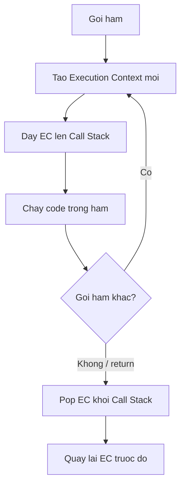

## Mục lục

- [Tổng quan](#tổng-quan)
- [Ba cách tạo hàm](#ba-cách-tạo-hàm)
- [Hoisting khác nhau giữa các dạng](#hoisting-khác-nhau-giữa-các-dạng)
- [Internal: Execution Context & Call Stack](#internal-execution-context--call-stack)
- [Tham số: default, rest, arguments](#tham-số-default-rest-arguments)
- [First-class functions](#first-class-functions)
- [Arrow function khác gì](#arrow-function-khác-gì)
- [Anti-patterns](#anti-patterns)
- [Bài liên quan](#bài-liên-quan)

---

## Tổng quan

Hàm là khối code tái sử dụng, nhận **tham số (parameters)** và (tuỳ chọn) trả về một giá trị. Nhưng trong JavaScript, hàm còn là **first-class citizen**: có thể gán cho biến, truyền làm tham số, trả về từ hàm khác — đây là nền tảng cho higher-order function, closure, và phần lớn pattern nâng cao.

```js
function square(n) {
  return n * n;
}
console.log(square(4));  // 16
```

Bài này tập trung vào *cách tạo hàm* và *chuyện gì xảy ra bên trong engine khi một hàm được gọi*.

---

## Ba cách tạo hàm

```js
// 1. Function declaration (function statement)
function add(a, b) {
  return a + b;
}

// 2. Function expression (gán hàm vào biến)
const sub = function (a, b) {
  return a - b;
};

// 3. Arrow function (ES6)
const mul = (a, b) => a * b;
```

| Dạng | Có tên? | Hoisted toàn bộ? | `this` riêng? | `arguments`? |
|------|---------|------------------|---------------|--------------|
| Declaration | Có | ✅ | ✅ | ✅ |
| Expression | Tuỳ chọn | ❌ (theo biến) | ✅ | ✅ |
| Arrow | Không | ❌ (theo biến) | ❌ (kế thừa lexical) | ❌ |

---

## Hoisting khác nhau giữa các dạng

Đây là khác biệt thực tế hay gặp nhất:

```js
// Declaration: gọi TRƯỚC khi định nghĩa vẫn chạy (hoisted cả thân hàm)
console.log(add(2, 3));   // 5
function add(a, b) { return a + b; }

// Expression: KHÔNG gọi trước được
console.log(sub(5, 2));   // ❌ ReferenceError (const trong TDZ)
const sub = function (a, b) { return a - b; };
```

> [!TIP]
> Nhiều người **ưu tiên function expression** vì nó tránh được hoisting — buộc bạn khai báo trước khi dùng, khiến luồng code rõ ràng và dễ đọc hơn. Xem chi tiết ở bài [Hoisting](/fundamentals/hoisting/).

---

## Internal: Execution Context & Call Stack

Mỗi khi một hàm được **gọi**, engine tạo một **Execution Context (EC)** mới và đẩy nó lên **Call Stack**. Hiểu cơ chế này giải thích được scope, `this`, đệ quy và stack overflow.

Một Execution Context gồm:

1. **Variable Environment** — chứa tham số, biến cục bộ, function declaration (được khởi tạo trong creation phase — xem [Hoisting](/fundamentals/hoisting/)).
2. **Scope chain** — tham chiếu tới lexical environment cha (để resolve biến ngoài).
3. **`this` binding** — giá trị `this` cho lần gọi này.

```js
function first() {
  second();
  console.log("first xong");
}
function second() {
  console.log("second chạy");
}
first();
```

Diễn biến Call Stack:

```text
Bước 1: gọi first()        Bước 2: first gọi second()    Bước 3: second return
┌──────────────┐           ┌──────────────┐              ┌──────────────┐
│              │           │  second EC   │ ← đẩy vào     │              │
│  first EC    │           │  first EC    │              │  first EC    │ ← tiếp tục
│  global EC   │           │  global EC   │              │  global EC   │
└──────────────┘           └──────────────┘              └──────────────┘
```



> [!IMPORTANT]
> Call Stack có giới hạn kích thước. Đệ quy không có điều kiện dừng (hoặc quá sâu) sẽ đẩy quá nhiều EC → `RangeError: Maximum call stack size exceeded` (stack overflow). Mối liên hệ với async xem bài [Event Loop](/async/event-loop/).

---

## Tham số: default, rest, arguments

### Default parameters

Tham số nhận giá trị mặc định **chỉ khi** không được truyền hoặc truyền `undefined` — *không* tính các giá trị falsy khác (`0`, `""`, `false`, `null`).

```js
function add(a, b = 1) {
  return a + b;
}
add(2);            // 3   — b dùng default
add(2, undefined); // 3   — undefined → default
add(2, 0);         // 2   — 0 hợp lệ, KHÔNG dùng default
add(2, null);      // "2null" → thực ra 2 + null = 2 (null ép thành 0)... lưu ý null vẫn được truyền
```

Default param có thể dùng các tham số *đứng trước* trong biểu thức của nó:

```js
function greet(name, greeting, message = greeting + " " + name) {
  return message;
}
greet("David", "Hi");                 // "Hi David"
greet("David", "Hi", "Chúc mừng!");   // "Chúc mừng!"
```

### Rest parameters

Gom các tham số dư thừa thành một **mảng thật** (khác `arguments`):

```js
function sum(...nums) {
  return nums.reduce((acc, n) => acc + n, 0);
}
sum(1, 2, 3, 4);   // 10
```

### arguments object

Mỗi hàm thường (không phải arrow) có object `arguments` — giống mảng nhưng *không phải* mảng (không có `.map`, `.reduce`):

```js
function legacy() {
  console.log(arguments.length);   // số tham số thực truyền
  console.log(Array.from(arguments));  // chuyển thành mảng thật
}
legacy(1, 2, 3);  // 3, [1,2,3]
```

> [!NOTE]
> Code hiện đại nên dùng **rest parameter `...args`** thay cho `arguments`: nó là mảng thật, rõ ràng, và hoạt động cả trong arrow function (vốn không có `arguments`).

---

## First-class functions

Trong JS, hàm là **giá trị** — có thể gán, truyền, trả về như mọi dữ liệu khác:

```js
const fns = [(x) => x + 1, (x) => x * 2];   // hàm trong mảng
const op = { run: function () {} };          // hàm trong object

function apply(fn, value) {                  // truyền hàm làm tham số
  return fn(value);
}
apply((x) => x ** 2, 5);                     // 25
```

Đây chính là điều kiện để có [Higher-order functions](/function-closure/higher-order-functions/) và [Closures](/function-closure/closures/).

---

## Arrow function khác gì

Arrow function **không** có `this`, `arguments`, không dùng làm constructor. Khác biệt quan trọng nhất là `this` — xem sâu ở bài [Từ khoá this](/function-closure/this-keyword/).

```js
const obj = {
  value: 42,
  regular: function () { return this.value; },  // this = obj
  arrow: () => this.value,                       // this = lexical (KHÔNG phải obj)
};
obj.regular();  // 42
obj.arrow();    // undefined — this kế thừa từ ngoài, không phải obj
```

---

## Anti-patterns

| Anti-pattern | Vấn đề | Cách đúng |
|--------------|--------|-----------|
| Dựa vào hoisting gọi hàm "ở dưới" | Khó đọc, dễ vỡ khi refactor | Khai báo trước khi dùng |
| Dùng `arguments` trong code mới | Không phải mảng, không có ở arrow | Dùng rest `...args` |
| Default param kỳ vọng chặn `0`/`""` | Chỉ `undefined` mới kích hoạt default | Kiểm tra tường minh nếu cần |
| Arrow function làm method cần `this` | `this` không trỏ object | Dùng function thường cho method |
| Đệ quy không điều kiện dừng | Stack overflow | Luôn có base case |

---

## Bài liên quan

- [Higher-order Functions](/function-closure/higher-order-functions/)
- [Closures](/function-closure/closures/)
- [Từ khoá this](/function-closure/this-keyword/)
- [Hoisting](/fundamentals/hoisting/)
- [Constructor Function](/objects-prototypes/constructor-function/)
