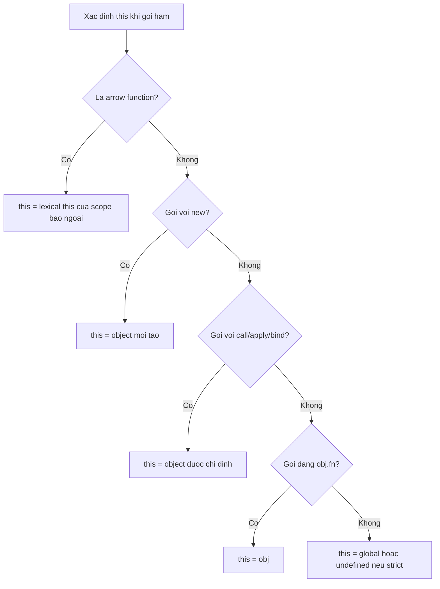

## Mục lục

- [Tổng quan](#tổng-quan)
- [Nguyên tắc cốt lõi: this theo call-site](#nguyên-tắc-cốt-lõi-this-theo-call-site)
- [4 quy tắc binding của this](#4-quy-tắc-binding-của-this)
- [this bị mất khi tách method](#this-bị-mất-khi-tách-method)
- [this trong callback](#this-trong-callback)
- [Arrow function: this theo lexical](#arrow-function-this-theo-lexical)
- [Cây quyết định this](#cây-quyết-định-this)
- [Pitfalls](#pitfalls)
- [Tự kiểm tra](#tự-kiểm-tra)
- [Cheat sheet](#cheat-sheet)
- [Bài liên quan](#bài-liên-quan)

---

## Tổng quan

`this` là một tham chiếu *động* mà JavaScript tự động truyền vào mỗi lần gọi hàm thường. Khác với nhiều ngôn ngữ (nơi `this` luôn là instance hiện tại), trong JS **giá trị của `this` phụ thuộc vào *cách* hàm được gọi**, không phải nơi hàm được định nghĩa.

```js
const obj = {
  myFunc: function () {
    console.log(this === obj);
  },
};

obj.myFunc();              // true  — gọi qua obj
const f = obj.myFunc;
f();                       // false — gọi "trần", this không còn là obj
```

> [!IMPORTANT]
> Quy tắc vàng: **`this` được xác định tại *call-site* (nơi & cách hàm được gọi), tại thời điểm runtime** — không phải tại nơi định nghĩa. Nắm điều này thì 90% confusion về `this` biến mất.

---

## Nguyên tắc cốt lõi: this theo call-site

Cùng một hàm, gọi theo cách khác nhau → `this` khác nhau:

```js
function show() {
  console.log(this);
}

show();              // global (hoặc undefined ở strict mode) — gọi trần
const o = { show };
o.show();            // o — gọi qua object đứng trước dấu chấm
```

Câu thần chú từ ghi chú gốc: *"Nếu gọi dạng `obj.func()` thì `this === obj`; nếu gọi `func()` trần thì `this === global` (hoặc `undefined` ở strict mode)."*

---

## 4 quy tắc binding của this

Xét theo thứ tự ưu tiên (cao → thấp):

### 1. `new` binding (cao nhất)

Khi gọi với `new`, `this` là object mới được tạo:

```js
function Person(name) {
  this.name = name;     // this = object mới
}
const p = new Person("Hiệp");
p.name;   // "Hiệp"
```

### 2. Explicit binding — `call` / `apply` / `bind`

Bạn chỉ định `this` tường minh (xem [call / apply / bind](/function-closure/call-apply-bind/)):

```js
function greet() { return this.name; }
const user = { name: "An" };
greet.call(user);    // "An" — this = user
```

### 3. Implicit binding — gọi qua object

`this` là object đứng *ngay trước dấu chấm* lúc gọi:

```js
const obj = { name: "obj", get() { return this.name; } };
obj.get();   // "obj"
```

### 4. Default binding — gọi trần (thấp nhất)

Không thuộc 3 trường hợp trên → `this` là global object (`window`/`globalThis`), hoặc `undefined` ở **strict mode**:

```js
function f() { return this; }
f();   // global (sloppy) | undefined (strict mode / ES module)
```

| Cách gọi | `this` là |
|----------|-----------|
| `new Fn()` | object mới tạo |
| `fn.call(o)` / `fn.apply(o)` / `fn.bind(o)()` | `o` |
| `obj.fn()` | `obj` |
| `fn()` (trần) | global / `undefined` (strict) |

---

## this bị mất khi tách method

Lỗi cực kỳ phổ biến: gán method vào biến rồi gọi → mất ngữ cảnh object:

```js
const module = {
  x: 42,
  getX: function () { return this.x; },
};

module.getX();           // 42 — implicit binding, this = module

const unbound = module.getX;
unbound();               // undefined — gọi trần, this = global (không có x)
```

Khi `unbound()` chạy, không có object nào "đứng trước dấu chấm" → default binding → `this` là global → `this.x` là `undefined`. Khắc phục bằng `bind` (xem bài [call / apply / bind](/function-closure/call-apply-bind/)).

---

## this trong callback

Callback được gọi *bên trong* một hàm khác, nên `this` của nó tuỳ thuộc hàm đó gọi nó ra sao:

```js
const obj = {
  name: "object1",
  myFunc: function () {
    console.log(this === obj);          // true — obj.myFunc()
    setTimeout(function () {
      console.log(this === obj);        // false
      console.log(this === globalThis); // true — callback gọi "trần"
    }, 0);
  },
};
obj.myFunc();
```

`setTimeout` gọi callback dạng "trần" (không bind), nên `this` trong đó là global. Ngược lại, `addEventListener` *cố tình* bind `this` tới phần tử DOM kích hoạt sự kiện:

```js
button.addEventListener("click", function () {
  console.log(this);   // chính là <button> — addEventListener bind this vào element
});
```

> [!NOTE]
> Với callback, hãy luôn hỏi: *"Hàm cha gọi callback này như thế nào?"* `setTimeout` → gọi trần → `this` global. `addEventListener` → bind tới element. `arr.map(cb)` → gọi trần (trừ khi truyền `thisArg`).

---

## Arrow function: this theo lexical

Arrow function **không có `this` riêng**. Nó lấy `this` từ **lexical context** — tức `this` của scope *bao quanh nơi nó được định nghĩa*. `call`/`apply`/`bind` **không** đổi được `this` của arrow.

```js
const obj = {
  name: "object1",
  func2: function () {
    console.log(this.name);             // "object1" — func2 gọi qua obj
    setTimeout(() => {
      console.log(this.name);           // "object1" — arrow lấy this của func2
    }, 0);
  },
  func3: () => {
    console.log(this.name);             // undefined — arrow ở object literal lấy this global
  },
};

obj.func2();   // "object1", rồi "object1"
obj.func3();   // undefined — KHÔNG có object context, this là global
```

```text
func2 (function thường): this = obj (vì gọi obj.func2())
   └─ arrow trong setTimeout: this = this của func2 = obj ✅

func3 (arrow ngay trong object literal):
   this = this của scope ngoài object = global ❌ (không phải obj!)
```

> [!WARNING]
> Đừng dùng arrow function làm **method** của object khi cần `this` trỏ object — vì arrow lấy `this` của scope *bao ngoài object literal* (thường là global), không phải object. Ngược lại, arrow lại **lý tưởng cho callback** bên trong method (như `setTimeout`) vì nó giữ đúng `this` của method.

---

## Cây quyết định this



---

## Pitfalls

| Pitfall | Kết quả | Cách đúng |
|---------|---------|-----------|
| Tách method `const f = obj.m; f()` | `this` mất, thành global | `obj.m.bind(obj)` |
| Dùng `function` callback trong method | `this` không còn là object | Dùng arrow callback |
| Dùng arrow làm method cần `this` | `this` = global, không phải object | Dùng `function` cho method |
| Quên strict mode đổi default `this` | `undefined` thay vì global | Hiểu rõ môi trường (ES module luôn strict) |
| `call`/`bind` lên arrow function | Không có tác dụng | Dùng function thường nếu cần đổi `this` |

---

## Tự kiểm tra

> [!NOTE]
> **Câu 1:** Hai dòng in ra gì?
> ```js
> const obj = { x: 1, get() { return this.x; } };
> console.log(obj.get());
> const g = obj.get;
> console.log(g());
> ```

> [!TIP]
> **Đáp án:** `1` rồi `undefined` (hoặc `TypeError` ở strict mode). `obj.get()` → implicit binding, `this = obj`. `g()` gọi trần → default binding, `this` = global/`undefined` → `this.x` là `undefined`.

> [!NOTE]
> **Câu 2:** Vì sao arrow trong `setTimeout` giữ đúng `this` nhưng `func3` thì không?
> ```js
> const o = {
>   name: 'A',
>   m() { setTimeout(() => console.log(this.name), 0); },
>   func3: () => console.log(this.name),
> };
> o.m(); o.func3();
> ```

> [!TIP]
> **Đáp án:** `m` in `"A"`, `func3` in `undefined`. Arrow lấy `this` từ scope **bao ngoài nơi nó được viết**: arrow trong `m` nằm trong lần gọi `o.m()` (`this = o`); còn `func3` nằm ngay trong object literal → `this` = scope ngoài (global).

---

## Cheat sheet

> [!IMPORTANT]
> 1. `this` được quyết định tại **call-site** (lúc gọi), không phải nơi định nghĩa.
> 2. 4 quy tắc (ưu tiên cao→thấp): **`new`** → object mới; **`call`/`apply`/`bind`** → chỉ định; **`obj.fn()`** → `obj`; **`fn()` trần** → global/`undefined`.
> 3. Tách method (`const f = obj.m`) → mất `this`. Fix bằng `obj.m.bind(obj)`.
> 4. **Arrow** không có `this` riêng → lấy theo lexical; `call`/`bind` **không** đổi được.
> 5. Arrow lý tưởng cho **callback trong method**; tránh dùng arrow làm **method**.
> 6. Câu hỏi vàng cho callback: *"hàm cha gọi nó như thế nào?"* (`setTimeout` → trần; `addEventListener` → element).

---

## Bài liên quan

- [call / apply / bind](/function-closure/call-apply-bind/)
- [Hàm cơ bản](/function-closure/function-basics/)
- [Closures](/function-closure/closures/)
- [Prototype & kế thừa](/objects-prototypes/prototype/)
- [Constructor Function](/objects-prototypes/constructor-function/)
