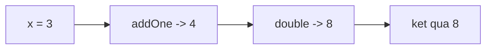

## Mục lục

- [Tổng quan](#tổng-quan)
- [Hai loại HOF](#hai-loại-hof)
- [map / filter / reduce hoạt động thế nào](#map--filter--reduce-hoạt-động-thế-nào)
- [reduce là khối xây dựng](#reduce-là-khối-xây-dựng)
- [Function composition](#function-composition)
- [Currying & partial application](#currying--partial-application)
- [Anti-patterns](#anti-patterns)
- [Bài liên quan](#bài-liên-quan)

---

## Tổng quan

**Higher-order function (HOF)** là hàm thoả mãn *ít nhất một* trong hai điều:

1. Nhận một hoặc nhiều hàm làm **tham số** (callback).
2. **Trả về** một hàm.

HOF tận dụng tính chất [first-class function](/functions/function-basics/) của JS, giúp viết code khai báo (declarative), tái sử dụng logic, và là nền tảng của lập trình hàm.

```js
// Nhận hàm làm tham số
[1, 2, 3].map((x) => x * 2);     // [2, 4, 6]

// Trả về hàm
const multiplier = (factor) => (n) => n * factor;
const double = multiplier(2);
double(5);                        // 10
```

---

## Hai loại HOF

```js
// (1) HOF nhận callback
function repeat(n, action) {
  for (let i = 0; i < n; i++) action(i);
}
repeat(3, console.log);   // 0, 1, 2

// (2) HOF trả về hàm (closure)
function greaterThan(threshold) {
  return (value) => value > threshold;
}
const over10 = greaterThan(10);
over10(15);   // true
```

> [!NOTE]
> Loại (2) — hàm trả về hàm — luôn tạo ra một [closure](/functions/closures/): hàm con "nhớ" biến của hàm cha (`threshold`) ngay cả sau khi hàm cha đã return.

---

## map / filter / reduce hoạt động thế nào

Ba HOF kinh điển trên mảng. Hiểu cách chúng lặp internal giúp dùng đúng và tự viết lại được khi cần.

```js
const nums = [1, 2, 3, 4];

nums.map((x) => x * 2);          // [2, 4, 6, 8]      — biến đổi từng phần tử
nums.filter((x) => x % 2 === 0); // [2, 4]            — giữ phần tử thoả điều kiện
nums.reduce((acc, x) => acc + x, 0); // 10            — gộp về một giá trị
```

Bản chất `map` chỉ là một vòng lặp + push (phiên bản tự viết để hiểu):

```js
function myMap(arr, fn) {
  const result = [];
  for (let i = 0; i < arr.length; i++) {
    result.push(fn(arr[i], i, arr));   // gọi callback với (value, index, array)
  }
  return result;
}
```

```text
map:    [1,2,3,4] ──fn(x)=x*2──▶ [2,4,6,8]    (giữ nguyên độ dài)
filter: [1,2,3,4] ──x%2===0───▶ [2,4]         (độ dài <=)
reduce: [1,2,3,4] ──acc+x─────▶ 10            (gộp về 1 giá trị)
```

> [!IMPORTANT]
> `map` và `filter` **không mutate** mảng gốc — chúng trả về mảng mới. Đây là lý do chúng hợp với phong cách [pure function](/functions/pure-functions/). `forEach` thì khác: nó không trả về gì, chỉ để chạy side effect.

---

## reduce là khối xây dựng

`reduce` mạnh đến mức có thể *tự cài đặt* `map` và `filter`. Điều này cho thấy nó là HOF nền tảng nhất:

```js
// map bằng reduce
const map = (arr, fn) =>
  arr.reduce((acc, x) => [...acc, fn(x)], []);

// filter bằng reduce
const filter = (arr, pred) =>
  arr.reduce((acc, x) => (pred(x) ? [...acc, x] : acc), []);

map([1, 2, 3], (x) => x * 10);        // [10, 20, 30]
filter([1, 2, 3, 4], (x) => x > 2);   // [3, 4]
```

`reduce` nhận `(accumulator, currentValue)` và một **giá trị khởi tạo**. Luôn truyền giá trị khởi tạo để tránh lỗi với mảng rỗng.

---

## Function composition

Kết hợp nhiều hàm nhỏ thành một pipeline — output của hàm này là input của hàm kế:

```js
const compose = (...fns) => (x) => fns.reduceRight((acc, fn) => fn(acc), x);
const pipe = (...fns) => (x) => fns.reduce((acc, fn) => fn(acc), x);

const addOne = (x) => x + 1;
const double = (x) => x * 2;

const f = pipe(addOne, double);   // double(addOne(x))
f(3);                              // (3+1)*2 = 8
```



`pipe` đọc trái→phải (tự nhiên hơn), `compose` đọc phải→trái (theo ký hiệu toán học `f(g(x))`).

---

## Currying & partial application

**Currying**: biến hàm nhiều tham số thành chuỗi hàm một tham số.

```js
// Thường
const add = (a, b, c) => a + b + c;
// Curried
const addC = (a) => (b) => (c) => a + b + c;
addC(1)(2)(3);   // 6
```

**Partial application**: cố định *một phần* tham số, trả về hàm chờ phần còn lại — chính là pattern *function factory*:

```js
const multiply = (x) => (y) => x * y;
const triple = multiply(3);   // cố định x=3
triple(10);                    // 30
```

> [!TIP]
> Currying/partial application rất hữu ích để tạo các hàm chuyên biệt từ hàm tổng quát (vd `multiply(5)` → `multiplyBy5`), tránh lặp tham số. Xem thêm [Factory Functions](/functions/factory-functions/).

---

## Anti-patterns

| Anti-pattern | Vấn đề | Cách đúng |
|--------------|--------|-----------|
| `reduce` không có giá trị khởi tạo | Lỗi với mảng rỗng | Luôn truyền initial value |
| Dùng `map` chỉ để chạy side effect | Tạo mảng thừa, gây nhầm | Dùng `forEach` |
| Lồng nhiều callback sâu | "callback hell", khó đọc | Dùng compose/pipe hoặc tách hàm |
| Mutate mảng trong callback `map` | Phá tính pure | Trả về giá trị mới, không sửa gốc |
| Curry quá đà cho hàm đơn giản | Khó đọc | Chỉ curry khi thật sự tái sử dụng |

---

## Bài liên quan

- [Hàm cơ bản](/functions/function-basics/)
- [Closures](/functions/closures/)
- [Factory Functions](/functions/factory-functions/)
- [Pure Functions](/functions/pure-functions/)
