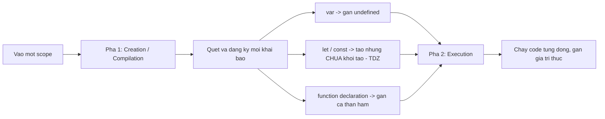

## Mục lục

- [Tổng quan](#tổng-quan)
- [Hai pha: Creation vs Execution](#hai-pha-creation-vs-execution)
- [Hoisting với var](#hoisting-với-var)
- [Hoisting với let / const (TDZ)](#hoisting-với-let--const-tdz)
- [Function declaration vs expression](#function-declaration-vs-expression)
- [Hoisting của class](#hoisting-của-class)
- [Khi var và function trùng tên](#khi-var-và-function-trùng-tên)
- [Bảng tổng kết hoisting](#bảng-tổng-kết-hoisting)
- [Pitfalls](#pitfalls)
- [Bài liên quan](#bài-liên-quan)

---

## Tổng quan

**Hoisting** là hành vi của JavaScript engine: trước khi chạy code trong một scope, engine **quét trước** và "kéo" các *khai báo* (biến, function, class) lên đầu scope đó. Nhờ vậy bạn có thể tham chiếu một số thứ *trước* dòng khai báo.

Nhưng "kéo lên đầu" là cách nói hình ảnh — thực chất engine không di chuyển dòng code nào. Nó xử lý theo **hai pha**, và mỗi loại khai báo được "chuẩn bị" khác nhau trong pha đầu.

```js
console.log(x);   // undefined  — không lỗi, nhờ hoisting của var
var x = 5;

greet();          // "Xin chào!" — gọi được trước khi định nghĩa
function greet() { console.log("Xin chào!"); }
```

> [!NOTE]
> Hoisting **không** copy giá trị lên đầu — chỉ phần *khai báo*. Phần *gán giá trị* vẫn ở nguyên vị trí ban đầu. Đây là chìa khoá để hiểu vì sao `var x` cho `undefined` chứ không phải `5`.

---

## Hai pha: Creation vs Execution

Mỗi khi một execution context (global hoặc function) được tạo, engine chạy qua **hai pha**:



1. **Creation phase** — engine duyệt toàn bộ scope, đăng ký tên các khai báo vào bộ nhớ:
   - `var` → đăng ký và gán `undefined`.
   - `let`/`const` → đăng ký nhưng **chưa khởi tạo** (nằm trong TDZ).
   - `function` declaration → đăng ký **kèm cả thân hàm** (nên gọi được ngay).
2. **Execution phase** — engine chạy từng dòng, thực hiện các phép gán giá trị thật.

Chính vì pha Creation chạy *trước*, nên đến pha Execution thì các tên đã "tồn tại" — đó là bản chất của hoisting.

---

## Hoisting với var

`var` được hoisted và **khởi tạo `undefined`** ngay trong creation phase.

```js
console.log(a);  // undefined
var a = 10;
console.log(a);  // 10
```

Engine "nhìn" đoạn trên như sau:

```js
var a;           // creation phase: đăng ký a = undefined
console.log(a);  // execution: undefined
a = 10;          // execution: gán 10
console.log(a);  // 10
```

```text
Creation phase          Execution phase
──────────────          ──────────────────────────
a = undefined    ──▶     console.log(a)  → undefined
                         a = 10
                         console.log(a)  → 10
```

---

## Hoisting với let / const (TDZ)

`let` và `const` **cũng được hoisted**, nhưng *không* được khởi tạo `undefined`. Từ đầu scope đến dòng khai báo, biến nằm trong **Temporal Dead Zone (TDZ)** — truy cập sẽ ném `ReferenceError`.

```js
console.log(b);  // ReferenceError: Cannot access 'b' before initialization
let b = 10;
```

```text
{
  ─── đầu scope ──────────────────────────────────┐
  │   ❌ TDZ của b                                  │
  │   console.log(b)  → ReferenceError              │
  let b = 10;  ←── b rời TDZ, được khởi tạo          │
  │   ✅ console.log(b) → 10                         │
  └──────────────────────────────────────────────────┘
}
```

> [!IMPORTANT]
> Nhiều người nói "let/const không bị hoisting" — **không chính xác**. Chúng *có* bị hoisting (engine biết tên biến từ đầu scope, đó là lý do nó không "rơi" ra outer scope), nhưng bị chặn truy cập bởi TDZ. Bằng chứng: ví dụ dưới ném `ReferenceError`, không phải in ra giá trị global.
> ```js
> let x = "ngoài";
> {
>   console.log(x);  // ReferenceError — KHÔNG in "ngoài"
>   let x = "trong"; // vì x bên trong đã được hoisted vào block
> }
> ```

---

## Function declaration vs expression

Khác biệt cực kỳ quan trọng và hay bị bug:

- **Function declaration** (`function foo() {}`) được hoisted **toàn bộ** (cả thân hàm) → gọi được trước khi định nghĩa.
- **Function expression** (`const foo = function() {}`) chỉ hoisted phần *biến* → biến tuân theo quy tắc `var`/`let`/`const`, còn hàm thì chưa gán.

```js
// Declaration: chạy tốt
sayHi();                      // "Hi"
function sayHi() { console.log("Hi"); }

// Expression với var: TypeError
sayHello();                   // TypeError: sayHello is not a function
var sayHello = function () { console.log("Hello"); };

// Expression với let: ReferenceError (TDZ)
sayHey();                     // ReferenceError: Cannot access 'sayHey' before initialization
let sayHey = function () { console.log("Hey"); };
```

Giải thích case `var sayHello`: ở creation phase, `sayHello` được hoisted = `undefined`. Khi gọi `sayHello()` thì đang gọi `undefined()` → `TypeError`.

| Dạng | Hoisted gì | Gọi trước khi khai báo |
|------|-----------|------------------------|
| `function foo(){}` | Cả tên + thân hàm | ✅ Chạy được |
| `var foo = function(){}` | Chỉ `foo = undefined` | ❌ `TypeError` |
| `let/const foo = function(){}` | Tên (trong TDZ) | ❌ `ReferenceError` |
| Arrow `const foo = () => {}` | Tên (trong TDZ) | ❌ `ReferenceError` |

---

## Hoisting của class

`class` được hoisted **giống `let`/`const`** — có hoisting nhưng nằm trong TDZ. Dùng class trước khi khai báo sẽ ném `ReferenceError`.

```js
const u = new User();   // ReferenceError: Cannot access 'User' before initialization
class User {}
```

> [!WARNING]
> Đừng nhầm class với function declaration. Function declaration gọi-trước được; class thì không. Luôn khai báo class *trước* khi dùng.

---

## Khi var và function trùng tên

Trong creation phase, **function declaration được ưu tiên hơn `var`** cùng tên. Còn ở execution phase thì phép gán mới ghi đè theo thứ tự dòng.

```js
console.log(typeof foo);  // "function" — function thắng var ở creation phase
var foo = 10;
function foo() {}
console.log(typeof foo);  // "number"   — execution gán foo = 10
```

---

## Bảng tổng kết hoisting

| Khai báo | Được hoisted? | Trạng thái đầu scope | Truy cập trước khai báo |
|----------|:---:|----------------------|--------------------------|
| `var` | ✅ | `undefined` | trả `undefined` |
| `let` | ✅ | TDZ (chưa khởi tạo) | `ReferenceError` |
| `const` | ✅ | TDZ (chưa khởi tạo) | `ReferenceError` |
| `function` declaration | ✅ | Đã gán cả thân hàm | gọi được |
| `class` | ✅ | TDZ (chưa khởi tạo) | `ReferenceError` |
| function/arrow expression | theo biến | theo `var`/`let`/`const` | `TypeError`/`ReferenceError` |

---

## Pitfalls

| Pitfall | Vì sao xảy ra | Cách tránh |
|---------|---------------|------------|
| `console.log(x); var x = 1` ra `undefined` | `var` hoisted `undefined` | Khai báo trước khi dùng; dùng `let`/`const` |
| Gọi function expression trước khi gán | Chỉ biến được hoisted, không phải hàm | Định nghĩa trước khi gọi |
| Tưởng `let`/`const` không hoisting | Chúng hoisting nhưng có TDZ | Hiểu đúng: hoisting + TDZ |
| Dùng `class` trước khi khai báo | Class nằm trong TDZ | Khai báo class trước |
| Dựa vào hoisting để gọi hàm "ở trên" | Code khó đọc, dễ vỡ khi refactor | Khai báo theo thứ tự dùng |

> [!TIP]
> Cách an toàn nhất để "miễn nhiễm" với hoisting: luôn **khai báo biến/hàm trước khi dùng**, và **mặc định `const`/`let`** thay vì `var`. Khi đó hoisting gần như không còn gây bất ngờ.

---

## Bài liên quan

- [var, let, const](/fundamentals/var-let-const/)
- [Scope & Scope Chain](/fundamentals/scope/)
- [Functions](/functions/function-basics/)
