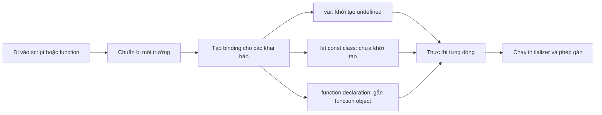
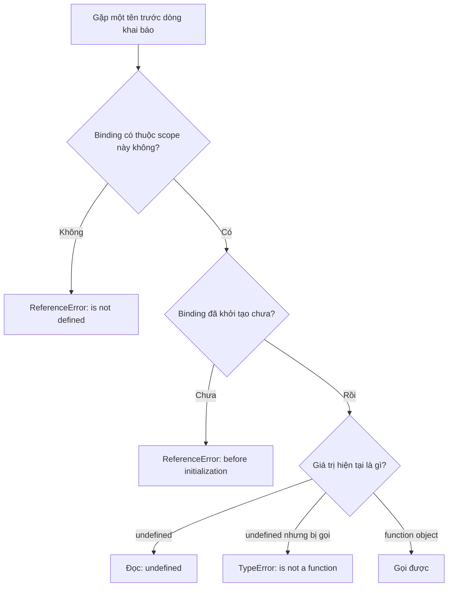

## Mục lục

- [Tổng quan](#tổng-quan)
- [Mô hình đúng: code không bị di chuyển](#mô-hình-đúng-code-không-bị-di-chuyển)
- [Ba thao tác dễ bị nhầm](#ba-thao-tác-dễ-bị-nhầm)
- [Hoisting với var](#hoisting-với-var)
- [Hoisting với let và const](#hoisting-với-let-và-const)
- [Function declaration và function expression](#function-declaration-và-function-expression)
- [Hoisting với class và import](#hoisting-với-class-và-import)
- [Hoisting xảy ra trong scope nào](#hoisting-xảy-ra-trong-scope-nào)
- [Khi var và function trùng tên](#khi-var-và-function-trùng-tên)
- [Phân biệt undefined và các loại lỗi](#phân-biệt-undefined-và-các-loại-lỗi)
- [Pitfalls thực tế](#pitfalls-thực-tế)
- [Best practices](#best-practices)
- [Tự kiểm tra](#tự-kiểm-tra)
- [Cheat sheet](#cheat-sheet)
- [Bài liên quan](#bài-liên-quan)

---

## Tổng quan

**Hoisting** là tên gọi cho hiện tượng một khai báo đã ảnh hưởng đến scope của nó **trước khi luồng thực thi đi tới dòng khai báo**.

Ví dụ đầu tiên:

```js
console.log(score); // undefined
var score = 10;

sayHello(); // "Xin chào"
function sayHello() {
  console.log("Xin chào");
}
```

Hai dòng trên đều sử dụng tên trước vị trí khai báo, nhưng kết quả khác nhau:

- `var score` đã tạo binding và được khởi tạo bằng `undefined`.
- `function sayHello` đã tạo binding và gắn sẵn function object.
- Phần gán `score = 10` **chưa chạy**, nên không thể nhận được `10` ở dòng đầu.

> [!IMPORTANT]
> Câu nhớ nhanh: **khai báo có thể được xử lý trước, nhưng phép gán thông thường vẫn chạy đúng tại vị trí của nó**.

Thuật ngữ *hoisting* giúp mô tả hành vi, nhưng không phải một thao tác tên là "hoist" trong ECMAScript. Đặc tả dùng các cơ chế như tạo **Environment Record**, tạo **binding** và khởi tạo binding. Vì vậy, hãy dùng hình ảnh "kéo khai báo lên đầu" để học nhanh, nhưng dùng mô hình binding để giải thích chính xác.

---

## Mô hình đúng: code không bị di chuyển

JavaScript engine không biến đổi:

```js
console.log(total);
var total = 100;
```

thành một file nguồn mới có dòng `var total` ở trên. Thay vào đó, trước khi thực thi thân script hoặc function, engine chuẩn bị môi trường chứa các tên được khai báo trong scope đó.

Có thể học theo mô hình hai bước:


```mermaid
flowchart LR
    A[Đi vào script hoặc function] --> B[Chuẩn bị môi trường]
    B --> B1[Tạo binding cho các khai báo]
    B1 --> B2[var: khởi tạo undefined]
    B1 --> B3[let const class: chưa khởi tạo]
    B1 --> B4[function declaration: gắn function object]
    B2 --> C[Thực thi từng dòng]
    B3 --> C
    B4 --> C
    C --> D[Chạy initializer và phép gán]
```

### Bước 1: chuẩn bị môi trường

Engine xác định những tên nào thuộc scope hiện tại và chuẩn bị trạng thái ban đầu cho chúng.

| Khai báo | Trạng thái trước khi chạy dòng đầu tiên |
|---|---|
| `var x` | binding đã khởi tạo với `undefined` |
| `let x` | binding đã tồn tại nhưng chưa khởi tạo |
| `const x` | binding đã tồn tại nhưng chưa khởi tạo |
| `class X` | binding đã tồn tại nhưng chưa khởi tạo |
| `function f() {}` | binding đã chứa function object |

### Bước 2: thực thi

Engine chạy code theo thứ tự từ trên xuống. Khi gặp initializer hoặc phép gán, giá trị mới được tính và lưu vào binding.

```js
var price = getPrice();
```

Dòng này chứa hai việc khác nhau:

1. Khai báo `var price` được xử lý khi chuẩn bị scope; `price` bắt đầu bằng `undefined`.
2. Lời gọi `getPrice()` và phép gán kết quả cho `price` chỉ xảy ra khi thực thi tới dòng đó.

> [!NOTE]
> "Creation phase → Execution phase" là mô hình học hữu ích. Tên thuật toán cụ thể trong spec thay đổi theo loại code, ví dụ `GlobalDeclarationInstantiation` hoặc `FunctionDeclarationInstantiation`; bạn không cần thuộc các tên này để dự đoán kết quả chương trình.

---

## Ba thao tác dễ bị nhầm

Để hiểu hoisting, phải tách rõ **declaration**, **initialization** và **assignment**.

```js
let count;  // declaration; đồng thời khởi tạo count = undefined khi dòng này chạy
count = 5;  // assignment

const limit = 10; // declaration + initialization; const bắt buộc có initializer
```

| Thao tác | Ý nghĩa | Ví dụ |
|---|---|---|
| Declaration | tạo một tên trong scope | `let count` |
| Initialization | đặt giá trị đầu tiên cho binding | `count` nhận `undefined` khi `let count` chạy |
| Assignment | thay giá trị của binding đã khởi tạo | `count = 5` |

Với `var`, initialization bằng `undefined` xảy ra ngay khi môi trường được chuẩn bị. Với `let`, initialization chỉ xảy ra khi luồng thực thi đến khai báo.

```js
console.log(a); // undefined
var a;

console.log(b); // ReferenceError
let b;
```

Sau khi dòng `let b;` đã chạy, `b` hoàn toàn hợp lệ và có giá trị `undefined`:

```js
let b;
console.log(b); // undefined
```

Điểm khác biệt không phải `undefined` có được phép hay không. Điểm khác biệt là **binding đã được khởi tạo hay vẫn còn ở trạng thái chưa khởi tạo**.

---

## Hoisting với var

### var được khởi tạo bằng undefined

```js
console.log(quantity); // undefined
var quantity = 3;
console.log(quantity); // 3
```

Trace theo thứ tự:

| Thời điểm | Hành động | Giá trị `quantity` |
|---|---|---|
| Chuẩn bị scope | tạo binding `quantity` | `undefined` |
| Dòng 1 | đọc `quantity` | in `undefined` |
| Dòng 2 | tính `3`, gán vào `quantity` | `3` |
| Dòng 3 | đọc `quantity` | in `3` |

Cách viết lại dưới đây chỉ là **mô hình tương đương để suy luận**:

```js
var quantity;
console.log(quantity);
quantity = 3;
console.log(quantity);
```

### Initializer vẫn giữ nguyên thứ tự thực thi

```js
var first = second;
var second = 20;

console.log(first);  // undefined
console.log(second); // 20
```

Trước khi chạy code, cả hai binding đều là `undefined`:

```text
first  → undefined
second → undefined
```

Khi chạy `first = second`, `second` vẫn là `undefined`, nên `first` nhận `undefined`. Dòng `second = 20` chạy sau đó không làm `first` tự động đổi theo.

### var thuộc function scope, không thuộc block scope

```js
function demo() {
  console.log(status); // undefined

  if (false) {
    var status = "done";
  }
}

demo();
```

Dù block `if` không chạy, khai báo `var status` vẫn thuộc toàn bộ `demo`. Binding tồn tại từ lúc function bắt đầu và có giá trị `undefined`.

> [!NOTE]
> `var` xuất hiện bên trong block rồi dùng được bên ngoài block chủ yếu là hệ quả của **function scope**, không nên gọi mọi trường hợp "rò khỏi block" là hoisting. Hoisting giải thích vì sao binding đã tồn tại trước dòng khai báo; scope giải thích binding tồn tại ở đâu.

---

## Hoisting với let và const

`let` và `const` tạo **lexical binding** theo block. Binding ảnh hưởng tới toàn bộ block ngay từ đầu, nhưng chưa thể đọc hoặc ghi cho tới khi luồng thực thi đi qua khai báo.

Khoảng thời gian đó gọi là **Temporal Dead Zone (TDZ)**.

```js
{
  // TDZ của discount bắt đầu từ đầu block
  console.log(discount); // ReferenceError
  const discount = 0.1;  // TDZ kết thúc sau khi initializer hoàn tất
}
```

```text
Bắt đầu block
│
├── discount đã thuộc block nhưng chưa khởi tạo
│   └── đọc / ghi / typeof discount → ReferenceError
│
├── const discount = 0.1
│   ├── tính initializer 0.1
│   └── khởi tạo binding
│
└── discount dùng bình thường
```

### Bằng chứng let và const đã ảnh hưởng tới scope

```js
const theme = "light";

{
  console.log(theme); // ReferenceError, không in "light"
  const theme = "dark";
}
```

`const theme` bên trong đã **shadow** biến bên ngoài cho toàn bộ block. Ở dòng `console.log`, engine tìm thấy binding bên trong trước, nhưng binding này còn trong TDZ nên ném `ReferenceError`; engine không tiếp tục tìm `theme` ở scope ngoài.

Đây là lý do hai cách diễn đạt sau thường xuất hiện:

- "`let`/`const` có hoisting nhưng nằm trong TDZ" — nhấn mạnh ảnh hưởng của binding lên toàn bộ scope.
- "`let`/`const` không hoisting" — cách nói thực dụng vì không thể dùng giá trị trước khai báo.

Trong bài này, ta dùng cách đầu vì nó giải thích được shadowing và TDZ.

### TDZ phụ thuộc thứ tự thực thi, không chỉ vị trí viết

```js
{
  const showValue = () => console.log(value);

  let value = 42;
  showValue(); // 42
}
```

Thân `showValue` có nhắc tới `value` trước dòng khai báo, nhưng **chưa đọc `value` ở thời điểm tạo function**. Đến khi gọi `showValue()`, dòng `let value = 42` đã chạy nên TDZ đã kết thúc.

Đổi thứ tự gọi sẽ lỗi:

```js
{
  const showValue = () => console.log(value);

  showValue(); // ReferenceError
  let value = 42;
}
```

### typeof không luôn an toàn

`typeof` với một tên hoàn toàn chưa được khai báo trả về chuỗi `"undefined"`:

```js
console.log(typeof notDeclared); // "undefined"
```

Nhưng `typeof` với binding đang trong TDZ vẫn ném lỗi:

```js
{
  console.log(typeof total); // ReferenceError
  let total = 10;
}
```

> [!IMPORTANT]
> TDZ chặn cả đọc, ghi và `typeof`. Nó kết thúc khi **luồng thực thi** tới khai báo và initialization hoàn tất, không đơn giản là khi nhìn thấy một dòng nằm phía trên hay phía dưới trong file.

---

## Function declaration và function expression

Đây là phần dễ xuất hiện nhất trong câu hỏi phỏng vấn về hoisting.

### Function declaration: có sẵn cả function object

```js
const result = add(2, 3);
console.log(result); // 5

function add(a, b) {
  return a + b;
}
```

Binding `add` đã chứa function object trước khi dòng đầu chạy, nên có thể gọi trước vị trí khai báo.

Các declaration như `async function`, generator `function*` và `async function*` cũng thuộc nhóm declaration có giá trị được chuẩn bị trước.

### Function expression với var: TypeError

```js
run(); // TypeError: run is not a function

var run = function () {
  console.log("running");
};
```

Trước dòng gán:

```text
run → undefined
```

Tên `run` tồn tại nên không có `ReferenceError`. Tuy nhiên, gọi `run()` tương đương gọi `undefined()`, vì vậy kết quả là `TypeError`.

### Function expression hoặc arrow function với const/let: ReferenceError

```js
run(); // ReferenceError: Cannot access 'run' before initialization

const run = function () {
  console.log("running");
};
```

Arrow function có cùng quy tắc:

```js
calculate(); // ReferenceError
const calculate = () => 2 + 3;
```

Không phải function expression hay arrow function "được hoisted một phần". Chính **biến chứa function** tuân theo quy tắc của `var`, `let` hoặc `const`.

### Bảng so sánh

| Cách định nghĩa | Trạng thái trước khai báo | Gọi trước khai báo |
|---|---|---|
| `function work() {}` | đã chứa function object | chạy được |
| `var work = function () {}` | `undefined` | `TypeError` |
| `let work = function () {}` | TDZ | `ReferenceError` |
| `const work = () => {}` | TDZ | `ReferenceError` |

### Function declaration bên trong block

Trong ES Modules và strict mode, function declaration trong block thuộc chính block đó và được hoisted tới đầu block:

```js
"use strict";

{
  greet(); // "Hi"

  function greet() {
    console.log("Hi");
  }
}

console.log(typeof greet); // "undefined"
```

Trong script cũ chạy non-strict mode, function declaration trong `if` hoặc block từng có hành vi khác nhau giữa các engine. Không nên dựa vào hành vi đó.

```js
// Cách rõ ràng hơn cho function có điều kiện
let handler;

if (condition) {
  handler = function handleCondition() {
    // ...
  };
}
```

---

## Hoisting với class và import

### Class declaration nằm trong TDZ

Class declaration tạo lexical binding giống `let`/`const`: binding thuộc scope từ đầu nhưng chưa khởi tạo.

```js
const user = new User(); // ReferenceError

class User {
  constructor() {
    this.name = "An";
  }
}
```

Phải thực thi xong khai báo class rồi mới sử dụng:

```js
class User {}
const user = new User(); // hợp lệ
```

Class expression tuân theo biến chứa nó:

```js
console.log(Service); // undefined
var Service = class {};
```

Ở đây `undefined` đến từ `var Service`, không phải do class expression có thể dùng trước.

### Import được liên kết trước khi module body chạy

Static import có thể được tham chiếu trước dòng import trong cùng module:

```js
console.log(apiVersion);

import { apiVersion } from "./config.js";
```

Các dependency được liên kết và đánh giá theo hệ thống ES Modules trước khi module body chạy. Tuy nhiên, import là **live binding**, và circular dependency vẫn có thể gây `ReferenceError` nếu một module đọc binding của module khác trước khi binding đó được khởi tạo.

> [!WARNING]
> Đừng cố sắp import xuống cuối file chỉ vì static import có cơ chế xử lý trước. Quy ước đặt import ở đầu file giúp dependency rõ ràng và tránh làm người đọc hiểu nhầm thứ tự.

---

## Hoisting xảy ra trong scope nào

Một khai báo chỉ được chuẩn bị trong **scope mà nó thuộc về**. Hoisting không làm biến vượt qua ranh giới scope.

```js
function createOrder() {
  console.log(orderId); // undefined
  var orderId = "A-001";
}

createOrder();
console.log(orderId); // ReferenceError: orderId is not defined
```

`orderId` được hoisted tới đầu function `createOrder`, không phải đầu toàn bộ chương trình.

### Quy tắc scope cần nhớ

| Khai báo | Scope gần nhất |
|---|---|
| `var` | function hoặc global script |
| `let`, `const`, `class` | block, function hoặc module |
| function declaration ở top-level function | function |
| function declaration trong block ở strict mode/module | block |
| static `import` | module |

Ví dụ kết hợp scope và TDZ:

```js
let value = "global";

function demo() {
  console.log(value); // ReferenceError

  if (true) {
    console.log(inner); // undefined
    var inner = "inside";
  }

  let value = "local";
  console.log(inner); // "inside"
}

demo();
```

Giải thích:

1. `let value = "local"` tạo binding cho toàn bộ scope của `demo`; dòng đầu chạm binding này trong TDZ.
2. `var inner` thuộc function `demo`, không thuộc block `if`; nó được khởi tạo `undefined` khi function bắt đầu.
3. Nếu bỏ dòng lỗi đầu tiên để chương trình tiếp tục, `inner` sẽ nhận `"inside"` trong block và vẫn dùng được sau block.

---

## Khi var và function trùng tên

Ở top-level của script hoặc function body, `var` và function declaration có thể dùng cùng tên. Binding ban đầu sẽ giữ function object; một khai báo `var` không có initializer không thay đổi giá trị đó.

```js
console.log(typeof task); // "function"

var task;
function task() {}

console.log(typeof task); // "function"
```

Nếu `var` có initializer, phép gán chạy theo thứ tự bình thường và có thể ghi đè function:

```js
console.log(typeof task); // "function"

task = 10;
var task;
function task() {}

console.log(typeof task); // "number"
```

Trace:

| Thời điểm | `task` |
|---|---|
| Sau khi chuẩn bị scope | function object |
| Dòng `console.log` đầu | in `"function"` |
| Dòng `task = 10` | `10` |
| Dòng `var task` | không gán lại gì |
| Dòng `console.log` cuối | in `"number"` |

Với nhiều function declaration cùng tên trong script/function body kiểu cũ, declaration xuất hiện sau thường cung cấp giá trị ban đầu:

```js
show(); // "second"

function show() {
  console.log("first");
}

function show() {
  console.log("second");
}
```

ES Modules và lexical declaration có quy tắc redeclare chặt hơn; nhiều trường hợp trùng tên sẽ là `SyntaxError` trước khi code chạy. Trong code thực tế, không nên tận dụng quy tắc ưu tiên này — hãy dùng tên duy nhất.

---

## Phân biệt undefined và các loại lỗi

Hoisting thường được hỏi thông qua loại lỗi. Chỉ cần xác định **binding có tồn tại không, đã khởi tạo chưa, và giá trị hiện tại có gọi được không**.

| Kết quả | Ý nghĩa thường gặp | Ví dụ |
|---|---|---|
| `undefined` | binding tồn tại và đã khởi tạo, nhưng chưa có giá trị hữu ích | đọc `var` trước initializer |
| `ReferenceError: ... before initialization` | binding tồn tại nhưng đang trong TDZ | đọc `let`/`const`/`class` quá sớm |
| `ReferenceError: ... is not defined` | không tìm thấy binding trong scope chain | đọc một tên chưa khai báo |
| `TypeError: ... is not a function` | binding tồn tại, nhưng giá trị hiện tại không callable | gọi function expression chứa trong `var` quá sớm |
| `SyntaxError: ... already been declared` | các declaration xung đột; chương trình không bắt đầu thực thi | khai báo `let x` hai lần cùng scope |

Quy trình debug nhanh:


```mermaid
flowchart TD
    A[Gặp một tên trước dòng khai báo] --> B{Binding có thuộc scope này không?}
    B -- Không --> C[ReferenceError: is not defined]
    B -- Có --> D{Binding đã khởi tạo chưa?}
    D -- Chưa --> E[ReferenceError: before initialization]
    D -- Rồi --> F{Giá trị hiện tại là gì?}
    F -- undefined --> G[Đọc: undefined]
    F -- undefined nhưng bị gọi --> H[TypeError: is not a function]
    F -- function object --> I[Gọi được]
```

---

## Pitfalls thực tế

### 1. Dùng var trước initializer

```js
if (user) {
  showProfile(user);
}

var user = getCurrentUser();
```

Điều kiện không lỗi, nhưng `user` là `undefined`, nên block bị bỏ qua một cách im lặng. Đây thường nguy hiểm hơn một lỗi rõ ràng.

**Cách sửa:** khai báo và khởi tạo trước khi dùng; ưu tiên `const`.

```js
const user = getCurrentUser();

if (user) {
  showProfile(user);
}
```

### 2. Gọi function expression quá sớm

```js
start();
var start = () => console.log("start");
```

Tên tồn tại nhưng giá trị là `undefined`, dẫn đến `TypeError`.

**Cách sửa:** chuyển định nghĩa lên trên, hoặc dùng function declaration nếu thật sự muốn API có thể gọi ở mọi vị trí trong scope.

### 3. Shadowing tạo TDZ ngoài dự đoán

```js
const price = 100;

function calculate() {
  console.log(price); // ReferenceError
  let price = 80;
}
```

`let price` local che `price` global cho toàn function, kể cả đoạn trước khai báo.

### 4. Tự tham chiếu trong initializer

```js
let count = count + 1; // ReferenceError
```

Vế phải đọc chính binding `count` khi initialization chưa hoàn tất.

Một biến scope ngoài cùng tên cũng không cứu được:

```js
let count = 10;

{
  let count = count + 1; // ReferenceError
}
```

### 5. Khai báo function có điều kiện

```js
if (featureEnabled) {
  function runFeature() {}
}
```

Trong module/strict mode, function chỉ thuộc block. Trong script cũ non-strict, hành vi lịch sử phức tạp và không nên dựa vào.

**Cách sửa:** khai báo một biến rõ ràng rồi gán function theo điều kiện, hoặc đưa function declaration ra ngoài và đặt điều kiện tại nơi gọi.

### 6. Circular import

Hai module import lẫn nhau có thể liên kết thành công nhưng vẫn đọc một binding trước khi module kia khởi tạo xong. Kết quả thường là `ReferenceError`, không phải import luôn an toàn chỉ vì import được xử lý trước module body.

**Cách sửa:** tách phần dùng chung sang module thứ ba, giảm side effect ở top-level và tránh đọc dependency vòng ngay khi module được đánh giá.

---

## Best practices

1. **Khai báo trước khi dùng** — đừng bắt người đọc phải mô phỏng hoisting để hiểu code.
2. **Mặc định dùng `const`** — dùng `let` khi cần gán lại; tránh `var` trong code mới.
3. **Đặt declaration gần nơi sử dụng** — scope ngắn và TDZ ngắn giúp code dễ đọc.
4. **Dùng function declaration có chủ đích** — phù hợp cho hàm chính có thể được gọi từ nhiều vị trí; dùng expression khi muốn nhấn mạnh function là một giá trị.
5. **Không trùng tên giữa `var`, function và lexical declaration** — dù một số tổ hợp hợp lệ, chúng gây khó đọc và dễ thành `SyntaxError` khi chuyển sang module.
6. **Đặt static import ở đầu file** — đây là quy ước về khả năng đọc, không phải giới hạn của hoisting.
7. **Dự đoán loại lỗi trước khi chạy** — xác định scope → trạng thái binding → giá trị hiện tại.

> [!TIP]
> Hoisting nên là kiến thức để **đọc và debug JavaScript**, không phải kỹ thuật để cố tình viết declaration ở dưới nơi sử dụng.

---

## Tự kiểm tra

### Câu 1: var và initializer

Đoạn code in gì?

```js
console.log(a);
var a = b;
var b = 7;
console.log(a, b);
```

### Câu 2: TDZ và shadowing

Vì sao code không in `"global"`?

```js
const mode = "global";

function test() {
  console.log(mode);
  const mode = "local";
}

test();
```

### Câu 3: declaration và expression

Lỗi xuất hiện ở dòng nào?

```js
hello();
run();

function hello() {
  console.log("hello");
}

var run = function () {
  console.log("run");
};
```

### Câu 4: TDZ theo thời điểm thực thi

Đoạn code có lỗi không?

```js
{
  const read = () => token;
  const token = "abc";
  console.log(read());
}
```

### Câu 5: function và var trùng tên

Đoạn code in gì?

```js
console.log(typeof convert);
var convert = 123;
function convert() {}
console.log(typeof convert);
```

<Accordions type="single">
  <Accordion title="Đáp án câu 1">
    Dòng đầu in `undefined`. Khi chạy `a = b`, cả `a` và `b` đều đang là `undefined`, nên `a` nhận `undefined`. Sau đó `b = 7`; dòng cuối in `undefined 7`.
  </Accordion>
  <Accordion title="Đáp án câu 2">
    `const mode` local tạo binding cho toàn scope của `test` và shadow `mode` global. Tại `console.log`, binding local vẫn trong TDZ nên ném `ReferenceError`.
  </Accordion>
  <Accordion title="Đáp án câu 3">
    `hello()` chạy và in `"hello"` vì function declaration đã có function object. `run()` ném `TypeError: run is not a function` vì `var run` đang là `undefined`; chương trình dừng ở đó.
  </Accordion>
  <Accordion title="Đáp án câu 4">
    Không lỗi. Function `read` chỉ đọc `token` khi được gọi. Lúc `read()` chạy, `const token = "abc"` đã khởi tạo xong, nên kết quả là `"abc"`.
  </Accordion>
  <Accordion title="Đáp án câu 5">
    Dòng đầu in `"function"`: binding ban đầu chứa function object. Initializer của `var convert = 123` chạy sau và ghi đè giá trị, nên dòng cuối in `"number"`.
  </Accordion>
</Accordions>

---

## Cheat sheet

| Khai báo | Binding trước dòng khai báo | Truy cập sớm | Scope chính |
|---|---|---|---|
| `var x = 1` | đã khởi tạo `undefined` | trả `undefined` | function/global script |
| `let x = 1` | chưa khởi tạo, trong TDZ | `ReferenceError` | block |
| `const x = 1` | chưa khởi tạo, trong TDZ | `ReferenceError` | block |
| `function f() {}` | đã chứa function object | gọi được | function/global; block trong strict mode |
| `var f = () => {}` | `undefined` | gọi → `TypeError` | function/global script |
| `const f = () => {}` | TDZ | gọi → `ReferenceError` | block |
| `class X {}` | TDZ | `ReferenceError` | block |
| static `import` | được liên kết trước module body | thường truy cập được; cẩn thận circular dependency | module |

> [!IMPORTANT]
> 1. Hoisting **không di chuyển code**; nó mô tả việc declaration ảnh hưởng tới scope trước khi được thực thi.
> 2. Tách ba khái niệm: **declaration → initialization → assignment**.
> 3. `var` bắt đầu bằng `undefined`; initializer vẫn chạy đúng vị trí.
> 4. `let`/`const`/`class` có binding nhưng nằm trong **TDZ** cho tới khi initialization hoàn tất.
> 5. Function declaration có sẵn function object; function expression tuân theo biến chứa nó.
> 6. Hoisting chỉ xảy ra trong scope tương ứng, không đưa tên vượt qua ranh giới scope.
> 7. Code tốt vẫn nên **khai báo trước khi dùng**.

---

## Bài liên quan

- [var, let, const](/fundamentals/var-let-const/)
- [Scope & Scope Chain](/fundamentals/scope/)
- [Functions](/function-closure/function-basics/)
- [Closures](/function-closure/closures/)
- [import / export](/modules/import-export/)
