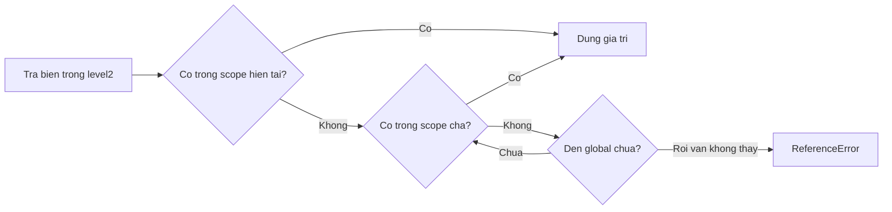

## Mục lục

- [Tổng quan](#tổng-quan)
- [Ba loại scope](#ba-loại-scope)
- [Lexical scope (static scope)](#lexical-scope-static-scope)
- [Scope chain & cách resolve biến](#scope-chain--cách-resolve-biến)
- [Variable shadowing](#variable-shadowing)
- [Scope & Closure](#scope--closure)
- [IIFE và module scope](#iife-và-module-scope)
- [Pitfalls](#pitfalls)
- [Bài liên quan](#bài-liên-quan)

---

## Tổng quan

**Scope** (phạm vi) là tập các quy tắc quyết định: *tại một điểm trong code, những biến/hàm nào đang "nhìn thấy" được?* Hiểu scope là nền tảng để hiểu hoisting, closure, và tránh vô số bug về biến.

JavaScript dùng **lexical scope** (còn gọi *static scope*): phạm vi của một biến được xác định **tại thời điểm viết code** (vị trí khai báo trong văn bản nguồn), *không phải* lúc hàm được gọi.

```js
const message = "global";

function outer() {
  const message = "outer";
  function inner() {
    console.log(message);  // "outer" — tra theo nơi inner ĐƯỢC VIẾT
  }
  inner();
}
outer();
```

---

## Ba loại scope

```text
┌─────────────────────────── Global scope ───────────────────────────┐
│  const g = 1;                                                       │
│                                                                     │
│   ┌───────────────────── Function scope (fn) ──────────────────┐    │
│   │  const f = 2;                                              │    │
│   │                                                            │    │
│   │     ┌──────────────── Block scope (if/for/{}) ─────────┐   │    │
│   │     │  let b = 3;   const c = 4;                       │   │    │
│   │     └──────────────────────────────────────────────────┘   │    │
│   └────────────────────────────────────────────────────────────┘    │
└─────────────────────────────────────────────────────────────────────┘
```

### 1. Global scope

Vùng ngoài cùng, không nằm trong function nào. Biến global truy cập được ở mọi nơi.

```js
const apiUrl = "https://api.example.com";  // global
function getUrl() { return apiUrl; }       // nhìn thấy apiUrl
```

### 2. Function scope

Mỗi function tạo một scope riêng. Biến khai báo trong function (bằng `var`, `let`, `const`) chỉ dùng được *trong* function đó.

```js
function calc() {
  const local = 42;
}
console.log(local);  // ReferenceError: local is not defined
```

### 3. Block scope

Cặp `{}` của `if`, `for`, `while`, hay block trần tạo block scope — **nhưng chỉ cho `let`/`const`**. `var` bỏ qua block scope (nó là function-scoped).

```js
{
  let a = 1;
  var b = 2;
}
console.log(b);  // 2  — var leak ra ngoài block
console.log(a);  // ReferenceError — let bị nhốt trong block
```

> [!IMPORTANT]
> Đây là lý do `var` nguy hiểm: một `var` trong `if`/`for` trở thành biến của *cả function*, dễ gây xung đột tên và ghi đè ngoài ý muốn. Dùng `let`/`const` để có block scope đúng nghĩa.

---

## Lexical scope (static scope)

"Lexical" nghĩa là *theo vị trí trong văn bản code*. Một hàm lồng bên trong hàm khác có thể truy cập biến của hàm cha — và điều này được quyết định **lúc viết**, không phải lúc gọi.

```js
function outer() {
  const secret = "abc";
  function inner() {
    console.log(secret);   // truy cập được biến của outer
  }
  return inner;
}

const fn = outer();
fn();   // "abc" — dù gọi ở ngoài, inner vẫn nhớ scope nơi nó được VIẾT
```

Đối lập với lexical scope là *dynamic scope* (phạm vi theo nơi *gọi*) — JavaScript **không** dùng cơ chế này cho biến. Ví dụ chứng minh:

```js
const x = "global";
function a() { console.log(x); }   // x tra theo nơi a được viết → "global"
function b() {
  const x = "trong b";
  a();                             // vẫn in "global", KHÔNG phải "trong b"
}
b();
```

---

## Scope chain & cách resolve biến

Khi engine gặp một biến, nó tra cứu theo **scope chain**: tìm ở scope hiện tại trước, không thấy thì leo ra scope cha, rồi cha của cha... cho đến global. Không thấy ở đâu cả → `ReferenceError`.

```js
const a = "global";
function level1() {
  const b = "level1";
  function level2() {
    const c = "level2";
    console.log(a, b, c);   // tra c (tại chỗ) → b (cha) → a (global)
  }
  level2();
}
level1();
```



> [!NOTE]
> Scope chain chỉ đi **một chiều: từ trong ra ngoài**. Scope cha **không** nhìn thấy biến của scope con. Vì vậy biến khai báo trong `level2` không dùng được ở `level1`.

---

## Variable shadowing

**Shadowing** xảy ra khi một biến ở scope trong có *cùng tên* với biến scope ngoài. Biến trong "che" biến ngoài trong phạm vi của nó.

```js
const value = "ngoài";
function demo() {
  const value = "trong";   // shadow biến ngoài
  console.log(value);      // "trong"
}
demo();
console.log(value);        // "ngoài" — biến ngoài không bị ảnh hưởng
```

Shadowing hợp lệ và hữu ích, nhưng lạm dụng làm code khó đọc. Lưu ý **illegal shadowing** giữa `let` và `var`:

```js
function f() {
  let a = 1;
  {
    var a = 2;   // SyntaxError: Identifier 'a' has already been declared
  }
}
```

---

## Scope & Closure

**Closure** là hệ quả trực tiếp của lexical scope: khi một hàm "ghi nhớ" scope nơi nó được tạo *ngay cả sau khi* hàm cha đã return.

```js
function counter() {
  let count = 0;                  // biến của counter
  return function () {
    count++;                      // closure giữ tham chiếu tới count
    return count;
  };
}

const next = counter();
console.log(next());  // 1
console.log(next());  // 2  — count vẫn sống nhờ closure
```

Dù `counter()` đã chạy xong, biến `count` không bị thu hồi vì hàm bên trong vẫn còn tham chiếu tới nó qua scope chain. Xem sâu hơn ở bài [Closures](/functions/closures/).

---

## IIFE và module scope

Trước khi có module ES6, lập trình viên dùng **IIFE** (Immediately Invoked Function Expression) để tạo scope riêng, tránh làm bẩn global:

```js
(function () {
  var privateVar = "ẩn";   // không leak ra global
  // ... code
})();
console.log(typeof privateVar);  // "undefined"
```

Ngày nay **ES Modules** tự cô lập scope: mỗi file module là một scope riêng, biến top-level *không* trở thành global. Đây là cách hiện đại để đóng gói.

---

## Pitfalls

| Pitfall | Hậu quả | Cách tránh |
|---------|---------|------------|
| `var` leak ra ngoài block | Xung đột tên, ghi đè ngoài ý muốn | Dùng `let`/`const` (block scope) |
| Quên `var`/`let`/`const` khi gán | Tạo biến global ngầm (sloppy mode) | Dùng `"use strict"`; luôn khai báo |
| Shadowing vô tình | Đọc nhầm biến, khó debug | Đặt tên rõ ràng, hạn chế trùng tên |
| Tưởng scope cha thấy biến con | `ReferenceError` | Nhớ scope chain chỉ đi từ trong ra ngoài |
| Lạm dụng biến global | Khó test, dễ va chạm | Đóng gói bằng module/closure/IIFE |

> [!TIP]
> Gán biến mà quên từ khoá (`x = 10` thay vì `let x = 10`) sẽ **tạo biến global ngầm** ở sloppy mode — một trong những bug khó chịu nhất. Luôn bật `"use strict"` (ES Modules tự bật) để biến lỗi này thành `ReferenceError`.

---

## Bài liên quan

- [Closures](/functions/closures/)
- [Hoisting](/fundamentals/hoisting/)
- [var, let, const](/fundamentals/var-let-const/)
