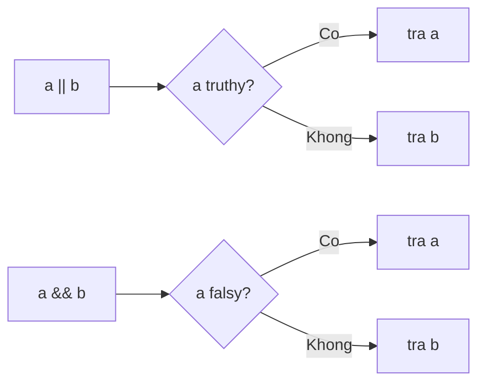

## Mục lục

- [Tổng quan](#tổng-quan)
- [Danh sách 8 giá trị falsy](#danh-sách-8-giá-trị-falsy)
- [Mọi thứ khác đều truthy](#mọi-thứ-khác-đều-truthy)
- [Boolean coercion: khi nào xảy ra](#boolean-coercion-khi-nào-xảy-ra)
- [Toán tử logic & short-circuit](#toán-tử-logic--short-circuit)
- [|| vs ?? — khác biệt sống còn](#-vs----khác-biệt-sống-còn)
- [Ép kiểu boolean tường minh](#ép-kiểu-boolean-tường-minh)
- [Pitfalls](#pitfalls)
- [Bài liên quan](#bài-liên-quan)

---

## Tổng quan

Trong JavaScript, ở **ngữ cảnh boolean** (điều kiện `if`, vòng lặp, toán tử logic...), mọi giá trị đều được **ép kiểu (coerce)** thành `true` hoặc `false`. Một giá trị được gọi là:

- **Falsy** — nếu nó ép thành `false`.
- **Truthy** — nếu nó ép thành `true`.

Mẹo ghi nhớ: chỉ có **8 giá trị falsy**, học thuộc danh sách đó. **Tất cả những thứ còn lại đều truthy** — kể cả những giá trị trông có vẻ "rỗng" như `"0"`, `[]`, `{}`.

---

## Danh sách 8 giá trị falsy

| Giá trị | Loại | Ghi chú |
|---------|------|---------|
| `false` | boolean | Bản thân `false` |
| `0` | number | Số 0 |
| `-0` | number | Âm 0 |
| `0n` | bigint | BigInt 0 |
| `""` (`''`, ` `` `) | string | Chuỗi rỗng |
| `null` | null | |
| `undefined` | undefined | |
| `NaN` | number | Not a Number |

```js
if (!false && !0 && !"" && !null && !undefined && !NaN) {
  console.log("Tất cả đều falsy");  // in ra
}
```

> [!IMPORTANT]
> Học thuộc đúng 8 giá trị này là đủ. Không cần nhớ "cái gì truthy" — cứ không nằm trong danh sách falsy thì là truthy.

---

## Mọi thứ khác đều truthy

Những giá trị hay bị tưởng nhầm là falsy nhưng thực ra **truthy**:

```js
if ("0")        console.log("'0' truthy");        // in — chuỗi "0" không rỗng
if ("false")    console.log("'false' truthy");    // in — chuỗi, không phải boolean
if (" ")        console.log("' ' truthy");        // in — chuỗi có dấu cách
if ([])         console.log("[] truthy");         // in — array rỗng vẫn truthy
if ({})         console.log("{} truthy");         // in — object rỗng vẫn truthy
if (function(){}) console.log("function truthy");  // in
if (Infinity)   console.log("Infinity truthy");   // in
```

> [!WARNING]
> `[]` và `{}` **truthy** dù "rỗng". Muốn kiểm tra mảng rỗng phải dùng `arr.length === 0`, kiểm tra object rỗng dùng `Object.keys(obj).length === 0` — *không* dùng `if (!arr)`.

---

## Boolean coercion: khi nào xảy ra

Ép kiểu boolean ngầm xảy ra ở các vị trí "ngữ cảnh boolean":

```js
if (value) { /* ... */ }            // điều kiện if
while (value) { /* ... */ }         // vòng lặp
value ? a : b;                      // ternary
!value;                             // toán tử NOT
a && b;   a || b;                   // toán tử logic
[1,2,3].filter(Boolean);            // truyền Boolean làm callback
```

Cơ chế: engine gọi phép toán trừu tượng `ToBoolean(value)` — trả `false` nếu value thuộc 8 giá trị falsy, ngược lại `true`.

---

## Toán tử logic & short-circuit

`&&` và `||` trong JS **không trả về boolean** — chúng trả về **một trong hai toán hạng gốc**, và đánh giá theo kiểu *short-circuit* (ngắn mạch: dừng ngay khi biết kết quả).

### `||` (OR) — trả về giá trị truthy đầu tiên

```js
console.log(0 || "mặc định");       // "mặc định" (0 falsy → lấy phải)
console.log("Hiệp" || "mặc định");  // "Hiệp" (truthy → lấy luôn, không xét phải)
console.log(null || 0 || "" || 5);  // 5 — truthy đầu tiên
```

Cú pháp `expr1 || expr2`: nếu `expr1` truthy → trả `expr1` (không đụng `expr2`); ngược lại trả `expr2`.

### `&&` (AND) — trả về giá trị falsy đầu tiên (hoặc cuối cùng nếu tất cả truthy)

```js
console.log(1 && 2 && 3);           // 3 — tất cả truthy → trả cuối
console.log(1 && 0 && 3);           // 0 — falsy đầu tiên, dừng luôn
console.log("a" && null && "b");    // null
```

### Ứng dụng thực tế

```js
// Guard: chỉ chạy khi user tồn tại
user && user.sendMessage();

// Render có điều kiện (React)
isLoggedIn && <Dashboard />;

// Giá trị mặc định (cẩn thận — xem mục || vs ?? bên dưới)
const port = config.port || 3000;
```



---

## || vs ?? — khác biệt sống còn

`||` lấy giá trị phải khi trái **falsy**. `??` (nullish coalescing, ES2020) chỉ lấy giá trị phải khi trái là **`null` hoặc `undefined`** — *không* tính `0`, `""`, `false`, `NaN`.

```js
const count = 0;

console.log(count || 10);   // 10 — vì 0 falsy (CÓ THỂ SAI ý định!)
console.log(count ?? 10);   // 0  — vì 0 không phải null/undefined (đúng ý định)

const name = "";
console.log(name || "Khách");  // "Khách" — "" falsy
console.log(name ?? "Khách");  // ""       — "" hợp lệ, giữ nguyên
```

| | `a || b` lấy `b` khi `a` là... | `a ?? b` lấy `b` khi `a` là... |
|---|---|---|
| `null` | ✅ | ✅ |
| `undefined` | ✅ | ✅ |
| `0` | ✅ | ❌ (giữ `0`) |
| `""` | ✅ | ❌ (giữ `""`) |
| `false` | ✅ | ❌ (giữ `false`) |
| `NaN` | ✅ | ❌ (giữ `NaN`) |

> [!TIP]
> Dùng `??` khi giá trị `0`, `""`, `false` là **hợp lệ** và bạn chỉ muốn thay thế khi *thực sự* không có giá trị (`null`/`undefined`). Đây là lỗi rất phổ biến: `count || 10` vô tình biến `0` thành `10`.

---

## Ép kiểu boolean tường minh

Khi cần một boolean *thật* (vd để so sánh nghiêm ngặt, trả về từ hàm), ép kiểu rõ ràng:

```js
Boolean(0);        // false
Boolean("hi");     // true
Boolean(null);     // false

!!"hi";            // true  — "double NOT" trick, ngắn gọn
!!0;               // false
!!{};              // true

[0, 1, "", "a", null].filter(Boolean);  // [1, "a"] — lọc bỏ falsy
```

`!!x` hoạt động vì `!x` đảo + ép boolean một lần, `!!x` đảo lại lần nữa → đúng giá trị truthy/falsy dưới dạng boolean.

---

## Pitfalls

| Pitfall | Vấn đề | Cách đúng |
|---------|--------|-----------|
| `if (!arr)` để kiểm tra mảng rỗng | `[]` truthy → không bao giờ vào | `if (arr.length === 0)` |
| `count || default` khi `count` có thể `0` | `0` bị thay bằng default | Dùng `count ?? default` |
| `if (obj.value)` khi `value` có thể `0`/`""` | Bỏ sót giá trị hợp lệ | So sánh tường minh: `value !== undefined` |
| Tưởng `"0"`, `"false"` là falsy | Chúng truthy (chuỗi không rỗng) | Parse về số/boolean trước khi xét |
| Trả `a && b` rồi kỳ vọng boolean | Trả về toán hạng, không phải `true/false` | Bọc `Boolean(a && b)` nếu cần boolean |
| Dùng `==` để kiểm tra falsy | Coercion khó lường | Kiểm tra rõ ràng hoặc dùng `===` |

---

## Bài liên quan

- [Toán tử & == vs ===](/fundamentals/operators/)
- [Kiểu dữ liệu & null / undefined / NaN](/fundamentals/data-types/)
