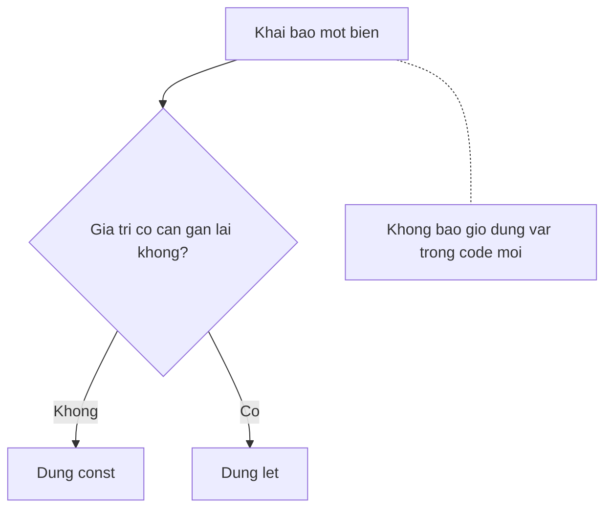

## Mục lục

- [Tổng quan](#tổng-quan)
- [Bảng so sánh nhanh](#bảng-so-sánh-nhanh)
- [Function scope vs Block scope](#function-scope-vs-block-scope)
- [Hoisting & Temporal Dead Zone](#hoisting--temporal-dead-zone)
- [Đào sâu internal: binding sống ở đâu](#đào-sâu-internal-binding-sống-ở-đâu)
- [Re-declare & Re-assign](#re-declare--re-assign)
- [const không phải "bất biến"](#const-không-phải-bất-biến)
- [Cái bẫy kinh điển: var trong vòng lặp](#cái-bẫy-kinh-điển-var-trong-vòng-lặp)
- [var làm ô nhiễm global object](#var-làm-ô-nhiễm-global-object)
- [Quy tắc chọn từ khoá](#quy-tắc-chọn-từ-khoá)
- [Anti-patterns](#anti-patterns)
- [Tự kiểm tra](#tự-kiểm-tra)
- [Cheat sheet](#cheat-sheet)
- [Bài liên quan](#bài-liên-quan)

---

## Tổng quan

`var`, `let`, `const` là ba cách khai báo biến trong JavaScript. Chúng khác nhau ở **ba trục** quan trọng:

1. **Scope** — biến "sống" ở phạm vi nào (function hay block)?
2. **Hoisting** — chuyện gì xảy ra khi truy cập biến *trước* dòng khai báo?
3. **Re-assign / Re-declare** — có được gán lại / khai báo lại không?

`var` là cách cũ (từ trước ES6), mang nhiều hành vi gây bug. `let` và `const` (ES6, 2015) ra đời để sửa chính những điểm đó. Trong code hiện đại, **gần như không còn lý do để dùng `var`**.

> [!NOTE]
> Một câu để nhớ định hướng cả bài: **mặc định dùng `const`, cần gán lại thì `let`, và quên `var` đi.** Phần còn lại của bài giải thích *tại sao*.

---

## Bảng so sánh nhanh

| Tiêu chí | `var` | `let` | `const` |
|----------|-------|-------|---------|
| Phiên bản | Mọi phiên bản JS | ES6 (2015)+ | ES6 (2015)+ |
| Scope | Function / Global | Block `{}` | Block `{}` |
| Hoisting | Có, khởi tạo `undefined` | Có, nhưng vào **TDZ** | Có, nhưng vào **TDZ** |
| Truy cập trước khai báo | `undefined` | `ReferenceError` | `ReferenceError` |
| Re-declare cùng scope | Được | **Không** (`SyntaxError`) | **Không** (`SyntaxError`) |
| Re-assign | Được | Được | **Không** (`TypeError`) |
| Bắt buộc khởi tạo lúc khai báo | Không | Không | **Có** |
| Tạo property trên global object | **Có** | Không | Không |

---

## Function scope vs Block scope

Đây là khác biệt **quan trọng nhất**. Scope quyết định biến nhìn thấy được ở đâu.

- `var` là **function-scoped**: biến thuộc về function gần nhất bao quanh nó. Nó **bỏ qua** các block `{}` của `if`, `for`, `while`...
- `let` / `const` là **block-scoped**: biến chỉ sống trong cặp `{}` gần nhất (kể cả `if`, `for`, hay block trần `{ }`).

```js
function demo() {
  if (true) {
    var a = 1;     // function-scoped → "leak" ra ngoài if
    let b = 2;     // block-scoped → chỉ sống trong if
    const c = 3;   // block-scoped
  }
  console.log(a);  // 1   — var nhìn thấy được
  console.log(b);  // ReferenceError: b is not defined
}
```

Hình dung phạm vi mỗi biến:

```text
function demo() {
  if (true) {
    ┌──────────────── block scope (let b, const c) ────────────────┐
    │  var a = 1;     ← a KHÔNG bị nhốt ở đây                       │
    │  let b = 2;     ← b chỉ sống trong khung này                  │
    │  const c = 3;   ← c chỉ sống trong khung này                  │
    └──────────────────────────────────────────────────────────────┘
  }
  // a vẫn còn (function scope), b & c đã "chết"
}
```

> [!WARNING]
> Việc `var` "rò rỉ" ra khỏi block là nguồn bug rất khó thấy: bạn tưởng biến chỉ tồn tại trong `if`/`for`, nhưng thực ra nó tồn tại suốt cả function và có thể bị ghi đè ngoài ý muốn.

---

## Hoisting & Temporal Dead Zone

**Hoisting** = cơ chế engine "kéo" phần *khai báo* biến lên đầu scope trước khi chạy code. Nhưng `var` và `let`/`const` được hoisted **khác nhau**.

### var: hoisted và khởi tạo `undefined`

```js
console.log(x);  // undefined  (không lỗi!)
var x = 10;
console.log(x);  // 10
```

Engine hiểu đoạn trên tương đương:

```js
var x;            // khai báo được kéo lên đầu, gán undefined
console.log(x);   // undefined
x = 10;           // phần gán giá trị vẫn ở nguyên chỗ cũ
console.log(x);   // 10
```

### let / const: hoisted nhưng nằm trong TDZ

`let` và `const` **cũng** được hoisted, nhưng **không** được khởi tạo `undefined`. Từ đầu scope cho tới dòng khai báo, biến nằm trong **Temporal Dead Zone (TDZ)** — vùng cấm truy cập. Chạm vào nó sẽ ném lỗi.

```js
console.log(y);  // ReferenceError: Cannot access 'y' before initialization
let y = 10;
```

```text
{
  ─── bắt đầu scope ───────────────────────────────┐
  │  ❌ TDZ: y tồn tại nhưng chưa khởi tạo          │  ← chạm vào → ReferenceError
  │     console.log(y)  → ReferenceError            │
  let y = 10;  ←── kết thúc TDZ, y khởi tạo         │
  │  ✅ y dùng bình thường = 10                      │
  └──────────────────────────────────────────────────┘
}
```

> [!IMPORTANT]
> TDZ **không phải bug** mà là tính năng: nó biến lỗi "dùng biến trước khi khai báo" thành một `ReferenceError` rõ ràng, thay vì âm thầm trả về `undefined` như `var`. Đây là một lý do lớn để ưu tiên `let`/`const`.

---

## Đào sâu internal: binding sống ở đâu

Để hiểu *vì sao* `var` và `let`/`const` hành xử khác nhau, cần nhìn xuống tầng spec. Mỗi scope khi chạy gắn với một **Environment Record** — một "bảng" lưu các *binding* (ràng buộc tên → ô giá trị). Có hai loại liên quan ở đây:

- **Variable Environment** — nơi chứa binding của `var` (và `function`). Gắn với *function/global* gần nhất.
- **Lexical Environment** — nơi chứa binding của `let`/`const`. Gắn với *block* `{}` gần nhất, tạo mới mỗi khi vào block.

Mỗi binding của `let`/`const` có một cờ trạng thái nội bộ: **uninitialized → initialized**. TDZ chính là khoảng thời gian binding ở trạng thái *uninitialized*: tên đã tồn tại trong Environment Record (nên không "rơi" ra scope ngoài), nhưng truy cập sẽ ném `ReferenceError`. Dòng khai báo `let y = ...` mới chuyển nó sang *initialized*.

```text
 var x   → Variable Env:  { x: undefined }          ← khởi tạo undefined ngay (creation)
 let y   → Lexical Env:   { y: <uninitialized> }    ← tồn tại nhưng cấm chạm (TDZ)
           ...gặp `let y = 1`→ { y: 1 }              ← initialized
```

### Vì sao `let` trong vòng lặp tạo binding mới mỗi vòng

Điểm "thần kỳ" của `for (let i...)`: theo spec, mỗi lần lặp engine chạy **CreatePerIterationEnvironment** — tạo một *Lexical Environment mới* cho vòng đó và **copy** giá trị `i` sang. Nhờ vậy mỗi closure "chụp" một ô `i` riêng. `var` thì chỉ có một binding duy nhất trong Variable Environment dùng chung cho mọi vòng.

```text
for (let i...)   vòng 0: Env₀{ i:0 }   vòng 1: Env₁{ i:1 }   vòng 2: Env₂{ i:2 }
for (var i...)              VarEnv{ i }  ← MỘT ô duy nhất, sau loop = 3
```

---

## Re-declare & Re-assign

Hai khái niệm khác nhau, dễ nhầm:

- **Re-declare**: khai báo lại *cùng tên biến* trong cùng scope.
- **Re-assign**: gán giá trị mới cho biến đã có.

```js
// var: re-declare thoải mái (nguy hiểm)
var a = 1;
var a = 2;     // OK, không báo lỗi → dễ ghi đè nhầm

// let: cấm re-declare
let b = 1;
let b = 2;     // SyntaxError: Identifier 'b' has already been declared

// let: re-assign được
let c = 1;
c = 2;         // OK

// const: cấm cả re-declare lẫn re-assign
const d = 1;
d = 2;         // TypeError: Assignment to constant variable.
```

| | Re-declare | Re-assign |
|---|:---:|:---:|
| `var` | ✅ | ✅ |
| `let` | ❌ | ✅ |
| `const` | ❌ | ❌ |

---

## const không phải "bất biến"

Hiểu lầm phổ biến nhất: `const` làm giá trị **immutable**. Sai. `const` chỉ chặn **gán lại (re-binding)** cái tham chiếu — *không* đóng băng nội dung object/array.

```js
const user = { name: "Hiệp" };
user.name = "An";        // ✅ OK — mutate property, KHÔNG re-assign biến
user.age = 30;           // ✅ OK — thêm property
console.log(user);       // { name: "An", age: 30 }

user = { name: "B" };    // ❌ TypeError — đây mới là re-assign
```

```text
const user  ─────▶  ┌─────────────────────┐
   (tham chiếu       │  { name, age, ... } │  ← const KHÔNG khoá ô này (mutate OK)
    bị khoá)         └─────────────────────┘
                     ▲
   user = {...}  ────┘  ← const CHẶN việc trỏ tham chiếu sang object khác
```

Muốn đóng băng *nội dung* thật sự, dùng `Object.freeze` (nông — chỉ một cấp):

```js
const config = Object.freeze({ port: 3000 });
config.port = 8080;       // âm thầm bị bỏ qua (hoặc TypeError ở strict mode)
console.log(config.port); // 3000
```

> [!TIP]
> Quy ước thực tế: dùng `const` cho **mọi** biến không cần gán lại — kể cả object/array bạn sẽ mutate. `const` ở đây nói "cái *tên* này luôn trỏ tới cùng một thứ", điều đó vẫn rất có giá trị cho việc đọc-hiểu code.

---

## Cái bẫy kinh điển: var trong vòng lặp

Đây là câu hỏi phỏng vấn "kinh điển" và là minh hoạ rõ nhất cho khác biệt scope.

```js
// Với var: in ra 3, 3, 3
for (var i = 0; i < 3; i++) {
  setTimeout(() => console.log(i), 0);
}
// Với let: in ra 0, 1, 2
for (let j = 0; j < 3; j++) {
  setTimeout(() => console.log(j), 0);
}
```

Vì sao?

- `var i` chỉ có **một** biến duy nhất, dùng chung cho cả vòng lặp (function scope). Khi callback `setTimeout` chạy (sau khi vòng lặp kết thúc), `i` đã là `3`. Cả 3 closure cùng nhìn vào *một* `i`.
- `let j` tạo **một binding mới cho mỗi lần lặp** (block scope). Mỗi closure "chụp" lại một `j` riêng với giá trị `0`, `1`, `2`.

```text
var:  i ──┐
          ├── (cùng 1 ô nhớ) ──▶ sau loop = 3  →  cả 3 callback đọc ra 3
          ┘

let:  j₀=0   j₁=1   j₂=2   ← mỗi vòng một ô riêng  →  callback đọc 0, 1, 2
```

> [!NOTE]
> Trước ES6, người ta phải dùng IIFE để "bắt" giá trị từng vòng: `(function(i){ setTimeout(...) })(i)`. Với `let`, vấn đề biến mất hoàn toàn.

---

## var làm ô nhiễm global object

Khi khai báo `var` ở phạm vi global, nó **tạo một property trên global object** (`window` trên browser, `globalThis` nói chung). `let`/`const` thì không.

```js
var a = 1;
let b = 2;
console.log(window.a); // 1        — bị "dán" vào window
console.log(window.b); // undefined — let không làm bẩn global
```

Điều này nguy hiểm vì dễ vô tình ghi đè các property có sẵn của `window` (vd `var name = ...` ghi đè `window.name`), gây bug rất khó truy.

---

## Quy tắc chọn từ khoá



Thứ tự ưu tiên thực tế:

1. **`const`** cho mặc định — phần lớn biến không cần gán lại.
2. **`let`** khi thật sự cần gán lại (biến đếm, accumulator, biến đổi trạng thái).
3. **`var`** chỉ khi bảo trì code cũ; không dùng trong code mới.

Lợi ích của thói quen này: code dễ đọc hơn (thấy `const` là biết giá trị ổn định), bắt bug sớm nhờ TDZ, và tránh các bẫy scope của `var`.

---

## Anti-patterns

| Anti-pattern | Hậu quả | Cách đúng |
|--------------|---------|-----------|
| Dùng `var` trong code mới | Bẫy scope, hoisting `undefined`, ô nhiễm global | Dùng `let`/`const` |
| Tưởng `const` làm object bất biến | Mutate ngoài ý muốn vẫn xảy ra | Dùng `Object.freeze` nếu cần đóng băng |
| Dùng `let` cho mọi thứ | Mất tín hiệu "biến này không đổi" | Mặc định `const`, chỉ `let` khi cần gán lại |
| `var i` trong vòng lặp có closure/async | In ra giá trị cuối cùng cho mọi vòng | Dùng `let i` |
| Khai báo biến xa nơi dùng | TDZ dài, khó đọc | Khai báo sát nơi dùng lần đầu |

---

## Tự kiểm tra

> [!NOTE]
> **Câu 1:** Output của đoạn này?
> ```js
> console.log(a);
> var a = 1;
> console.log(b);
> let b = 2;
> ```

> [!TIP]
> **Đáp án:** in `undefined`, rồi **ném `ReferenceError`** ở `console.log(b)`. `var a` hoisted = `undefined`; `let b` ở trong TDZ → chạm vào là lỗi (dòng `console.log(b)` không bao giờ in xong, chương trình dừng tại đó).

> [!NOTE]
> **Câu 2:** `const arr = [1, 2]; arr.push(3); arr = [];` — dòng nào lỗi?

> [!TIP]
> **Đáp án:** `arr.push(3)` **OK** (mutate nội dung), `arr = []` **ném `TypeError`** (re-assign tham chiếu). `const` khoá *tên*, không khoá *nội dung*.

---

## Cheat sheet

> [!IMPORTANT]
> 1. **Mặc định `const`**, cần gán lại thì `let`, **quên `var`**.
> 2. `var` = **function scope** (leak khỏi block); `let`/`const` = **block scope**.
> 3. Cả ba đều **hoisted**: `var` → `undefined`; `let`/`const` → **TDZ** (`ReferenceError` nếu chạm trước khai báo).
> 4. `const` chặn **re-binding**, *không* làm object bất biến → cần `Object.freeze` nếu muốn đóng băng (nông).
> 5. `for (let i...)` tạo **binding mới mỗi vòng** → closure/async đọc đúng giá trị; `var` thì không.
> 6. `var` ở global tạo property trên `globalThis`/`window`; `let`/`const` thì không.

---

## Bài liên quan

- [Hoisting](/fundamentals/hoisting/)
- [Scope & Scope Chain](/fundamentals/scope/)
- [Kiểu dữ liệu](/fundamentals/data-types/)
- [Closures](/function-closure/closures/)
