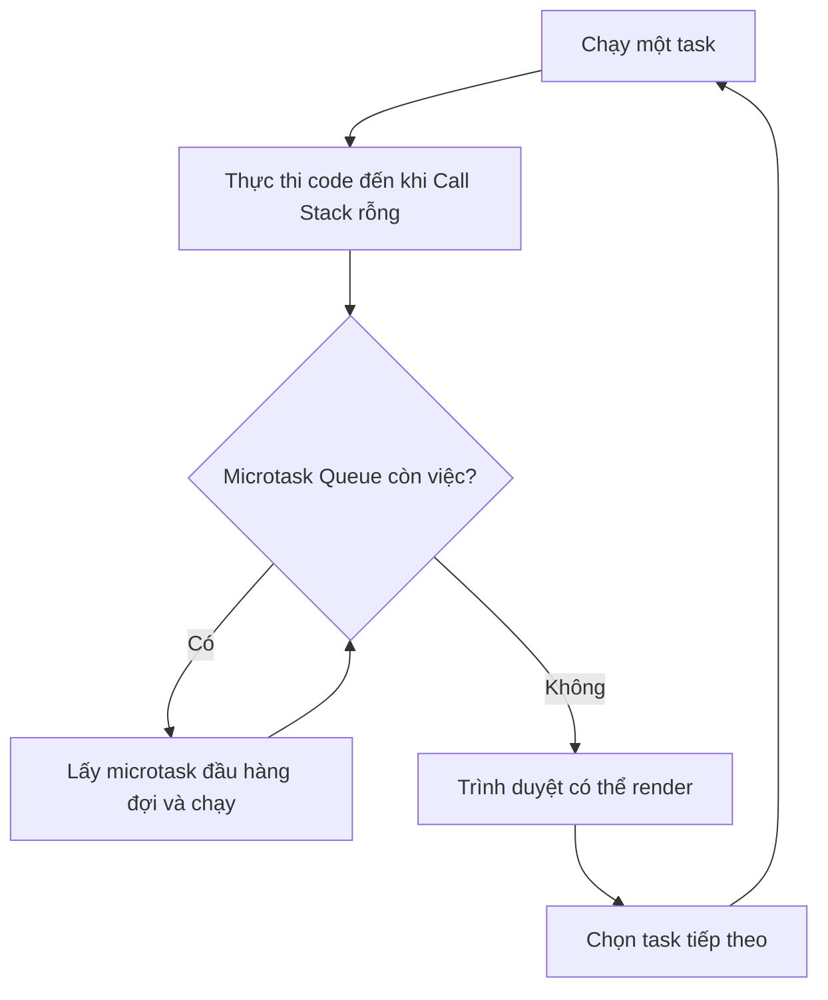

<Callout type="info" title="Mục tiêu phỏng vấn">
  Sau bài này, bạn có thể dự đoán thứ tự output và giải thích **vì sao** từng callback chạy ở thời điểm đó, thay vì chỉ học thuộc công thức “sync → microtask → macrotask”.
</Callout>

## Mục lục

- [Câu hỏi phỏng vấn](#câu-hỏi-phỏng-vấn)
- [Câu trả lời ngắn gọn](#câu-trả-lời-ngắn-gọn)
- [Mô hình cần nhớ](#mô-hình-cần-nhớ)
  - [Code đồng bộ](#code-đồng-bộ)
  - [Microtask](#microtask)
  - [Macrotask](#macrotask)
- [Quy trình phân tích từng bước](#quy-trình-phân-tích-từng-bước)
- [Ví dụ cơ bản](#ví-dụ-cơ-bản)
- [Bài toán tổng hợp](#bài-toán-tổng-hợp)
  - [Đề bài](#đề-bài)
  - [Pha chạy code đồng bộ](#pha-chạy-code-đồng-bộ)
  - [Pha xử lý microtask](#pha-xử-lý-microtask)
  - [Pha xử lý macrotask](#pha-xử-lý-macrotask)
  - [Bảng trace hoàn chỉnh](#bảng-trace-hoàn-chỉnh)
- [Các bẫy thường gặp](#các-bẫy-thường-gặp)
  - [setTimeout 0 không chạy ngay](#settimeout-0-không-chạy-ngay)
  - [Promise executor chạy đồng bộ](#promise-executor-chạy-đồng-bộ)
  - [then nối chuỗi không vào queue cùng lúc](#then-nối-chuỗi-không-vào-queue-cùng-lúc)
  - [Code sau await là microtask](#code-sau-await-là-microtask)
  - [Microtask được tạo trong macrotask](#microtask-được-tạo-trong-macrotask)
  - [Microtask có thể làm Event Loop bị đói](#microtask-có-thể-làm-event-loop-bị-đói)
- [Browser và Node.js khác nhau ở đâu](#browser-và-nodejs-khác-nhau-ở-đâu)
- [Cách trình bày câu trả lời trong phỏng vấn](#cách-trình-bày-câu-trả-lời-trong-phỏng-vấn)
- [Câu hỏi mở rộng thường gặp](#câu-hỏi-mở-rộng-thường-gặp)
- [Tổng kết](#tổng-kết)
- [Bài liên quan](#bài-liên-quan)

## Câu hỏi phỏng vấn

> Hãy phân tích luồng chạy của JavaScript Event Loop. Microtask khác Macrotask như thế nào? Khi `Promise`, `async/await` và `setTimeout` xuất hiện cùng nhau, thứ tự thực thi được xác định ra sao?

Nhà tuyển dụng thường không chỉ cần một định nghĩa. Họ muốn kiểm tra ba khả năng:

1. Bạn có phân loại đúng từng đoạn code là **đồng bộ**, **microtask** hay **macrotask** không.
2. Bạn có mô phỏng đúng sự thay đổi của các hàng đợi không.
3. Bạn có giải thích được các trường hợp lồng nhau, chẳng hạn microtask được tạo bên trong macrotask.

## Câu trả lời ngắn gọn

JavaScript chạy code trên một **Call Stack**. Tại một thời điểm, chỉ một đoạn JavaScript được thực thi trên stack đó.

Khi Call Stack rỗng, Event Loop xử lý công việc theo mô hình sau:

1. Chạy một **task** đang sẵn sàng, ví dụ script ban đầu hoặc callback của `setTimeout`.
2. Chạy hết **Microtask Queue**. Nếu một microtask tạo thêm microtask, tác vụ mới cũng được xử lý trong cùng lần này.
3. Trình duyệt có thể cập nhật giao diện nếu cần.
4. Chuyển sang task tiếp theo và lặp lại.

Vì vậy, trong mô hình phỏng vấn trên trình duyệt, thứ tự ưu tiên thường là:

```text
Code đồng bộ → toàn bộ microtask → một macrotask → toàn bộ microtask mới → macrotask tiếp theo
```

<Callout type="warn" title="Không chỉ là ba nhóm chạy một lần">
  Công thức “sync → microtask → macrotask” chỉ đúng như một cách ghi nhớ ban đầu. Sau **mỗi** macrotask, Event Loop lại phải xử lý hết các microtask mới trước khi lấy macrotask tiếp theo.
</Callout>

## Mô hình cần nhớ



Trong HTML Standard, thuật ngữ chính xác là **task**, không phải macrotask. “Macrotask” là cách gọi phổ biến để phân biệt task với microtask. Ngoài ra, trình duyệt có thể quản lý nhiều task queue theo nguồn thay vì chỉ một hàng đợi toàn cục. Khi giải bài phỏng vấn thông thường, mô hình một Macrotask Queue vẫn đủ để suy luận thứ tự.

### Code đồng bộ

Code đồng bộ chạy ngay trên Call Stack và hoàn thành trước khi Event Loop lấy callback từ hàng đợi.

Ví dụ:

```js
console.log('A');

function printB() {
  console.log('B');
}

printB();
console.log('C');
// A → B → C
```

Lời gọi hàm thông thường, phép tính và phần code nằm trước `await` đầu tiên đều thuộc nhóm này.

### Microtask

Microtask là công việc được xử lý tại **microtask checkpoint**. Event Loop chạy microtask sau khi task hiện tại kết thúc và tiếp tục cho đến khi hàng đợi rỗng.

Các nguồn phổ biến:

- Callback của `Promise.then`, `.catch` và `.finally`.
- Phần tiếp tục chạy sau `await`.
- Callback được đăng ký bằng `queueMicrotask`.
- `MutationObserver` trong trình duyệt.

```js
Promise.resolve().then(() => console.log('promise'));
queueMicrotask(() => console.log('queued'));
```

Hai callback trên không chạy ngay tại dòng đăng ký. Chúng được đưa vào Microtask Queue theo thứ tự được tạo.

### Macrotask

Macrotask, hay **task** theo thuật ngữ của HTML Standard, là một đơn vị công việc mà Event Loop chọn để chạy trong một lượt.

Các nguồn phổ biến trên trình duyệt:

- Script ban đầu.
- Callback của `setTimeout` và `setInterval`.
- Sự kiện giao diện như `click`, `input` và `scroll`.
- Callback từ một số hoạt động I/O hoặc message event.

```js
setTimeout(() => console.log('timer'), 0);
```

Delay bằng `0` chỉ có nghĩa là timer không yêu cầu chờ thêm theo giá trị delay. Callback vẫn phải đợi task hiện tại kết thúc và Microtask Queue được xử lý hết.

## Quy trình phân tích từng bước

Khi gặp một đoạn code hỏi output, hãy dùng quy trình sau:

1. **Đánh dấu từng dòng.** Ghi `sync`, `microtask` hoặc `macrotask` bên cạnh mỗi thao tác.
2. **Chạy toàn bộ code đồng bộ trên giấy.** Ghi output ngay và chỉ đưa callback bất đồng bộ vào hàng đợi tương ứng.
3. **Khi stack rỗng, xử lý hết Microtask Queue.** Sau mỗi callback, kiểm tra xem nó có tạo thêm microtask hoặc macrotask không.
4. **Lấy một macrotask.** Chạy callback đó đến hết.
5. **Quay lại Microtask Queue.** Phải vét hết microtask mới trước khi lấy macrotask tiếp theo.
6. **Lặp lại cho đến khi các hàng đợi rỗng.**

<Callout type="idea" title="Mẹo làm bài">
  Đừng nhìn vào thời gian `0 ms` hay vị trí callback trong source code để đoán. Hãy nhìn vào **thời điểm callback được enqueue** và **nó được enqueue vào hàng đợi nào**.
</Callout>

## Ví dụ cơ bản

```js
console.log('A');

setTimeout(() => {
  console.log('B');
}, 0);

Promise.resolve().then(() => {
  console.log('C');
});

console.log('D');
```

Phân loại:

| Đoạn code | Loại | Hành động |
|---|---|---|
| `console.log('A')` | Đồng bộ | In `A` ngay |
| `setTimeout(...)` | Đăng ký macrotask | Callback `B` chờ trong Macrotask Queue |
| `Promise.then(...)` | Đăng ký microtask | Callback `C` chờ trong Microtask Queue |
| `console.log('D')` | Đồng bộ | In `D` ngay |

Sau khi script kết thúc, Call Stack rỗng. Event Loop xử lý microtask `C` trước, rồi mới xử lý timer `B`.

```text
Output: A → D → C → B
```

## Bài toán tổng hợp

### Đề bài

Hãy dự đoán output của đoạn code sau:

```js
console.log('1');

setTimeout(() => {
  console.log('2');
  Promise.resolve().then(() => console.log('3'));
}, 0);

Promise.resolve()
  .then(() => {
    console.log('4');
    setTimeout(() => console.log('5'), 0);
  })
  .then(() => console.log('6'));

queueMicrotask(() => console.log('7'));

(async function run() {
  console.log('8');
  await null;
  console.log('9');
})();

console.log('10');
```

### Pha chạy code đồng bộ

JavaScript chạy từ trên xuống:

1. In `1`.
2. Đăng ký timer chứa `2`; callback đi vào Macrotask Queue khi timer sẵn sàng.
3. Đăng ký callback đầu tiên của chuỗi Promise; microtask `4` được enqueue.
4. `queueMicrotask` enqueue microtask `7`.
5. Gọi `run()`:
   - `8` được in ngay vì phần trước `await` chạy đồng bộ.
   - `await null` tạm dừng hàm. Phần chứa `9` được lên lịch như một microtask.
6. In `10`.

Trạng thái sau pha đồng bộ:

```text
Output:          1, 8, 10
Microtask Queue: [4, 7, 9]
Macrotask Queue: [timer 2]
```

### Pha xử lý microtask

Event Loop xử lý microtask theo thứ tự FIFO, tức vào trước ra trước:

1. Microtask `4` chạy và in `4`.
   - Nó đăng ký timer `5` vào Macrotask Queue.
   - Khi callback `.then` này hoàn thành, Promise mà nó trả về được resolve. Lúc đó callback `.then(() => console.log('6'))` mới được enqueue thành microtask `6`.
2. Queue hiện là `[7, 9, 6]`. Microtask `7` chạy và in `7`.
3. Microtask `9` chạy và in `9`.
4. Microtask `6` chạy và in `6`.

Trạng thái sau khi vét hết microtask:

```text
Output:          1, 8, 10, 4, 7, 9, 6
Microtask Queue: []
Macrotask Queue: [timer 2, timer 5]
```

### Pha xử lý macrotask

Event Loop lấy timer đầu tiên:

1. Timer `2` chạy và in `2`.
2. Callback của timer tạo một Promise microtask chứa `3`.
3. Timer kết thúc. Trước khi lấy timer `5`, Event Loop phải xử lý microtask `3`, nên `3` được in.
4. Microtask Queue rỗng. Event Loop lấy timer tiếp theo và in `5`.

Kết quả cuối cùng:

```text
1 → 8 → 10 → 4 → 7 → 9 → 6 → 2 → 3 → 5
```

### Bảng trace hoàn chỉnh

| Bước | Công việc đang chạy | Microtask Queue sau bước này | Macrotask Queue sau bước này | Output |
|---:|---|---|---|---|
| 1 | Script in `1` | `[]` | `[]` | `1` |
| 2 | Script đăng ký timer `2` | `[]` | `[2]` | `1` |
| 3 | Script đăng ký Promise `4` | `[4]` | `[2]` | `1` |
| 4 | Script đăng ký `queueMicrotask(7)` | `[4, 7]` | `[2]` | `1` |
| 5 | `run()` in `8`, gặp `await` | `[4, 7, 9]` | `[2]` | `1, 8` |
| 6 | Script in `10` và kết thúc | `[4, 7, 9]` | `[2]` | `1, 8, 10` |
| 7 | Microtask `4` chạy | `[7, 9, 6]` | `[2, 5]` | `1, 8, 10, 4` |
| 8 | Microtask `7` chạy | `[9, 6]` | `[2, 5]` | `…, 7` |
| 9 | Microtask `9` chạy | `[6]` | `[2, 5]` | `…, 9` |
| 10 | Microtask `6` chạy | `[]` | `[2, 5]` | `…, 6` |
| 11 | Timer `2` chạy, tạo microtask `3` | `[3]` | `[5]` | `…, 2` |
| 12 | Microtask `3` chạy | `[]` | `[5]` | `…, 3` |
| 13 | Timer `5` chạy | `[]` | `[]` | `…, 5` |

## Các bẫy thường gặp

### setTimeout 0 không chạy ngay

```js
setTimeout(() => console.log('timeout'), 0);
console.log('sync');
// sync → timeout
```

`setTimeout(..., 0)` không đưa callback lên Call Stack ngay. Nó đăng ký một timer. Khi đủ điều kiện, callback mới trở thành task và vẫn phải chờ Event Loop chọn.

Nói ngắn gọn: **`0` là độ trễ tối thiểu được yêu cầu, không phải thời điểm thực thi được đảm bảo.**

### Promise executor chạy đồng bộ

Hàm được truyền vào `new Promise(...)` gọi là **executor**. Executor chạy ngay khi Promise được tạo. Chỉ callback của `.then`, `.catch` hoặc `.finally` mới chạy dưới dạng microtask.

```js
console.log('A');

new Promise((resolve) => {
  console.log('B');
  resolve();
}).then(() => console.log('C'));

console.log('D');
// A → B → D → C
```

`B` là code đồng bộ. `C` là microtask.

### then nối chuỗi không vào queue cùng lúc

```js
Promise.resolve()
  .then(() => console.log('A'))
  .then(() => console.log('B'));

queueMicrotask(() => console.log('C'));
// A → C → B
```

Ban đầu chỉ callback `A` được enqueue. Callback `B` phụ thuộc vào Promise do `.then` đầu tiên trả về. Vì vậy, `B` chỉ được enqueue sau khi `A` hoàn thành. Lúc đó `C` đã nằm trong queue.

### Code sau await là microtask

```js
async function demo() {
  console.log('A');
  await null;
  console.log('B');
}

demo();
console.log('C');
// A → C → B
```

`demo()` bắt đầu chạy đồng bộ và in `A`. Khi gặp `await`, hàm tạm dừng và trả quyền điều khiển cho code gọi. Phần tiếp tục chứa `B` chạy ở một Promise job, thường được gọi là microtask trong mô hình phỏng vấn.

### Microtask được tạo trong macrotask

```js
setTimeout(() => {
  console.log('A');
  Promise.resolve().then(() => console.log('B'));
}, 0);

setTimeout(() => console.log('C'), 0);
// A → B → C
```

Sau timer đầu tiên, Event Loop không chuyển thẳng sang timer thứ hai. Nó thực hiện microtask checkpoint, chạy `B`, rồi mới chạy timer chứa `C`.

Đây là lý do công thức đúng phải là:

```text
một macrotask → vét hết microtask → macrotask tiếp theo
```

### Microtask có thể làm Event Loop bị đói

Event Loop phải xử lý microtask cho đến khi queue rỗng. Nếu mỗi microtask liên tục tạo thêm một microtask, timer và thao tác render có thể không có cơ hội chạy. Hiện tượng này gọi là **starvation**, tức các nhóm công việc khác bị “bỏ đói”.

```js
function repeat() {
  queueMicrotask(repeat);
}

repeat();
setTimeout(() => console.log('Có thể không bao giờ chạy'), 0);
```

<Callout type="error" title="Không chia việc nặng bằng microtask đệ quy">
  Nếu cần cho UI có cơ hội render giữa các lô công việc, hãy nhường quyền bằng macrotask như `setTimeout` hoặc `MessageChannel`. Với tính toán nặng, ưu tiên chuyển công việc sang Web Worker.
</Callout>

## Browser và Node.js khác nhau ở đâu

Phần phân tích ở trên dùng mô hình của trình duyệt. Node.js cũng có Event Loop nhưng macrotask được tổ chức thành các **phase** của libuv, chẳng hạn `timers`, `poll` và `check`.

| Khía cạnh | Browser | Node.js |
|---|---|---|
| Môi trường quản lý async | Web APIs | libuv và các API của Node.js |
| Render giao diện | Có thể render giữa các task | Không có bước render |
| Timer | `setTimeout`, `setInterval` | `setTimeout`, `setInterval` ở phase timers |
| API riêng | `requestAnimationFrame` | `setImmediate`, `process.nextTick` |
| Ưu tiên đặc biệt | Promise microtask, `queueMicrotask` | `process.nextTick` được xử lý trước Promise microtask |

Ví dụ Node.js:

```js
Promise.resolve().then(() => console.log('promise'));
process.nextTick(() => console.log('nextTick'));
// nextTick → promise
```

<Callout type="warn" title="Hãy xác nhận môi trường chạy">
  Với câu hỏi có `process.nextTick`, `setImmediate` hoặc callback I/O, không nên áp dụng máy móc mô hình của browser. Hãy nói rõ phiên bản Node.js và ngữ cảnh gọi vì chúng có thể ảnh hưởng đến thứ tự timer và I/O.
</Callout>

## Cách trình bày câu trả lời trong phỏng vấn

Một câu trả lời tốt nên đi theo thứ tự sau:

1. **Nêu mô hình:** JavaScript chạy một tác vụ trên Call Stack; callback bất đồng bộ phải chờ trong hàng đợi.
2. **Nêu quy tắc ưu tiên:** sau khi task hiện tại kết thúc, Event Loop vét hết microtask trước task tiếp theo.
3. **Phân loại API:** Promise và phần sau `await` là microtask; timer và UI event là task/macrotask.
4. **Trace đoạn code:** liệt kê output đồng bộ, trạng thái Microtask Queue và trạng thái Macrotask Queue.
5. **Nhắc đến trường hợp lồng nhau:** microtask sinh trong task phải chạy trước task kế tiếp.
6. **Chốt đáp án:** đọc output theo thứ tự và giải thích một bẫy quan trọng.

Bạn có thể trả lời ngắn như sau:

> Em chạy toàn bộ code đồng bộ trước và ghi lại các callback được enqueue. Khi Call Stack rỗng, Event Loop xử lý toàn bộ Microtask Queue, gồm Promise reactions và phần tiếp tục sau `await`. Sau đó nó mới lấy một task như callback `setTimeout`. Khi task đó kết thúc, Event Loop lại vét microtask trước khi lấy task tiếp theo. Vì vậy em sẽ trace queue sau từng callback, không chỉ gom tất cả timer xuống cuối một lần.

## Câu hỏi mở rộng thường gặp

**1. `setTimeout(fn, 0)` có đảm bảo chạy sau đúng 0 ms không?**

Không. Callback chỉ có thể chạy sau khi timer đủ điều kiện, task hiện tại kết thúc và các microtask được xử lý. Trình duyệt còn có thể áp dụng timer clamping hoặc throttle tab nền.

**2. `await Promise.resolve()` có chạy đồng bộ không?**

Không hoàn toàn. Phần trước `await` chạy đồng bộ. Phần sau `await` được tiếp tục trong một Promise job, nên chạy sau code đồng bộ còn lại.

**3. Microtask có luôn chạy trước mọi macrotask không?**

Microtask đã được enqueue sẽ chạy tại microtask checkpoint trước khi Event Loop chọn task tiếp theo. Tuy nhiên, callback phải được enqueue trước thì mới có thể được xử lý; một Promise chưa settle chưa tạo ra reaction job sẵn sàng để chạy.

**4. Rendering nằm ở đâu?**

Trình duyệt có thể render sau khi task kết thúc và microtask queue đã rỗng. Rendering không được đảm bảo sau mọi task, vì trình duyệt còn phụ thuộc vào nhịp khung hình và trạng thái trang.

**5. Vì sao microtask quá nhiều có thể làm giao diện bị đơ?**

Vì trình duyệt cần hoàn tất microtask checkpoint trước khi chuyển sang cơ hội render. Một chuỗi microtask không kết thúc sẽ giữ Event Loop ở checkpoint đó.

## Tổng kết

Hãy ghi nhớ năm quy tắc:

1. Code đồng bộ chạy đến hết trước khi callback trong queue được lấy ra.
2. Promise reaction, `queueMicrotask` và phần sau `await` thuộc Microtask Queue.
3. Timer, UI event và script ban đầu là task, thường được gọi là macrotask.
4. Sau mỗi task, Event Loop xử lý **hết** microtask trước task tiếp theo.
5. Khi phân tích output, phải cập nhật queue sau từng callback vì callback có thể tạo thêm công việc.

```text
Task hiện tại
    ↓
Call Stack rỗng
    ↓
Vét hết Microtask Queue
    ↓
Browser có thể render
    ↓
Task tiếp theo
```

## Bài liên quan

<Cards>
  <Card title="Event Loop — Deep Dive" href="/async/event-loop/" description="Tìm hiểu Call Stack, rendering, Node.js phases và starvation sâu hơn." />
  <Card title="Promises" href="/async/promises/" description="Hiểu Promise state, chaining và cách reaction được lên lịch." />
  <Card title="Async/Await" href="/async/async-await/" description="Phân tích cách await tạm dừng và tiếp tục một async function." />
</Cards>
