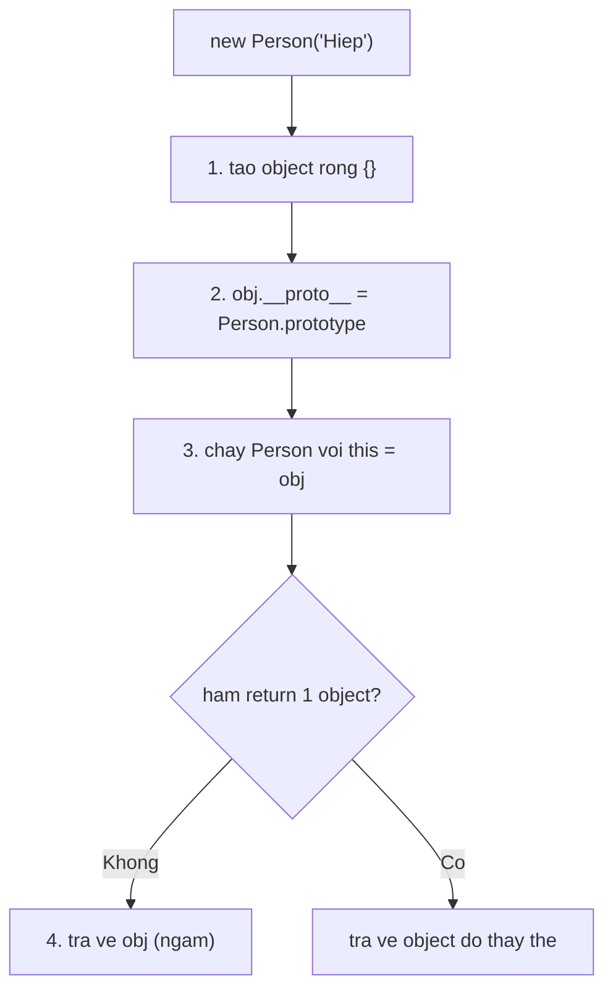

## Mục lục

- [Tổng quan](#tổng-quan)
- [new làm gì bên trong (4 bước)](#new-làm-gì-bên-trong-4-bước)
- [Vì sao không cần return mà vẫn trả object](#vì-sao-không-cần-return-mà-vẫn-trả-object)
- [Bẫy quên this](#bẫy-quên-this)
- [Bẫy quên new](#bẫy-quên-new)
- [Method nên đặt lên prototype](#method-nên-đặt-lên-prototype)
- [Constructor function là tiền thân của class](#constructor-function-là-tiền-thân-của-class)
- [Pitfalls](#pitfalls)
- [Bài liên quan](#bài-liên-quan)

---

## Tổng quan

**Constructor function** là một hàm *thường*, được dùng kèm từ khoá `new` để **tạo ra object**. Nó là "bản thiết kế" (blueprint) để dựng nhiều object cùng cấu trúc — cách làm OOP trong JS *trước khi* có `class`.

```js
// Quy ước: viết hoa chữ cái đầu (không bắt buộc)
function Person(name) {
  this.name = name;
  this.talk = function () { return "talking"; };
}

const me = new Person("Hiệp");
me.name;     // "Hiệp"
me.talk();   // "talking"
```

Điểm mấu chốt nằm ở hai từ khoá `new` và `this` — và để hiểu chúng, ta xem `new` thực sự làm gì.

---

## new làm gì bên trong (4 bước)

Khi bạn viết `new Person("Hiệp")`, engine thực hiện 4 bước:

```text
1. Tạo một object rỗng:           const obj = {}
2. Gán prototype:                 obj.__proto__ = Person.prototype
3. Gọi Person với this = obj:     Person.call(obj, "Hiệp")
4. Trả về obj (nếu hàm không
   tự return một object khác):     return obj
```



Có thể hình dung `new` "viết lại" hàm thành:

```js
function Person(name) {
  // const this = {};                  ← new ngầm tạo (bước 1-2)
  this.name = name;
  this.talk = function () { return "talking"; };
  // return this;                      ← new ngầm trả về (bước 4)
}
```

> [!IMPORTANT]
> Bước 2 chính là mối nối với [prototype chain](/objects-prototypes/prototype/): `me.__proto__ === Person.prototype`. Nhờ vậy instance truy cập được mọi thứ đặt trên `Person.prototype`.

---

## Vì sao không cần return mà vẫn trả object

Như sơ đồ bước 4: `new` *tự* trả về `this` (object vừa dựng) khi hàm không tự return một object nào. Đó là lý do constructor function thường không có câu `return` mà vẫn cho ra object.

```js
function Person(name) {
  this.name = name;
  // không có return, nhưng new vẫn trả về object
}
const p = new Person("Hiệp");
p.name;   // "Hiệp"
```

Lưu ý ngoại lệ: nếu hàm **tự return một object**, `new` trả về object đó thay vì `this`. Nếu return một primitive thì bị bỏ qua (vẫn trả `this`):

```js
function A() { this.x = 1; return { x: 99 }; }
new A().x;   // 99 — object tự return thắng

function B() { this.x = 1; return 5; }
new B().x;   // 1 — return primitive bị bỏ qua
```

---

## Bẫy quên this

Nếu trong constructor bạn quên `this`, biến chỉ là biến cục bộ — **không** gắn vào object:

```js
function Person(name) {
  name = name;                              // chỉ gán cho tham số cục bộ
  talk = function () { return "talking"; }; // tạo biến global (sloppy) / lỗi (strict)
}

const you = new Person("Hiệp");
you.name;     // undefined — name không gắn vào object
you.talk();   // TypeError — talk không phải method của object
```

Phải gán qua `this.name`, `this.talk` thì property mới thuộc về object được tạo.

---

## Bẫy quên new

Gọi constructor function mà **quên `new`** là lỗi kinh điển: hàm chạy như hàm thường, `this` không phải object mới mà là global (hoặc `undefined` ở strict mode):

```js
function Person(name) { this.name = name; }

const ok = new Person("Hiệp");   // this = object mới → ok.name = "Hiệp"
const bad = Person("Hiệp");       // KHÔNG new: this = global, hàm trả undefined
bad;          // undefined
// ở sloppy mode còn lỡ ghi `name` ra global object!
```

> [!WARNING]
> Để chống quên `new`, có thể kiểm tra `new.target` (là `undefined` khi gọi không có `new`) và tự sửa, hoặc đơn giản dùng `class` — class **bắt buộc** gọi với `new`, gọi thiếu sẽ ném `TypeError` ngay.

```js
function Person(name) {
  if (!new.target) return new Person(name);  // tự thêm new nếu thiếu
  this.name = name;
}
```

---

## Method nên đặt lên prototype

Đặt method *trong* constructor khiến **mỗi instance có một bản sao riêng** → tốn bộ nhớ:

```js
// LÃNG PHÍ: mỗi object một bản talk riêng
function Person(name) {
  this.name = name;
  this.talk = function () { return "talking"; };
}

// TỐT: talk nằm trên prototype, mọi instance dùng chung
function Person2(name) {
  this.name = name;
}
Person2.prototype.talk = function () { return "talking"; };

const a = new Person2("A");
const b = new Person2("B");
a.talk === b.talk;   // true — cùng một hàm
```

Lý do sâu hơn xem [Prototype & kế thừa](/objects-prototypes/prototype/) — đây chính là điều `class` làm tự động cho bạn.

---

## Constructor function là tiền thân của class

`class` ra đời (ES6) như cú pháp gọn hơn cho mô hình constructor function + prototype. Hai đoạn sau **tương đương về bản chất**:

```js
// Constructor function
function Person(name) { this.name = name; }
Person.prototype.talk = function () { return "talking"; };

// Class — engine dịch về đúng cơ chế trên
class PersonC {
  constructor(name) { this.name = name; }
  talk() { return "talking"; }   // tự đặt lên PersonC.prototype
}
```

> [!NOTE]
> Thực tế engine cũng "hạ" `class` về dạng constructor function + prototype. Hiểu constructor function giúp bạn hiểu *class hoạt động ra sao bên dưới*. Xem [Class](/objects-prototypes/class/).

---

## Pitfalls

| Pitfall | Vấn đề | Cách đúng |
|---------|--------|-----------|
| Quên `new` | `this` = global, trả `undefined`, ô nhiễm global | Dùng `new.target` hoặc `class` |
| Quên `this.` khi gán property | Property không gắn vào object | Luôn gán qua `this.x` |
| Đặt method trong constructor | Nhân bản hàm mỗi instance | Đặt lên `prototype` |
| `return` một primitive mong nó thay object | Bị bỏ qua | Chỉ object tự-return mới thay `this` |
| Dùng arrow function làm constructor | Arrow không có `this`/không `new` được | Dùng function thường hoặc class |

---

## Bài liên quan

- [Prototype & kế thừa](/objects-prototypes/prototype/)
- [Class](/objects-prototypes/class/)
- [Từ khoá this](/function-closure/this-keyword/)
- [Factory Functions](/function-closure/factory-functions/)
