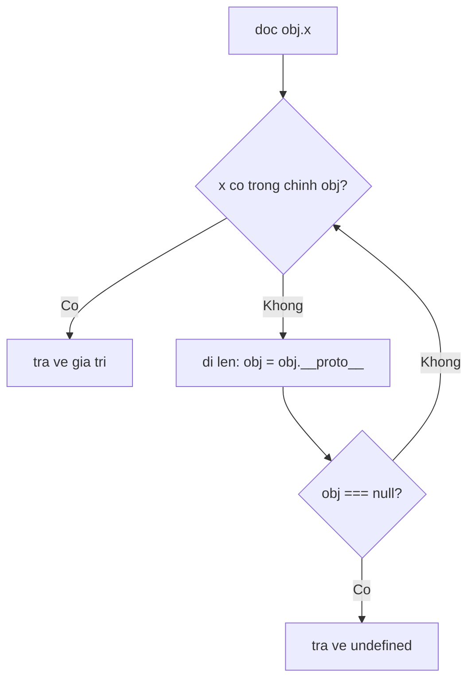

## Mục lục

- [Tổng quan](#tổng-quan)
- [Trực giác: chuỗi tra cứu](#trực-giác-chuỗi-tra-cứu)
- [[[Prototype]] / __proto__ — mọi object đều có](#prototype--__proto__--mọi-object-đều-có)
- [Property lookup đi lên prototype chain](#property-lookup-đi-lên-prototype-chain)
- [prototype (của hàm) khác __proto__ (của object)](#prototype-của-hàm-khác-__proto__-của-object)
- [Vì sao đặt method lên prototype](#vì-sao-đặt-method-lên-prototype)
- [Object.prototype là đỉnh chuỗi](#objectprototype-là-đỉnh-chuỗi)
- [Kế thừa qua prototype](#kế-thừa-qua-prototype)
- [Shadowing & hasOwnProperty](#shadowing--hasownproperty)
- [Self-check](#self-check)
- [Bài liên quan](#bài-liên-quan)

---

## Tổng quan

JavaScript **không** kế thừa theo class như Java/C++ ở tầng cốt lõi. Thay vào đó nó dùng **prototype**: mỗi object có một liên kết ẩn tới một object khác (prototype của nó), và khi truy cập một property không có sẵn, engine **đi ngược lên chuỗi prototype** để tìm. `class` chỉ là lớp cú pháp đường (syntactic sugar) phủ lên cơ chế này.

```js
const obj = { age: 10 };
obj.age;          // 10 — có sẵn
obj.toString();   // "[object Object]" — KHÔNG có trong obj, tìm thấy ở Object.prototype
```

Câu hỏi cốt lõi: **`obj` chỉ có `age`, sao gọi được `toString()`?** Phần dưới trả lời bằng cơ chế prototype chain.

---

## Trực giác: chuỗi tra cứu

Hình dung mỗi object có một "mũi tên đi lên" trỏ tới object cha (prototype). Khi bạn hỏi một property, JS hỏi chính object trước; không có thì lần theo mũi tên lên cha, lên ông, ... cho tới khi gặp hoặc hết chuỗi (`null`).

```text
obj { age: 10 }
   │  __proto__
   ▼
Object.prototype { toString, hasOwnProperty, valueOf, ... }
   │  __proto__
   ▼
null   (hết chuỗi → trả undefined nếu vẫn chưa thấy)
```

---

## [[Prototype]] / __proto__ — mọi object đều có

Theo ghi chú gốc: *"Dù bạn tạo object bằng cách nào, object sinh ra luôn có một liên kết `__proto__`."*

- `[[Prototype]]` là **khe nội bộ** (internal slot) theo spec — liên kết tới prototype của object.
- `__proto__` là **getter/setter công khai** để đọc/ghi khe đó (cách cũ). Cách chuẩn hiện nay: `Object.getPrototypeOf(obj)` / `Object.setPrototypeOf(obj, proto)`.

```js
const obj = {};                          // object literal
Object.getPrototypeOf(obj) === Object.prototype;   // true
obj.__proto__ === Object.prototype;                // true (cùng ý nghĩa)
```

Bản thân prototype cũng là object, nên nó cũng có `__proto__` của riêng nó → tạo thành **chuỗi (chain)**.

---

## Property lookup đi lên prototype chain

Thuật toán khi đọc `obj.x`:



Minh hoạ từ ghi chú gốc:

```js
const obj = { age: 10 };

obj.age;          // 10        — thấy ngay trong obj
obj.name;         // undefined — không có trong obj, lên Object.prototype cũng không có → undefined
obj.toString();   // function  — không có trong obj, tìm thấy ở Object.prototype
```

> [!IMPORTANT]
> Lookup chỉ đi **một chiều: từ dưới lên trên** (từ object → prototype → ... → `null`). Không bao giờ đi xuống. Khi gặp `null` mà vẫn chưa thấy → `undefined` (với property) hoặc `TypeError` (nếu gọi như hàm).

---

## prototype (của hàm) khác __proto__ (của object)

Đây là điểm gây nhầm lẫn lớn nhất. Có **hai** thứ tên gần giống nhau:

| | Nằm trên | Là gì |
|---|----------|-------|
| `__proto__` / `[[Prototype]]` | **mọi object** | liên kết đi lên cha để lookup |
| `prototype` | **chỉ function / class** | object sẽ trở thành `__proto__` của các instance tạo bởi `new` |

```js
function Person(name) {
  this.name = name;
}

const p1 = new Person("Hiệp");

// Chìa khoá: prototype của HÀM === __proto__ của INSTANCE
p1.__proto__ === Person.prototype;              // true
Object.getPrototypeOf(p1) === Person.prototype; // true
```

```text
Person (function)              p1 (instance)
  ┌─────────────┐               ┌──────────────┐
  │ prototype ──┼──────┐        │ name: "Hiệp" │
  └─────────────┘      │        │ __proto__ ───┼──┐
                       │        └──────────────┘  │
                       ▼                          │
              Person.prototype  ◀─────────────────┘
              { constructor: Person }
              (p1.__proto__ trỏ vào ĐÂY)
```

> [!NOTE]
> Chỉ **function và class** mới có thuộc tính `prototype`. Object thường (`{}`) không có `prototype`, chỉ có `__proto__`. Nhớ: *function dùng `prototype` để "phát" cho instance; instance nhận về dưới dạng `__proto__`.*

---

## Vì sao đặt method lên prototype

Đây là lý do prototype quan trọng về **hiệu năng/bộ nhớ**. So sánh hai cách:

```js
// CÁCH 1 — method gắn trong constructor: MỖI instance một bản sao
function PersonA(name) {
  this.name = name;
  this.talk = function () { return "talking"; };   // nhân bản mỗi lần new
}
const a1 = new PersonA("A");
const a2 = new PersonA("B");
a1.talk === a2.talk;   // false — hai hàm KHÁC nhau → tốn bộ nhớ

// CÁCH 2 — method trên prototype: CHIA SẺ một bản chung
function PersonB(name) {
  this.name = name;
}
PersonB.prototype.talk = function () { return "talking"; };
const b1 = new PersonB("A");
const b2 = new PersonB("B");
b1.talk === b2.talk;   // true — cùng một hàm trên PersonB.prototype
```

```text
Cách 1 (lãng phí):           Cách 2 (chia sẻ):
 a1 { name, talk:fn1 }         b1 { name } ─┐
 a2 { name, talk:fn2 }         b2 { name } ─┤ __proto__
   → 2 hàm talk riêng                       ▼
                              PersonB.prototype { talk }  ← 1 hàm chung
```

> [!TIP]
> Khi `talk()` nằm trên `PersonB.prototype`, gọi `b1.talk()` sẽ không thấy `talk` trong `b1` → lookup lên `b1.__proto__` (= `PersonB.prototype`) → tìm thấy. Mọi instance dùng chung, không nhân bản. **`class` làm chính xác điều này tự động** — method của class được đặt lên prototype.

---

## Object.prototype là đỉnh chuỗi

`Object` bản thân là một **function (constructor)**, không phải object:

```js
typeof Object;   // "function"
```

Mọi object thường, khi lần theo `__proto__` đủ xa, đều kết thúc ở **`Object.prototype`** (chứa `toString`, `hasOwnProperty`, `valueOf`...), rồi tới `null`:

```js
const obj = {};
obj.__proto__ === Object.prototype;                 // true
Object.prototype.__proto__ === null;                // true — đỉnh chuỗi
```

Với mảng, instance của class extends... chuỗi dài hơn (thêm `Array.prototype`, prototype của lớp cha...) trước khi tới `Object.prototype`:

```text
[1,2,3] ──▶ Array.prototype ──▶ Object.prototype ──▶ null
           (map, filter, push...)
```

---

## Kế thừa qua prototype

Vì lookup đi lên chuỗi, ta "kế thừa" bằng cách nối prototype này vào prototype kia.

### Object.create — tạo object với prototype chỉ định

```js
const animal = {
  eat() { return `${this.name} đang ăn`; },
};

const dog = Object.create(animal);   // dog.__proto__ = animal
dog.name = "Mực";
dog.eat();   // "Mực đang ăn" — eat tìm thấy ở animal qua chuỗi
```

### Nối chuỗi giữa hai constructor (cách trước class)

```js
function Animal(name) { this.name = name; }
Animal.prototype.speak = function () { return `${this.name} kêu`; };

function Dog(name) { Animal.call(this, name); }       // kế thừa property
Dog.prototype = Object.create(Animal.prototype);      // nối chuỗi prototype
Dog.prototype.constructor = Dog;                       // sửa lại constructor
Dog.prototype.bark = function () { return "Gâu!"; };

const d = new Dog("Mực");
d.speak();   // "Mực kêu" — kế thừa từ Animal.prototype
d.bark();    // "Gâu!"
```

> [!NOTE]
> `class ... extends` (xem [Class](/objects-prototypes/class/)) chính là cú pháp gọn cho đoạn nối chuỗi prototype thủ công ở trên. Engine "dịch" class về đúng cơ chế constructor + prototype này.

---

## Shadowing & hasOwnProperty

Nếu instance có property *trùng tên* với prototype, property của instance **che (shadow)** prototype — vì lookup gặp nó trước:

```js
function Person() {}
Person.prototype.role = "user";

const p = new Person();
p.role;                       // "user" — từ prototype
p.role = "admin";             // tạo property OWN trên p (che prototype)
p.role;                       // "admin" — own property thắng
Person.prototype.role;        // "user"  — prototype không bị đổi

Object.hasOwn(p, "role");     // true  — của riêng p
Object.hasOwn(p, "toString"); // false — kế thừa, không phải own
```

`hasOwnProperty` / `Object.hasOwn` phân biệt property *của riêng object* với property *kế thừa* — quan trọng khi duyệt bằng `for...in`.

---

## Self-check

1. **`obj = {}` chỉ rỗng, sao gọi được `obj.toString()`?**
   → Lookup không thấy trong `obj` → lên `obj.__proto__` = `Object.prototype`, nơi có `toString`.
2. **`p1.__proto__` bằng cái gì?**
   → `Person.prototype` (prototype của hàm dựng = `__proto__` của instance).
3. **Vì sao nên để method trên `prototype` thay vì trong constructor?**
   → Trong constructor: mỗi instance một bản sao (tốn bộ nhớ). Trên prototype: mọi instance chia sẻ một bản.
4. **`Object.prototype.__proto__` là gì?**
   → `null` — đỉnh của mọi prototype chain.

---

## Bài liên quan

- [Constructor Function](/objects-prototypes/constructor-function/)
- [Class](/objects-prototypes/class/)
- [Object](/objects-prototypes/object/)
- [Closures](/functions/closures/)
